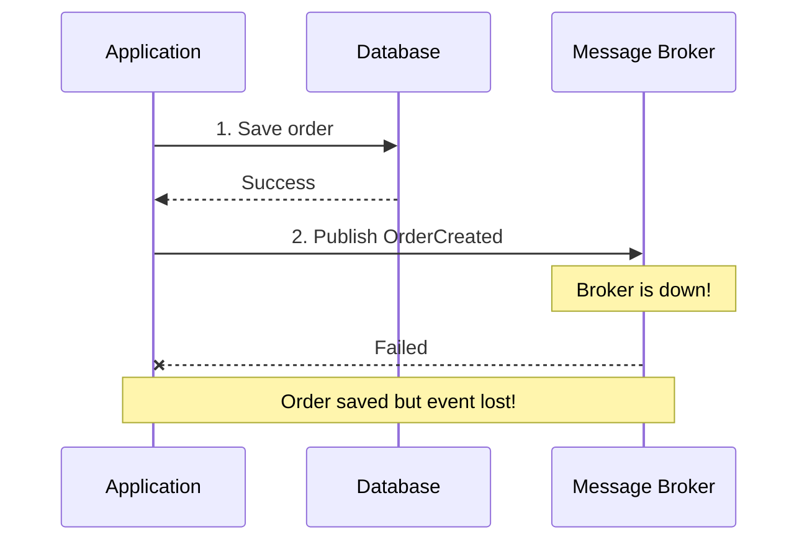
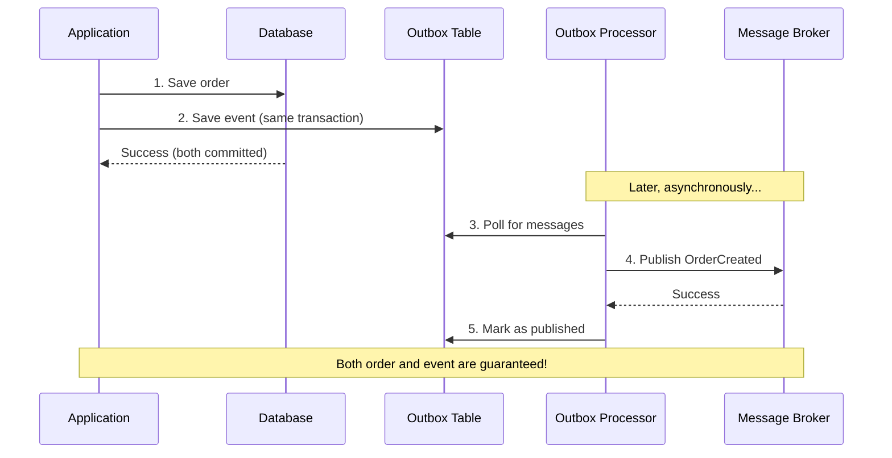
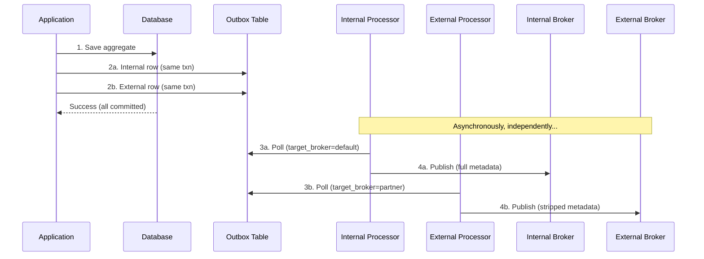
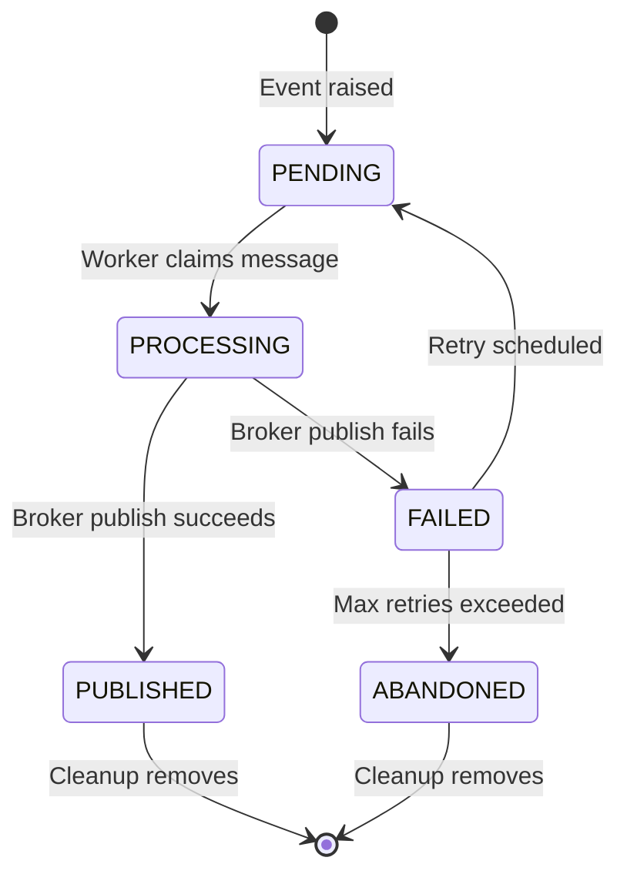

# Outbox Pattern

The outbox pattern ensures reliable message delivery by storing messages in the
same database transaction as your business data, then publishing them to the
message broker in a separate process. This guarantees that messages are never
lost, even if the broker is temporarily unavailable.

## Why Use the Outbox Pattern?

Without the outbox pattern, there's a risk of data inconsistency:


```mermaid
sequenceDiagram
    participant App as Application
    participant DB as Database
    participant Broker as Message Broker

    App->>DB: 1. Save order
    DB-->>App: Success
    App->>Broker: 2. Publish OrderCreated
    Note over Broker: Broker is down!
    Broker--xApp: Failed

    Note over App,Broker: Order saved but event lost!
```

With the outbox pattern:


```mermaid
sequenceDiagram
    participant App as Application
    participant DB as Database
    participant Outbox as Outbox Table
    participant OP as Outbox Processor
    participant Broker as Message Broker

    App->>DB: 1. Save order
    App->>Outbox: 2. Save event (same transaction)
    DB-->>App: Success (both committed)

    Note over OP,Broker: Later, asynchronously...

    OP->>Outbox: 3. Poll for messages
    OP->>Broker: 4. Publish OrderCreated
    Broker-->>OP: Success
    OP->>Outbox: 5. Mark as published

    Note over App,Broker: Both order and event are guaranteed!
```

## How It Works

Three things happen, in order:

**1. Event storage.** When an aggregate is saved through a repository,
any events it raised are written to the outbox table *within the same
transaction* as the aggregate state. If the transaction rolls back,
both disappear together; if it commits, both are durable.

**2. Outbox processing.** The `OutboxProcessor` runs as part of the
Engine, polling the outbox table, publishing each row to the configured
broker, and marking the row as `PUBLISHED` on success. Failures are
retried with exponential backoff.

**3. Message consumption.** StreamSubscription consumers read from the
broker stream, just as they would for any other message. They have no
awareness of the outbox — it's an implementation detail of the
publisher side.

The guarantee that holds this together: step 1 is transactional with
the aggregate save. Steps 2 and 3 are eventually consistent but never
lossy — a row that's written in the outbox is published exactly once
(with at-least-once semantics from the consumer's perspective).

One outbox processor runs per database provider. A domain with one
database has one processor; a domain with a `default` database and an
`analytics` database has two, each publishing its own outbox to the
configured broker.

See the [Outbox Guide](../../guides/server/outbox.md) for enabling the
outbox, creating the table, configuring retries and cleanup, and
investigating abandoned messages.

## External Dispatch for Published Events

Events marked with `published=True` can be delivered to external brokers —
other bounded contexts, partner systems, or analytics pipelines. When
`external_brokers` is configured, the Unit of Work creates additional outbox
rows for each external broker, alongside the internal row:


```mermaid
sequenceDiagram
    participant App as Application
    participant DB as Database
    participant Outbox as Outbox Table
    participant IOP as Internal Processor
    participant EOP as External Processor
    participant IBR as Internal Broker
    participant EBR as External Broker

    App->>DB: 1. Save aggregate
    App->>Outbox: 2a. Internal row (same txn)
    App->>Outbox: 2b. External row (same txn)
    DB-->>App: Success (all committed)

    Note over IOP,EBR: Asynchronously, independently...

    IOP->>Outbox: 3a. Poll (target_broker=default)
    IOP->>IBR: 4a. Publish (full metadata)

    EOP->>Outbox: 3b. Poll (target_broker=partner)
    EOP->>EBR: 4b. Publish (stripped metadata)
```

Each row is processed independently — if the external broker is down, the
internal row publishes normally while the external row retries on its own
schedule.

### External Envelope

External messages use a stripped envelope that removes internal-only fields
(`expected_version`, `asynchronous`, `priority`, event store positions,
`checksum`) while preserving fields external consumers need: headers for
deduplication, domain context for routing, and user-provided extensions.

For setup, see
[Dispatching Published Events to External Brokers](../../guides/server/external-event-dispatch.md).
For architectural trade-offs, see
[Publishing Events to External Brokers](../../patterns/publishing-events-to-external-brokers.md).

---

## Outbox Message Lifecycle

Messages in the outbox go through several states:


```mermaid
stateDiagram-v2
    [*] --> PENDING: Event raised
    PENDING --> PROCESSING: Worker claims message
    PROCESSING --> PUBLISHED: Broker publish succeeds
    PROCESSING --> FAILED: Broker publish fails
    FAILED --> PENDING: Retry scheduled
    FAILED --> ABANDONED: Max retries exceeded
    PUBLISHED --> [*]: Cleanup removes
    ABANDONED --> [*]: Cleanup removes
```

### Message States

| State | Description |
|-------|-------------|
| `PENDING` | Message waiting to be processed |
| `PROCESSING` | Message claimed by a worker |
| `PUBLISHED` | Successfully published to broker |
| `FAILED` | Publishing failed, may be retried |
| `ABANDONED` | Max retries exceeded, given up |

## Retry Mechanism

Failed messages are retried with exponential backoff:

```
Attempt 1: Immediate
Attempt 2: 60 seconds later (base_delay)
Attempt 3: 120 seconds later (base_delay * 2)
Attempt 4: 240 seconds later (base_delay * 4)
... up to max_backoff_seconds
```

With jitter enabled, delays are randomized by ±25% to prevent
thundering-herd problems when a broker recovers and many messages
become retry-eligible simultaneously.

After `max_attempts` failures, the message is marked `ABANDONED` and
stops retrying. It remains in the outbox table as a durable record of
the failure until cleanup removes it.

For tuning retry attempts, backoff, and jitter, see the
[Outbox Guide](../../guides/server/outbox.md#configure-retries).

## Message Cleanup

`PUBLISHED` and `ABANDONED` rows are purged on a schedule so the outbox
table doesn't grow unbounded. Published rows are kept long enough to
serve as an audit trail; abandoned rows are kept long enough to
investigate. The retention windows are separately configurable — see
[Outbox Guide: Configure cleanup](../../guides/server/outbox.md#configure-cleanup).

## Multi-Worker Support

When running with `--workers N` (see [Multi-Worker Mode](../../reference/server/supervisor.md)), each
worker runs its own `OutboxProcessor`. Messages are claimed atomically at the
database level to prevent duplicate publishing.

### Database-Level Locking

The processor uses an atomic `UPDATE...WHERE` to claim messages. Under READ
COMMITTED isolation (PostgreSQL, MSSQL), concurrent updates on the same row
block until the first transaction commits, then re-evaluate the WHERE clause --
so only one worker succeeds:

```python
# Simplified view of claim_for_processing():
claimed_count = dao.query.filter(
    id=message.id,
    status__in=["pending", "failed"],   # Only eligible messages
).update_all(
    status="processing",
    locked_by=worker_id,
    locked_until=now + timedelta(minutes=5),
)
# claimed_count > 0 only for the winning worker
```

This prevents the TOCTOU (Time-Of-Check-Time-Of-Use) race condition where two
workers could both read a message as `PENDING` and both attempt to publish it.

### Lock Fields

Each outbox message carries lock metadata:

| Field | Description |
|-------|-------------|
| `locked_by` | Worker identifier that holds the lock |
| `locked_until` | When the lock expires (default 5 minutes) |
| `status` | Current processing state (`PROCESSING` while locked) |

### Lock Lifecycle

1. Worker fetches a batch of `PENDING` messages.
2. For each message, the worker calls `claim_for_processing()` -- an atomic
   database operation that sets the status to `PROCESSING` and records the
   worker ID and lock expiry.
3. If the claim succeeds, the worker publishes the message to the broker and
   marks it as `PUBLISHED`. If publishing fails, the message is marked as
   `FAILED` for retry.
4. If the claim fails (another worker already claimed it), the worker skips
   that message and moves on.
5. All operations happen within a `UnitOfWork`, so the claim, publish, and
   status update are atomic.

### Stale Lock Recovery

If a worker crashes while holding a lock, the lock expires after the configured
duration (default 5 minutes). The message remains in `PROCESSING` status with
an expired `locked_until` timestamp. Another worker detects the expired lock
and the message becomes eligible for reprocessing.

## Operational Signals

Four signals characterize outbox health. Any of them drifting
persistently is worth investigating:

| Signal | Meaning | Likely cause when elevated |
|---|---|---|
| Pending count | Rows waiting to be processed | Worker throughput below publish rate; broker slow or unreachable |
| Failed count | Rows that failed at least once | Transient broker errors; downstream schema drift |
| Retry rate | Fraction of attempts that retry | Persistent broker issue; publish-side bug |
| Abandoned count | Rows that exhausted retries | Chronic failure — needs investigation before cleanup removes the evidence |

Runtime visibility is available via Observatory's `/api/outbox`
endpoint and via direct queries on the outbox repository. See
[Outbox Guide: Investigate abandoned messages](../../guides/server/outbox.md#investigate-abandoned-messages).

## Related

- [Using the Outbox](../../guides/server/outbox.md) — Enable the outbox, create the table, configure retries and cleanup, investigate abandoned messages.
- [Dispatching Published Events to External Brokers](../../guides/server/external-event-dispatch.md) — Routing events to partner systems.
- [Subscription Types](../../reference/server/subscription-types.md) — How StreamSubscription consumes outbox-published messages.
- [Server Configuration](../../reference/server/configuration.md) — Full configuration reference.
