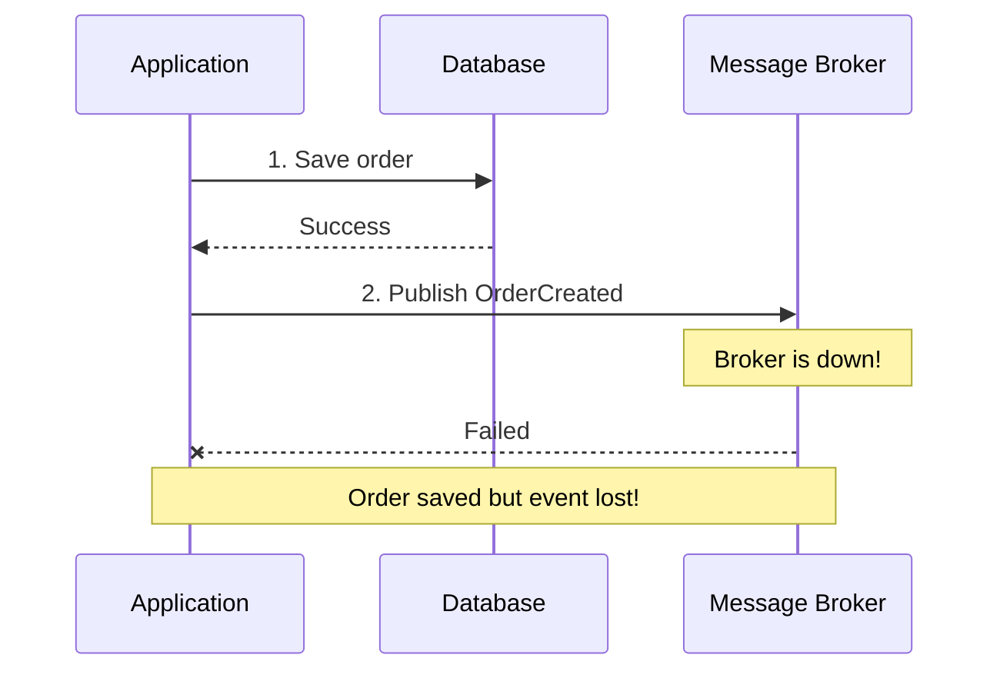
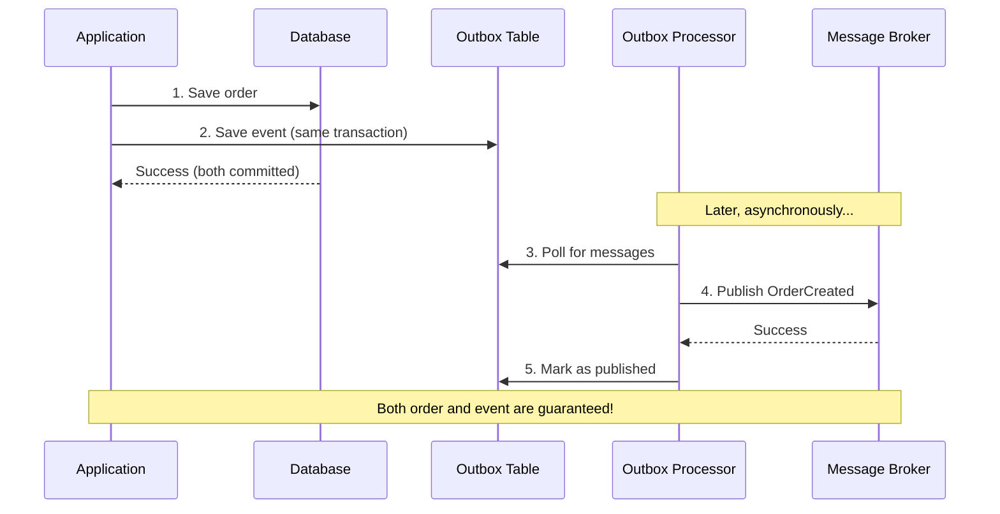
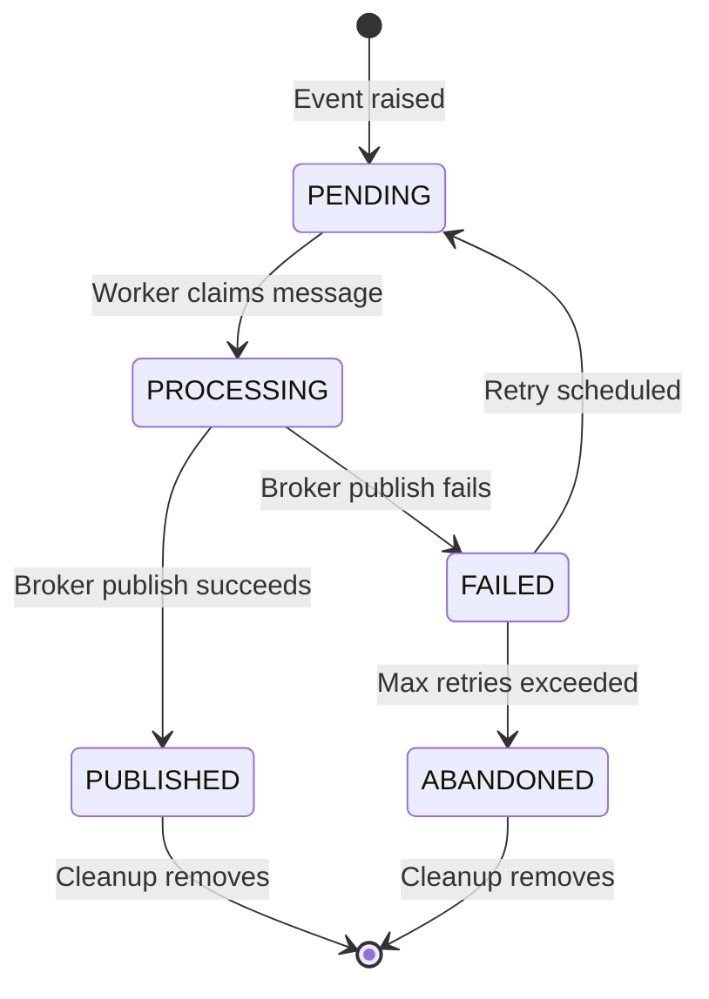

# Outbox Pattern

The outbox pattern ensures reliable message delivery by storing messages in the
same database transaction as your business data, then publishing them to the
message broker in a separate process. This guarantees that messages are never
lost, even if the broker is temporarily unavailable.

## Why Use the Outbox Pattern?

Without the outbox pattern, there's a risk of data inconsistency:



With the outbox pattern:



## How It Works

### 1. Event Storage

When you save an aggregate that raises events, Protean stores the events in the
outbox table within the same transaction:

```python
with domain.domain_context():
    order = Order.create(customer_id="123", items=[...])
    # Order raises OrderCreated event internally

    domain.repository_for(Order).add(order)
    # Transaction commits:
    # - Order saved to orders table
    # - OrderCreated saved to outbox table
```

### 2. Outbox Processing

The `OutboxProcessor` runs as part of the Engine, polling the outbox table and
publishing messages to the configured broker:

```python
# Simplified flow
messages = outbox_repo.find_unprocessed(limit=10)

for message in messages:
    message.start_processing(worker_id)
    broker.publish(message.stream_name, message.data)
    message.mark_published()
```

### 3. Message Consumption

StreamSubscription consumers read from the broker stream:

```python
@domain.event_handler(part_of=Inventory, stream_category="order")
class InventoryEventHandler:
    @handle(OrderCreated)
    def reserve_stock(self, event):
        # Process the event
        ...
```

## Configuration

### Enabling the Outbox

The outbox is automatically enabled when you set the subscription type to
`"stream"`.  This is the **recommended** way to enable the outbox:

```toml
# domain.toml
[server]
default_subscription_type = "stream"   # Enables outbox automatically

[outbox]
broker = "default"         # Which broker to publish to
messages_per_tick = 10     # Messages processed per cycle
tick_interval = 1          # Seconds between cycles

# Retry configuration
[outbox.retry]
max_attempts = 3           # Maximum retry attempts
base_delay_seconds = 60    # Initial retry delay
max_backoff_seconds = 3600 # Maximum retry delay (1 hour)
backoff_multiplier = 2     # Exponential backoff multiplier
jitter = true              # Add randomization to delays
jitter_factor = 0.25       # ±25% randomization

# Cleanup configuration
[outbox.cleanup]
published_retention_hours = 168   # Keep published messages for 7 days
abandoned_retention_hours = 720   # Keep abandoned messages for 30 days
cleanup_interval_ticks = 86400    # Cleanup every 86400 ticks
```

!!! note "Backward Compatibility"
    The legacy `enable_outbox = true` flag still works and will activate the
    outbox regardless of subscription type.  However, setting
    `enable_outbox = true` with `default_subscription_type = "event_store"`
    is a configuration error (the outbox publishes to Redis Streams, but
    event-store subscriptions never read from them).

### Setting Up the Outbox Table

Before starting the server with outbox enabled, create the outbox database
table:

```bash
# Create all tables (aggregates, entities, projections, outbox)
protean db setup --domain my_domain

# Or create only the outbox table (useful when migrating)
protean db setup-outbox --domain my_domain
```

### Broker Configuration

Ensure you have a broker configured for the outbox:

```toml
[brokers.default]
provider = "redis"
URI = "redis://localhost:6379/0"
```

### Multiple Database Providers

If your domain uses multiple database providers, Protean creates an outbox
processor for each one:

```toml
[databases.default]
provider = "postgresql"
database_uri = "postgresql://localhost/main"

[databases.analytics]
provider = "postgresql"
database_uri = "postgresql://localhost/analytics"

# Creates two outbox processors:
# - outbox-processor-default-to-default
# - outbox-processor-analytics-to-default
```

## Outbox Message Lifecycle

Messages in the outbox go through several states:



### Message States

| State | Description |
|-------|-------------|
| `PENDING` | Message waiting to be processed |
| `PROCESSING` | Message claimed by a worker |
| `PUBLISHED` | Successfully published to broker |
| `FAILED` | Publishing failed, may be retried |
| `ABANDONED` | Max retries exceeded, given up |

## Retry Mechanism

Failed messages are automatically retried with exponential backoff:

```
Attempt 1: Immediate
Attempt 2: 60 seconds later (base_delay)
Attempt 3: 120 seconds later (base_delay * 2)
Attempt 4: 240 seconds later (base_delay * 4)
... up to max_backoff_seconds
```

With jitter enabled (default), delays are randomized by ±25% to prevent
thundering herd problems.

### Retry Configuration

```toml
[outbox.retry]
max_attempts = 3           # Give up after 3 attempts
base_delay_seconds = 60    # Start with 1 minute delay
max_backoff_seconds = 3600 # Cap at 1 hour
backoff_multiplier = 2     # Double delay each attempt
jitter = true              # Add randomization
jitter_factor = 0.25       # ±25%
```

## Message Cleanup

Old messages are automatically cleaned up based on retention settings:

```toml
[outbox.cleanup]
published_retention_hours = 168   # Remove published after 7 days
abandoned_retention_hours = 720   # Remove abandoned after 30 days
cleanup_interval_ticks = 86400    # Run cleanup daily (approx)
```

Cleanup removes:

- **Published messages**: Successfully delivered, kept for audit trail
- **Abandoned messages**: Failed after max retries

## Multi-Worker Support

When running with `--workers N` (see [Multi-Worker Mode](../../reference/server/supervisor.md)), each
worker runs its own `OutboxProcessor`. Messages are claimed atomically at the
database level to prevent duplicate publishing.

### Database-Level Locking

The processor uses an atomic `UPDATE...WHERE` to claim messages. Under READ
COMMITTED isolation (PostgreSQL, MSSQL), concurrent updates on the same row
block until the first transaction commits, then re-evaluate the WHERE clause --
so only one worker succeeds:

```python
# Simplified view of claim_for_processing():
claimed_count = dao.query.filter(
    id=message.id,
    status__in=["pending", "failed"],   # Only eligible messages
).update_all(
    status="processing",
    locked_by=worker_id,
    locked_until=now + timedelta(minutes=5),
)
# claimed_count > 0 only for the winning worker
```

This prevents the TOCTOU (Time-Of-Check-Time-Of-Use) race condition where two
workers could both read a message as `PENDING` and both attempt to publish it.

### Lock Fields

Each outbox message carries lock metadata:

| Field | Description |
|-------|-------------|
| `locked_by` | Worker identifier that holds the lock |
| `locked_until` | When the lock expires (default 5 minutes) |
| `status` | Current processing state (`PROCESSING` while locked) |

### Lock Lifecycle

1. Worker fetches a batch of `PENDING` messages.
2. For each message, the worker calls `claim_for_processing()` -- an atomic
   database operation that sets the status to `PROCESSING` and records the
   worker ID and lock expiry.
3. If the claim succeeds, the worker publishes the message to the broker and
   marks it as `PUBLISHED`. If publishing fails, the message is marked as
   `FAILED` for retry.
4. If the claim fails (another worker already claimed it), the worker skips
   that message and moves on.
5. All operations happen within a `UnitOfWork`, so the claim, publish, and
   status update are atomic.

### Stale Lock Recovery

If a worker crashes while holding a lock, the lock expires after the configured
duration (default 5 minutes). The message remains in `PROCESSING` status with
an expired `locked_until` timestamp. Another worker detects the expired lock
and the message becomes eligible for reprocessing.

## Monitoring

The outbox processor logs important events:

```
DEBUG: Found 10 messages to process
DEBUG: Published to orders: abc12345...
DEBUG: Outbox batch: 10/10 processed
INFO:  Outbox cleanup: removed 100 messages (95 published, 5 abandoned)
```

### Key Metrics to Monitor

| Metric | Description | Action if High |
|--------|-------------|----------------|
| Pending messages | Messages waiting to be processed | Increase workers or throughput |
| Failed messages | Messages that failed publishing | Check broker connectivity |
| Retry rate | Messages being retried | Investigate root cause |
| Processing time | Time to process a batch | Tune batch size |

## Best Practices

### 1. Size Your Batches Appropriately

```toml
[outbox]
messages_per_tick = 100  # Larger batches for high throughput
tick_interval = 0        # No delay between batches
```

### 2. Configure Retries Conservatively

```toml
[outbox.retry]
max_attempts = 5         # More attempts for critical messages
base_delay_seconds = 30  # Start with shorter delays
```

### 3. Monitor Abandoned Messages

Set up alerts for abandoned messages - they indicate persistent problems:

```python
# Query for abandoned messages
abandoned = outbox_repo.find_by_status(OutboxStatus.ABANDONED)
if abandoned:
    alert("Outbox has abandoned messages!")
```

### 4. Use Appropriate Retention

Balance audit requirements with storage costs:

```toml
[outbox.cleanup]
published_retention_hours = 24    # Keep 1 day for debugging
abandoned_retention_hours = 168   # Keep 7 days for investigation
```

## Next Steps

- [Subscription Types](../../reference/server/subscription-types.md) - How StreamSubscription consumes
  outbox messages
- [Configuration](../../reference/server/configuration.md) - Full configuration reference
- [Running the Server](../../guides/server/index.md) - Starting the server with outbox processing
