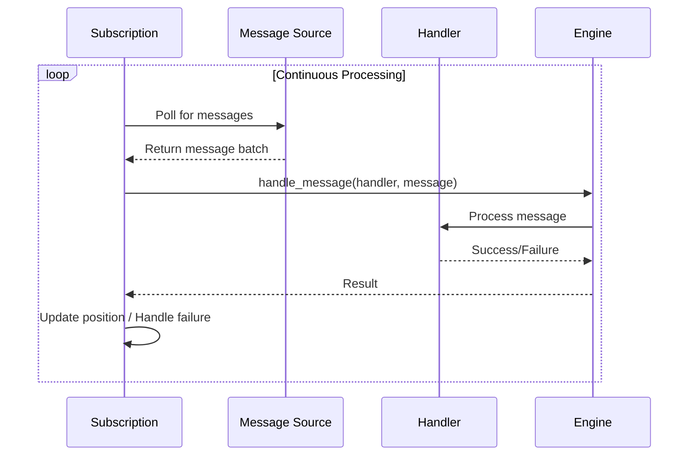

# Subscriptions

Subscriptions are the mechanism that connects handlers to message sources. They
manage the flow of messages from event stores and message brokers to your
handlers, tracking position, handling errors, and ensuring reliable delivery.

## What is a Subscription?

A subscription is a long-running process that:

1. **Polls for messages** from a message source (event store or broker stream)
2. **Delivers messages** to the appropriate handler
3. **Tracks position** to resume from where it left off
4. **Handles failures** with retries and error callbacks



## Types of Subscriptions

Protean provides two types of subscriptions:

### Handler Subscriptions

Handler subscriptions connect **event handlers**, **command handlers**, and
**projectors** to message sources. They can use either:

- **StreamSubscription**: For production workloads using Redis Streams
- **EventStoreSubscription**: For reading directly from the event store

The `SubscriptionFactory` automatically selects the appropriate type based on
configuration.

### Broker Subscriptions

Broker subscriptions connect **subscribers** to external message brokers. They
are used for consuming messages from systems outside your domain:

```python
@domain.subscriber(broker="default", stream="external_orders")
class ExternalOrderSubscriber:
    @handle("OrderReceived")
    def handle_order_received(self, event):
        # Process external order
        ...
```

## Stream Categories {#stream-categories}

Subscriptions connect handlers to **[stream categories](./stream-categories.md)**, which are logical groupings of related messages (events and commands). Stream categories determine how messages are organized and routed from message sources (event stores, brokers) to handlers.

### How Subscriptions Use Stream Categories

When you define a handler, it subscribes to a specific stream category:

```python
@domain.event_handler(part_of=Order)
class OrderEventHandler:
    # Subscribes to Order's stream category ("order")
    ...
```

The engine creates a subscription that:

1. Polls the stream category for new messages
2. Delivers messages to the handler
3. Tracks the handler's position in the stream
4. Handles errors and retries

### Default Stream Category Subscription

Handlers automatically subscribe to their associated aggregate's stream category:

```python
@domain.aggregate
class Order:
    ...  # Stream category: "order"

@domain.event_handler(part_of=Order)
class OrderEventHandler:
    # Automatically subscribes to "order" stream category
    ...
```

### Custom Stream Category Subscription

Handlers can subscribe to a different stream category:

```python
@domain.event_handler(part_of=Order, stream_category="all_orders")
class OrderReportHandler:
    # Subscribes to "all_orders" instead of Order's default
    ...
```

### Cross-Aggregate Subscriptions

Handlers can be part of one aggregate but subscribe to another aggregate's stream category for cross-aggregate coordination:

```python
@domain.event_handler(part_of=Inventory, stream_category="order")
class InventoryEventHandler:
    """Updates inventory based on order events."""

    @handle(OrderShipped)
    def reduce_stock(self, event):
        # React to Order events while being part of Inventory
        ...
```

For comprehensive details on stream categories, including message organization, routing patterns, event sourcing, and best practices, see the [Stream Categories](./stream-categories.md) guide.

## Subscription Lifecycle

### Initialization

When a subscription starts, it performs type-specific initialization:

- **StreamSubscription**: Ensures consumer group exists in Redis
- **EventStoreSubscription**: Loads last processed position from event store

### Polling Loop

Subscriptions run a continuous polling loop:

```python
async def poll(self):
    while self.keep_going and not self.engine.shutting_down:
        # Get next batch of messages
        messages = await self.get_next_batch_of_messages()

        if messages:
            # Process the batch
            await self.process_batch(messages)

        # Sleep between ticks (if configured)
        await asyncio.sleep(self.tick_interval)
```

### Message Processing

For each message in a batch:

1. Deserialize the message
2. Call `engine.handle_message(handler, message)`
3. On success: Acknowledge the message, update position
4. On failure: Retry or move to dead letter queue

### Shutdown

During shutdown, subscriptions:

1. Stop accepting new messages
2. Complete processing of current batch
3. Persist final position
4. Clean up resources

## Position Tracking

Subscriptions track their position to ensure messages are not reprocessed after
restarts.

### EventStoreSubscription Position

EventStoreSubscription stores position in the event store itself:

```python
# Position stream name
f"position-{subscriber_name}-{stream_category}"

# Position is stored as a message
{
    "data": {"position": 42},
    "metadata": {"type": "Read", ...}
}
```

Position is updated periodically based on `position_update_interval`.

### StreamSubscription Position

StreamSubscription uses Redis Streams' built-in consumer group tracking:

- Messages are acknowledged after successful processing
- Pending messages are tracked automatically
- Failed messages can be retried or moved to DLQ

## Error Handling

Subscriptions handle errors at multiple levels:

### Handler Errors

When a handler raises an exception:

1. The exception is logged with full context
2. The handler's `handle_error` method is called (if defined)
3. The subscription continues processing

### Subscription Errors

For transient errors (network issues, etc.):

- Exponential backoff between retries
- Configurable maximum retries
- Dead letter queue for persistent failures (StreamSubscription only)

### Fatal Errors

For unrecoverable errors:

- The engine's exception handler is triggered
- Graceful shutdown is initiated
- Exit code indicates failure


## Next Steps

- [Subscription Types](../../reference/server/subscription-types.md) - Deep dive into StreamSubscription
  vs EventStoreSubscription
- [Configuration](../../reference/server/configuration.md) - Configure subscriptions with profiles and
  options
