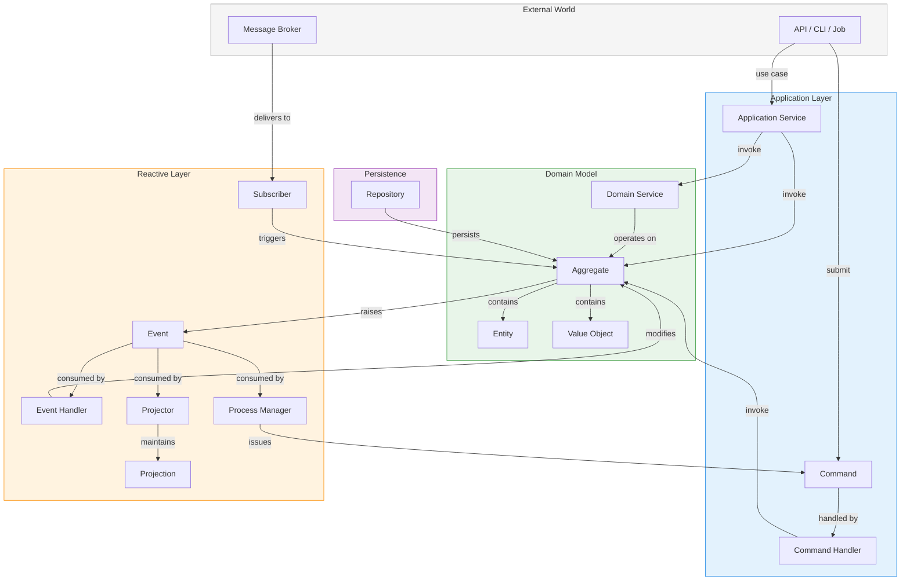

# Building Blocks

Building blocks are the tactical patterns of Domain-Driven Design — the
concrete elements you use to model, enforce, and evolve business logic in
code. Protean provides a decorator-driven element for each pattern, so you
can focus on domain semantics rather than infrastructure plumbing.

The elements are organized into four layers, each with a distinct
responsibility.

## Domain Model

The domain model is the heart of the system. It captures the essential
complexity of the business in code — the concepts, rules, and relationships
that give the software its reason to exist.

| Element | Purpose |
|---------|---------|
| [Aggregate](./aggregates.md) | Root entity and transaction boundary for a cluster of objects |
| [Entity](./entities.md) | Object with unique identity, always accessed through its aggregate |
| [Value Object](./value-objects.md) | Immutable, identity-less object defined entirely by its attributes |
| [Domain Service](./domain-services.md) | Stateless operation that spans multiple aggregates |

## Application Layer

The application layer sits between the external world and the domain model.
It translates intentions into domain operations without containing business
logic itself.

| Element | Purpose |
|---------|---------|
| [Application Service](./application-services.md) | Coordinates a use-case by orchestrating aggregates and domain services |
| [Command](./commands.md) | Immutable DTO expressing an intent to change state |
| [Command Handler](./command-handlers.md) | Receives a command, loads the aggregate, invokes domain logic, and persists |

## Reactive Layer

The reactive layer responds to things that have already happened. It
propagates state changes, maintains read models, and bridges to external
systems — all without coupling back to the code that produced the original
change.

| Element | Purpose |
|---------|---------|
| [Event](./events.md) | Immutable fact recording a state change in the domain |
| [Event Handler](./event-handlers.md) | Reacts to domain events with side effects and cross-aggregate coordination |
| [Process Manager](./process-managers.md) | Stateful coordinator for multi-step processes spanning multiple aggregates |
| [Projection](./projections.md) | Read-optimized, denormalized view of domain data |
| [Projector](./projectors.md) | Specialized handler that keeps a projection in sync with domain events |
| [Subscriber](./subscribers.md) | Consumes messages from an external message broker |

## Persistence

Persistence elements decouple the domain model from storage technology,
so aggregates remain ignorant of how and where they are stored.

| Element | Purpose |
|---------|---------|
| [Repository](./repositories.md) | Collection-oriented interface to persist and retrieve aggregates |
