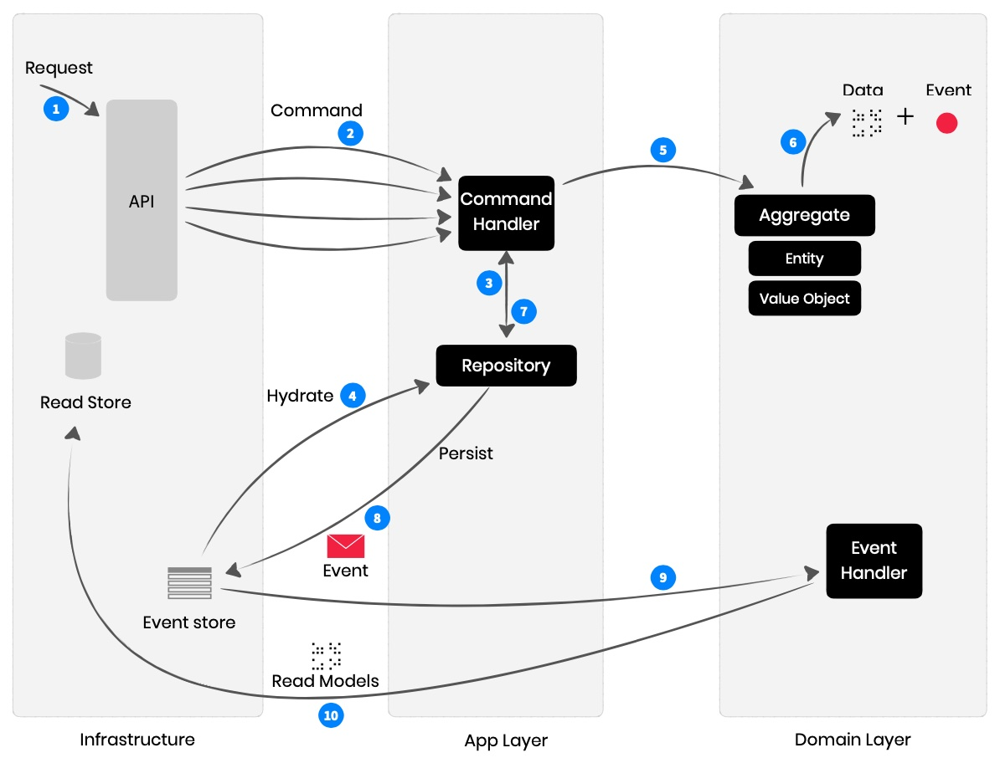

# Event Sourcing

Event Sourcing is a pattern where the state of a system is derived by replaying
a sequence of events, allowing complete reconstruction and auditing of past
states.

# Elements

| Element | Layer | Purpose  |
| ------- | ----- | -------  |
| Application Service | Application | Orchestrates business operations by coordinating between the domain logic and infrastructure components. |
| Commands | Application | Imperative messages that request a specific action or change in the system, typically altering the state of the application or domain. |
| Command Handlers | Application | Components responsible for executing the business logic associated with a specific command, processing the command to perform the required action or state change. |
| Aggregates | Domain | A cluster of domain entities that are treated as a single unit, ensuring consistency and encapsulating business logic. |
| Events | Domain | A record of a significant change in state or behavior within the domain, which can trigger subsequent processing. |
| Event Handlers | Domain | A component that listens for specific events and executes business logic in response to those events. |
| Repository | Application | A data access layer that provides an abstraction for retrieving and persisting domain objects, ensuring that domain logic remains isolated from data storage concerns. |
| Event Store | Infrastructure | A specialized storage system that captures and persists all domain events, allowing the reconstruction of aggregate states and enabling event sourcing patterns. |

## Workflow

This workflow emphasizes the Event Sourcing pattern, where each state change
is captured as an event, enabling complete traceability and the ability to
reconstruct the state of the system at any point in time.

1. **Request**: A client request is made to the system, which is received by the API layer.
2. **Command**: The API layer converts the request into a Command, which encapsulates the action that should be performed, and passes it to the Command Handler.
3. **Command Handler**: The Command Handler processes the Command, interacting with the Repository to retrieve the relevant Aggregate.
4. **Hydrate**: The Repository hydrates the Aggregate by reconstructing its state from past events stored in the Event Store.
5. **Aggregate**: The Command Handler invokes the appropriate method on the Aggregate to perform the required business operation.
6. **Output**: The Aggregate processes the command, which results in a state change. Instead of directly updating the state in a persistence store, the Aggregate generates an Event that describes the change.
7. **Repository**: The generated Event is passed back to the Repository, which is responsible for persisting the Event.
8. **Event Store**: The Repository saves the Event in the Event Store, ensuring that all changes in the domain are captured as a series of events.
9. **Event Handler**: The Event is then processed by an Event Handler, which reacts to the event by performing additional business logic or updating projections.
10. **Read Models**: The Event Handler updates the Read Store with new or modified Read Models that are optimized for query operations, ensuring that the latest state can be efficiently retrieved for future read requests.