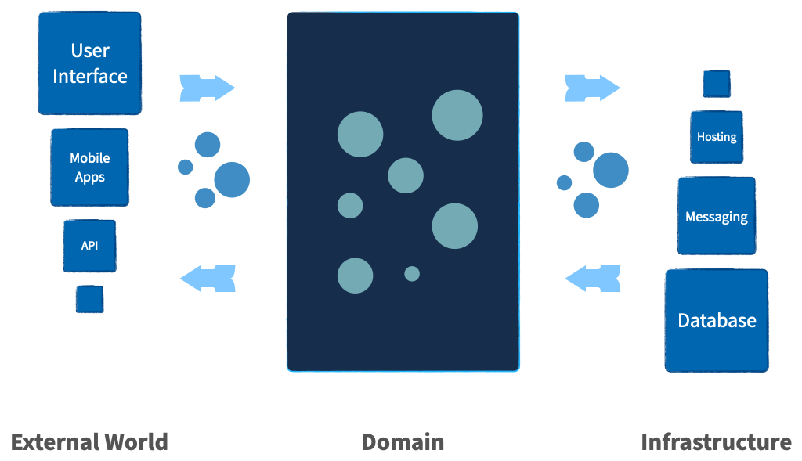

# Features

## Managing Complexity

Managing complexity is essential to creating maintainable and scalable
applications. Protean is designed to tackle this challenge head-on by
providing a robust framework that organizes and simplifies complex systems.

Protean promotes a technology-agnostic domain model, ensuring that the core
business logic remains free from technological dependencies. This clear
separation allows developers to focus on solving business problems without
being encumbered by the intricacies of the underlying technology stack.

The framework encourages organizing code into distinct contexts, aligning with
DDD principles. By defining clear boundaries for each
subdomain and bounded context, Protean reduces the interdependencies and tight
coupling that often plague complex systems. This modular approach enhances the
maintainability and adaptability of the application.

Protean's architecture fosters loose coupling between components and domains,
enabling each part of the system to evolve independently. This decoupling not
only simplifies development but also enhances the flexibility and scalability
of the application, making it easier to accommodate future changes and
requirements.

Moreover, Protean emphasizes the importance of testable code. By isolating the
domain logic from technology, the framework ensures that the business rules can
be thoroughly tested in isolation. This high degree of testability leads to
more reliable and robust applications, as developers can validate the
correctness of the domain model without interference from external systems.

With Protean, managing complexity becomes a structured and systematic process.
The framework's design principles and architectural patterns empower
development teams to build sophisticated applications that are both resilient
and easy to maintain.

## Built for Growth

Adaptability and scalability are crucial for long-term success in the fast-paced
world of startups and evolving applications. Protean is specifically designed
to support and accelerate growth, making it an ideal choice for dynamic and
ambitious projects. By providing tools and patterns to manage complexity and
support rapid evolution, Protean helps your application grow alongside your
business ambitions.

Leveraging a technology-agnostic domain model and clear separation of concerns,
Protean ensures that core business logic remains robust and adaptable,
regardless of infrastructure changes. Thorough testing of domain logic in
isolation from infrastructure components allows for confident deployment of new
features and updates.

Protean emphasizes loose coupling between components and domains, reducing
dependencies and simplifying changes without disrupting the entire system.
This decoupling enhances application resilience, enabling it to handle
increased complexity and scale efficiently.

The framework's modular design facilitates easy scaling and integration of new
features. As your application evolves, Protean supports seamless refactoring
and extension, allowing your system to grow organically with your business
needs. This adaptability is crucial for startups, where the ability to pivot
and innovate quickly can make all the difference.

## Rapid Prototyping

The first iteration of a model is rarely perfect. Effective models often
emerge from the process of exploring a problem from multiple perspectives and
iterating on initial ideas. Rapid prototyping is essential for refining models,
validating assumptions, and achieving robust designs.

Protean is designed with rapid prototyping in mind, enabling developers to
construct and evaluate models quickly. By providing pre-packaged in-memory
stubs, Protean allows you to focus solely on the domain logic without being
bogged down by the complexities of the underlying technology.
This means you can iterate swiftly, throwing away your first model and
even your second, to discover the best solution through continuous refinement.

The ability to rapidly prototype with Protean accelerates the development
process, allowing for immediate feedback and adjustments.

## Technology Independence

{width="600"}

Applications need to work with technologies and infrastructure components to
be useful. However, the technologies in use often start dictating how the
application should work. Technology concerns creep into business logic, and
before long, we have introduced unwanted complexity into the application.

Protean addresses this issue by clearly separating the domain
model and technology. This isolation of the domain layer from the technology
stack prevents the introduction of accidental complexity into the business
logic.

By embracing the ports and adapters architecture, Protean
ensures that the core business logic remains agnostic to technological
specifics. This architectural choice means that integrating different
technologies is simply a matter of configuration, not a redesign of the
application’s core.

## Event-centric Communication

As software systems become complex, the decoupling of subdomains becomes
essential for maintaining flexibility and scalability.
Tight coupling between different bounded contexts can lead to increased
dependencies, making the system more fragile and more challenging to maintain.
Event-centric communication is a powerful pattern that addresses these
challenges by promoting loose coupling and enhancing the modularity of the
application.

Protean leverages events as the primary mechanism for both state transfer and
storage (if using the EventSourcing pattern), facilitating seamless communication
between different parts of the system. By adopting an event-centric approach,
Protean ensures that subdomains remain decoupled, reducing dependencies and
allowing each bounded context to evolve independently. Events encapsulate
state changes, which are then propagated across the system, ensuring that
all relevant components are updated accordingly.

This decoupling through events not only simplifies the system architecture but
also enhances its resilience and scalability.

## Multi-domain codebase

In the initial stages of software development, it is uncommon to clearly
understand all the domains and their boundaries. Premature decisions
regarding these boundaries are often provisional and can even be detrimental as
the project progresses. As the system matures and the development team gains
deeper insights into the domain, subdomains, and bounded contexts naturally
emerge.

Protean is designed to accommodate this evolutionary process, allowing
developers to easily refactor and extract subdomains from a larger domain.
This flexibility ensures that the architecture remains aligned with the
evolving business requirements and domain knowledge. The high degree of
testability within Protean ensures that these refactoring efforts can be
performed safely and confidently, without introducing regressions or
instability into the system.

By supporting a multi-domain codebase, Protean empowers teams to iteratively
refine and adapt their domain boundaries. This adaptive approach not only
enhances the maintainability of the codebase but also ensures that the system
remains resilient and scalable as it evolves.

## Ports and Adapters

Protean embraces the Ports and Adapters architecture, also known as Hexagonal
architecture, to create a flexible and maintainable application structure.
This architectural pattern separates the core business logic (the domain) from
the external systems and technologies it interacts with, promoting a clean and
decoupled design.

Protean comes pre-packaged with a wide array of adapters for various ports,
including databases, message brokers, caches, and event stores. These built-in
adapters enable seamless integration with common technologies, allowing
developers to focus on the domain logic without being burdened by the
complexities of interfacing with different systems.

Moreover, Protean's architecture is designed to be extensible. Developers can
easily create and plug in new adapters for additional ports as needed.
This extensibility empowers teams to integrate with any external system without
altering the core business logic, maintaining the integrity and modularity
of the application.

## Testability

The ability to thoroughly test an application is crucial for ensuring
reliability and maintainability. Protean is designed with testability at its
core, allowing for comprehensive testing of the domain logic while keeping it
isolated from technological concerns.

By isolating the domain from technology, Protean enables developers to
achieve 100% test coverage. This separation ensures that the business logic can
be tested independently of the underlying infrastructure, leading to more
straightforward and thorough testing processes. Developers can focus on
validating the correctness of the domain model without being distracted by the
complexities of external systems.

Protean also makes isolating test cases requiring specific infrastructure
components easy. This means that tests can be written to verify
interactions with databases, message brokers, and other technologies in a
controlled and predictable manner.
