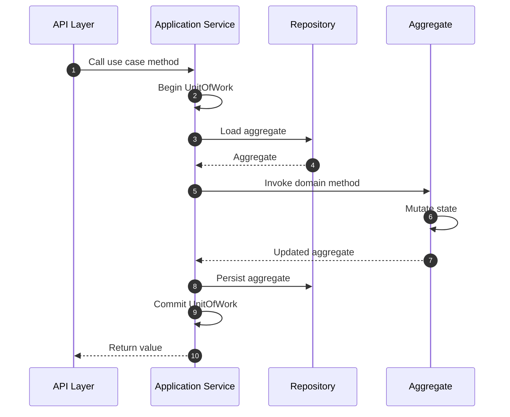

# Application Services

!!! abstract "Applies to: DDD"


Application services act as a bridge between the external API layer and the
domain model, orchestrating business logic and use cases without exposing the
underlying domain complexity. They encapsulate and coordinate operations,
making them reusable and easier to manage, ensuring that all interactions with
the domain are consistent and controlled.

## Key Facts

- Application Services encapsulate business use cases and serve as the main
entry point for external requests to interact with the domain model.
- Application Services are predominantly used on the write side of the
application. If you want to use them on the read side as well, it is
recommended to create a separate application service for the read side.
- Application Services are stateless and should not hold any business logic
themselves; instead, they orchestrate and manage the flow of data and
operations to and from the domain model.
- Application Services ensure transaction consistency by automatically
enclosing all use case methods within a unit of work context.
- Application Services can interact with multiple aggregates and repositories,
but should only persist one aggregate, relying on events for eventual
consistency.

## Defining an Application Service

Application Services are defined with the `Domain.application_service`
decorator:

```python hl_lines="32 34 41"
{! docs_src/guides/change_state_008.py !}
```

1. The `@auth.application_service(part_of=User)` decorator registers the class
as an Application Service associated with the `User` aggregate. The `part_of`
option is mandatory — every Application Service must be linked to exactly one
aggregate.

2. The `@use_case` decorator on `register_user` marks the method as a use case
entry point. It automatically wraps the method body in a `UnitOfWork` context,
providing transaction management.

3. The `@use_case` decorator on `activate_user` follows the same pattern. Each
use case method represents a distinct business operation, receives plain Python
arguments, and can return values directly to the caller.

Unlike command handlers (which are dispatched via `domain.process()`),
application services are instantiated and called directly:

```python
user_service = UserApplicationServices()
user_id = user_service.register_user(email="john@example.com", name="John Doe")
user_service.activate_user(user_id=user_id)
```

This makes them ideal for synchronous request-response workflows where the
caller needs an immediate result.

## The `@use_case` Decorator

The `@use_case` decorator is imported from `protean` and is the primary
mechanism for marking methods as use case entry points:

```python
from protean import use_case
```

It has two responsibilities:

1. **Unit of Work wrapping** — every method decorated with `@use_case` is
automatically enclosed in a `UnitOfWork` context. If the method completes
successfully, the UoW commits all pending changes. If an exception is raised,
the UoW rolls back all changes.

2. **Execution logging** — the decorator logs the invocation of each use case
at the INFO level, providing traceability for debugging and auditing.

```python
@domain.application_service(part_of=Order)
class OrderApplicationServices:
    @use_case
    def place_order(self, customer_id: str, items: list) -> Identifier:
        # Everything inside here runs within a UnitOfWork
        order = Order.create(customer_id=customer_id, items=items)
        current_domain.repository_for(Order).add(order)
        return order.id
```

!!!note
    Only methods decorated with `@use_case` are automatically wrapped in a
    Unit of Work. Regular methods on an Application Service class do not
    receive this treatment. You can add helper methods without the decorator,
    but they will not have automatic transaction management.

## Workflow



1. **API Layer Calls Use Case Method**: The external layer (e.g., a REST
controller, GraphQL resolver, or CLI handler) instantiates the Application
Service and calls the appropriate use case method with plain Python arguments.

1. **UnitOfWork Begins**: The `@use_case` decorator automatically opens a
`UnitOfWork` context before the method body executes.

1. **Application Service Loads Aggregate**: If the use case operates on an
existing aggregate, the service retrieves it from the repository using
`current_domain.repository_for(Aggregate).get(id)`.

1. **Aggregate Receives Method Call**: The application service invokes the
relevant domain method on the aggregate, passing the necessary parameters.

1. **Aggregate Mutates**: The aggregate applies business rules, validates
invariants, and changes its internal state. It may also raise domain events.

1. **Application Service Persists Aggregate**: The service persists the
mutated aggregate back to the repository using `repository.add()`.

1. **UnitOfWork Commits**: Upon successful completion of the method, the
`UnitOfWork` commits all pending changes to the persistence store and
publishes any raised domain events.

1. **Return Value Delivered**: The return value from the use case method is
passed directly back to the calling API layer, enabling immediate feedback
(e.g., a newly created entity ID).

## Return Values

Application Services execute synchronously and always return values directly
to the caller. This is one of their key advantages for request-response
workflows.

Common return value patterns:

```python
@domain.application_service(part_of=User)
class UserApplicationServices:
    @use_case
    def register_user(self, email: str, name: str) -> Identifier:
        user = User.register(email, name)
        current_domain.repository_for(User).add(user)
        return user.id  # Return the new entity's identifier

    @use_case
    def activate_user(self, user_id: Identifier) -> None:
        user = current_domain.repository_for(User).get(user_id)
        user.activate()
        current_domain.repository_for(User).add(user)
        # No return value needed for mutative operations

    @use_case
    def get_user(self, user_id: Identifier) -> User:
        return current_domain.repository_for(User).get(user_id)
```

This direct return capability distinguishes Application Services from both
Command Handlers (whose return values depend on sync/async processing mode)
and Event Handlers (which never return values). Application Services always
execute synchronously, so the caller always receives the return value
immediately.

## Unit of Work

Use case methods always execute within a `UnitOfWork` context by default. The
UnitOfWork pattern ensures that the series of changes to an aggregate cluster
are treated as a single, atomic transaction. If an error occurs, the
UnitOfWork rolls back all changes, ensuring no partial updates are applied.

Each use case method is wrapped in a `UnitOfWork` context, without having to
explicitly specify it. Both use case methods in `UserApplicationServices`
below are equivalent:

```python hl_lines="8"
from protean import UnitOfWork, use_case


@domain.application_service(part_of=User)
class UserApplicationServices:
    @use_case
    def register_user(self, email: str, name: str) -> Identifier:
        with UnitOfWork():
            ...  # code to register user

    @use_case
    def activate_user(self, user_id: Identifier) -> None:
        ...  # code to activate user
```

!!!note
    A `UnitOfWork` context applies to objects in the aggregate cluster,
    and not multiple aggregates. An Application Service method can load
    multiple aggregates to perform the business process, but should never
    persist more than one at a time. Other aggregates should be synced
    eventually through domain events.

## Error Handling

Application Services handle errors differently from Command and Event
Handlers. Because they execute synchronously with the caller always present,
there is no `handle_error` hook method. Instead, exceptions propagate
directly to the caller.

When an exception occurs inside a `@use_case` method, the `UnitOfWork`
context manager rolls back all uncommitted changes before re-raising the
exception. This ensures that no partial state is persisted, maintaining
data consistency.

```python
@domain.application_service(part_of=User)
class UserApplicationServices:
    @use_case
    def register_user(self, email: str, name: str) -> Identifier:
        user = User.register(email, name)
        current_domain.repository_for(User).add(user)
        return user.id


# In the API layer
try:
    user_service = UserApplicationServices()
    user_id = user_service.register_user(
        email="john@example.com", name="John Doe"
    )
except ValidationError as exc:
    # Handle validation errors (e.g., return 400 response)
    ...
except Exception as exc:
    # Handle unexpected errors (e.g., return 500 response)
    ...
```

**Best Practices:**

- Keep use case methods focused on orchestration so that domain-level errors
are raised by the aggregate, not the service.
- Let domain validation errors bubble up to the API layer for appropriate
HTTP status mapping.
- Use the API layer for cross-cutting concerns like logging failed operations,
not the application service itself.
