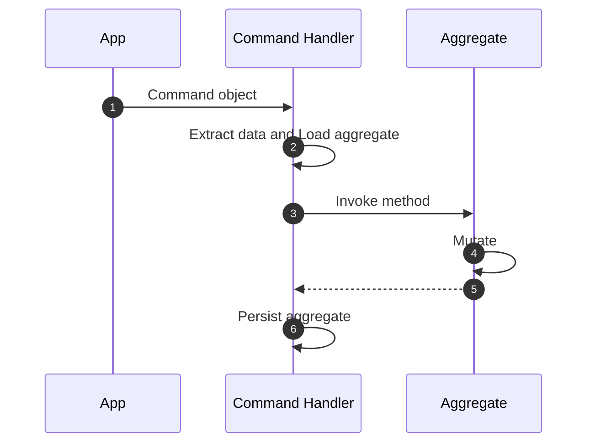

# Command Handlers

Command handlers are responsible for executing commands and persisting system
state. They typically interact with aggregate roots to perform the required
operations, ensuring that all business rules and invariants are upheld.

## Key Facts

- Command Handlers extract relevant data from a command and invoke the
appropriate aggregate method with the necessary parameters.
- Command Handlers are responsible for hydrating (loading) and persisting
aggregates.
- A Command Handler method can hydrate more than one aggregate at a time,
depending on the business process requirements, but it should always persist
one aggregate root. Other aggregates should be synced eventually through
domain events.

## Defining a Command Handler

Command Handlers are defined with the `Domain.command_handler` decorator:

```python hl_lines="20-23 47-53"
{! docs_src/guides/change_state_007.py !}
```

### Stream Category {#stream-category}

Command handlers automatically subscribe to commands in their associated aggregate's [stream category](../essentials/stream-categories.md). When a command is processed, it's routed to the appropriate handler based on the command's target aggregate and its stream category.

For example, if an `Order` aggregate has a stream category of `order`, its command handler will listen for commands on the `order` stream category. Commands are stored in streams following the pattern `<domain>::<stream_category>-<aggregate_id>`.

You can also configure a command handler to listen to a different stream category using the `stream_category` parameter:

```python
@domain.command_handler(part_of=Order, stream_category="customer_orders")
class OrderCommandHandler:
    # Subscribes to commands in the "customer_orders" stream category
    ...
```

This is useful for cross-aggregate coordination patterns or when you want multiple aggregates to share a command stream.

Learn more about stream categories and message routing in the [Stream Categories](../essentials/stream-categories.md) guide.

## Workflow



1. **Domain Sends Command Object to Command Handler**: The domain layer
initiates the process by sending a command object to the command handler.
This command object encapsulates the intent to perform a specific action or
operation within the domain.

1. **Command Handler Loads Aggregate**: Upon receiving the command object, the
command handler begins by loading the necessary aggregate from the repository
or data store. The aggregate is the key entity that will be acted upon based
on the command.

1. **Command Handler Extracts Data and Invokes Aggregate Method**: The command
handler extracts the relevant data from the command object and invokes the
appropriate method on the aggregate. This method call triggers the aggregate
to perform the specified operation.

1. **Aggregate Mutates**: Within the aggregate, the invoked method processes
the data and performs the necessary business logic, resulting in a change
(mutation) of the aggregate's state. This ensures that the operation adheres
to the business rules and maintains consistency.

1. **Aggregate Responds to Command Handler**: After mutating its state, the
aggregate completes its operation and returns control to the command handler.
The response may include confirmation of the successful operation or any
relevant data resulting from the mutation.

1. **Command Handler Persists Aggregate**: Finally, the command handler
persists the modified aggregate back to the repository or data store. This
ensures that the changes made to the aggregate's state are saved and reflected
in the system's state.

## Return Values from Command Handlers

Command handlers can optionally return values to the caller when processed synchronously. This behavior is determined by how the command is processed by the domain.

### Synchronous Processing

When commands are processed synchronously, the command handler's return value is passed back to the caller. This is useful for:

- Returning newly created resource identifiers
- Providing validation or processing results
- Returning calculated values or status information

To process a command synchronously and receive its return value:

```python
# Process command synchronously and get the return value
result = domain.process(command, asynchronous=False)
```

Example of a command handler that returns a value:

```python
@domain.command_handler(part_of=Account)
class AccountCommandHandler:
    @handle(RegisterCommand)
    def register(self, command: RegisterCommand):
        account = Account(
            email=command.email,
            name=command.name
        )
        self.repository_for(Account).add(account)
        
        # Return the account ID for immediate use
        return account.id
```

### Asynchronous Processing

When commands are processed asynchronously (the default behavior), the command handler's return value is not passed back to the caller. Instead, the domain's `process` method returns the position of the command in the event store:

```python
# Process command asynchronously (default)
position = domain.process(command)  # or domain.process(command, asynchronous=True)
```

In asynchronous processing, commands are handled in the background by the Protean Engine, and any return values from the command handler are ignored.

### Configuring Default Processing Behavior

The default command processing behavior can be configured in the domain's configuration:

```toml
# ...
command_processing = "sync"  # or "async"
# ...
```

When set to "sync", all commands will be processed synchronously by default unless explicitly specified as asynchronous, and vice versa.

## Idempotency in Handlers

When a command is submitted with an idempotency key (via
`domain.process(command, idempotency_key="...")`), the key is available in the
handler through the command's metadata:

```python
@domain.command_handler(part_of=Account)
class AccountCommandHandler:
    @handle(ChargeCard)
    def charge(self, command: ChargeCard):
        key = command._metadata.headers.idempotency_key

        # Pass through to external APIs that support idempotency
        stripe.PaymentIntent.create(
            amount=command.amount,
            currency="usd",
            idempotency_key=key,
        )
```

This is useful for:

- **Pass-through to external APIs**: Many services (Stripe, payment processors)
  accept idempotency keys natively. Passing the same key ensures end-to-end
  retry safety.
- **Handler-level deduplication**: For additive operations (incrementing
  counters, adding items), the handler can check the key against a set of
  previously processed keys stored on the aggregate.

For detailed patterns including natural idempotency, check-then-act, and
event-sourced aggregate strategies, see the
[Command Idempotency](../../patterns/command-idempotency.md) pattern guide.

## Unit of Work

Command handler methods always execute within a `UnitOfWork` context by
default. The UnitOfWork pattern ensures that the series of changes to an
aggregate cluster are treated as a single, atomic transaction. If an error
occurs, the UnitOfWork rolls back all changes, ensuring no partial updates
are applied.

Each command handler method is wrapped in a `UnitOfWork` context, without
having to explicitly specify it. Both handler methods in
`AccountCommandHandler` below are equivalent:

```python hl_lines="8"
from protean import handle, UnitOfWork


@domain.command_handler(part_of=Account)
class AccountCommandHandler:
    @handle(RegisterCommand)
    def register(self, command: RegisterCommand):
        with UnitOfWork():
            ...  # code to register account
    
    @handle(ActivateCommand)
    def activate(self, command: ActivateCommand):
        ...  # code to activate account
```

!!!note
    A `UnitOfWork` context applies to objects in the aggregate cluster,
    and not multiple aggregates. A Command Handler method can load multiple
    aggregates to perform the business process, but should never persist more
    than one at a time. Other aggregates should be synced eventually through
    domain events.

## Error Handling

Command handlers support custom error handling through the optional `handle_error` method. This method is called when an exception occurs during command processing, allowing you to implement specialized error handling strategies.

### The `handle_error` Method

You can define a `handle_error` class method in your command handler to handle exceptions:

```python
@domain.command_handler(part_of=Account)
class AccountCommandHandler:
    @handle(RegisterCommand)
    def register(self, command: RegisterCommand):
        # Command handling logic that might raise exceptions
        ...
    
    @classmethod
    def handle_error(cls, exc: Exception, message):
        """Custom error handling logic for command processing failures"""
        # Log the error
        logger.error(f"Failed to process command: {exc}")
        
        # Perform recovery operations
        # Example: notify monitoring systems, attempt retry, etc.
        ...
```

### How It Works

1. When an exception occurs in a command handler method, the Protean Engine catches it.
2. The engine logs detailed error information including stack traces.
3. The engine calls the command handler's `handle_error` method, passing:
   - The original exception that was raised
   - The command message being processed when the exception occurred
4. After `handle_error` returns, processing continues with the next command.

### Handling Errors in the Error Handler

If an exception occurs within the `handle_error` method itself, the Protean Engine will catch that exception too, log it, and continue processing. This ensures that even failures in error handling don't crash the system.

```python
@classmethod
def handle_error(cls, exc: Exception, message):
    try:
        # Potentially risky error handling logic
        ...
    except Exception as error_exc:
        # This secondary exception will be caught by the engine
        logger.error(f"Error in error handler: {error_exc}")
        # The engine will continue processing regardless
```

### Best Practices

1. Make error handlers robust and avoid complex logic that might fail.
2. Use error handlers for logging, notification, and simple recovery.
3. Don't throw exceptions from error handlers unless absolutely necessary.
4. Consider implementing retry logic for transient failures.
