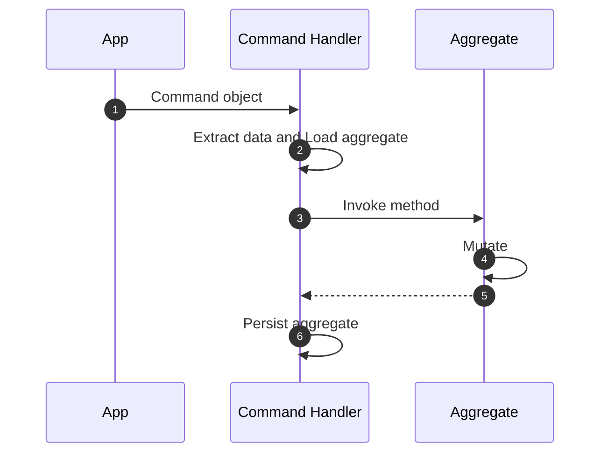

# Command Handlers

Command handlers are responsible for executing commands and persisting system
state. They typically interact with aggregate roots to perform the required
operations, ensuring that all business rules and invariants are upheld.

## Key Facts

- Command Handlers extract relevant data from a command and invoke the
appropriate aggregate method with the necessary parameters.
- Command Handlers are responsible for hydrating (loading) and persisting
aggregates.
- A Command Handler method can hydrate more than one aggregate at a time,
depending on the business process requirements, but it should always persist
one aggregate root. Other aggregates should be synced eventually through
domain events.

## Defining a Command Handler

Command Handlers are defined with the `Domain.command_handler` decorator:

```python hl_lines="20-23 47-53"
{! docs_src/guides/change_state_007.py !}
```

## Workflow



1. **Domain Sends Command Object to Command Handler**: The domain layer
initiates the process by sending a command object to the command handler.
This command object encapsulates the intent to perform a specific action or
operation within the domain.

1. **Command Handler Loads Aggregate**: Upon receiving the command object, the
command handler begins by loading the necessary aggregate from the repository
or data store. The aggregate is the key entity that will be acted upon based
on the command.

1. **Command Handler Extracts Data and Invokes Aggregate Method**: The command
handler extracts the relevant data from the command object and invokes the
appropriate method on the aggregate. This method call triggers the aggregate
to perform the specified operation.

1. **Aggregate Mutates**: Within the aggregate, the invoked method processes
the data and performs the necessary business logic, resulting in a change
(mutation) of the aggregate's state. This ensures that the operation adheres
to the business rules and maintains consistency.

1. **Aggregate Responds to Command Handler**: After mutating its state, the
aggregate completes its operation and returns control to the command handler.
The response may include confirmation of the successful operation or any
relevant data resulting from the mutation.

1. **Command Handler Persists Aggregate**: Finally, the command handler
persists the modified aggregate back to the repository or data store. This
ensures that the changes made to the aggregate's state are saved and reflected
in the system's state.

## Return Values from Command Handlers

Command handlers can optionally return values to the caller when processed synchronously. This behavior is determined by how the command is processed by the domain.

### Synchronous Processing

When commands are processed synchronously, the command handler's return value is passed back to the caller. This is useful for:

- Returning newly created resource identifiers
- Providing validation or processing results
- Returning calculated values or status information

To process a command synchronously and receive its return value:

```python
# Process command synchronously and get the return value
result = domain.process(command, asynchronous=False)
```

Example of a command handler that returns a value:

```python
@domain.command_handler(part_of=Account)
class AccountCommandHandler:
    @handle(RegisterCommand)
    def register(self, command: RegisterCommand):
        account = Account(
            email=command.email,
            name=command.name
        )
        self.repository_for(Account).add(account)
        
        # Return the account ID for immediate use
        return account.id
```

### Asynchronous Processing

When commands are processed asynchronously (the default behavior), the command handler's return value is not passed back to the caller. Instead, the domain's `process` method returns the position of the command in the event store:

```python
# Process command asynchronously (default)
position = domain.process(command)  # or domain.process(command, asynchronous=True)
```

In asynchronous processing, commands are handled in the background by the Protean Engine, and any return values from the command handler are ignored.

### Configuring Default Processing Behavior

The default command processing behavior can be configured in the domain's configuration:

```toml
# ...
command_processing = "sync"  # or "async"
# ...
```

When set to "sync", all commands will be processed synchronously by default unless explicitly specified as asynchronous, and vice versa.

## Unit of Work

Command handler methods always execute within a `UnitOfWork` context by
default. The UnitOfWork pattern ensures that the series of changes to an
aggregate cluster are treated as a single, atomic transaction. If an error
occurs, the UnitOfWork rolls back all changes, ensuring no partial updates
are applied.

Each command handler method is wrapped in a `UnitOfWork` context, without
having to explicitly specify it. Both handler methods in
`AccountCommandHandler` below are equivalent:

```python hl_lines="8"
from protean import handle, UnitOfWork


@domain.command_handler(part_of=Account)
class AccountCommandHandler:
    @handle(RegisterCommand)
    def register(self, command: RegisterCommand):
        with UnitOfWork():
            ...  # code to register account
    
    @handle(ActivateCommand)
    def activate(self, command: ActivateCommand):
        ...  # code to activate account
```

!!!note
    A `UnitOfWork` context applies to objects in the aggregate cluster,
    and not multiple aggregates. A Command Handler method can load multiple
    aggregates to perform the business process, but should never persist more
    than one at a time. Other aggregates should be synced eventually through
    domain events.