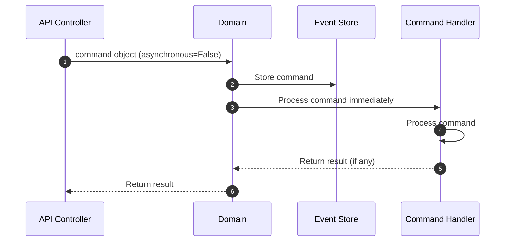
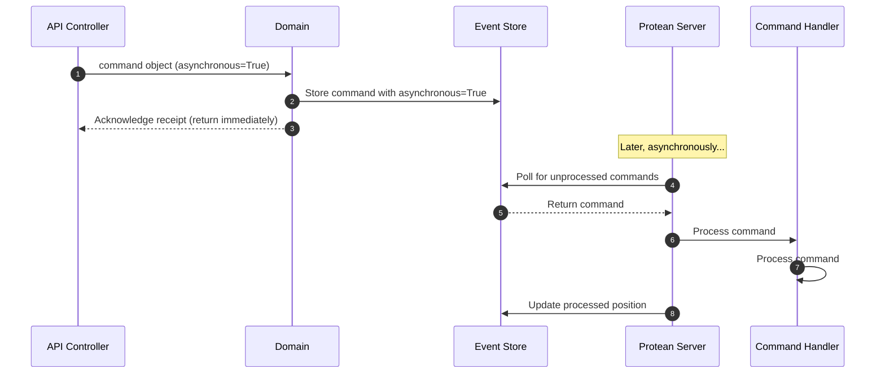

# Commands

Commands represent actions or operations that change the state of the system.
They encapsulate the intent to perform a specific task, often containing data necessary for the action, and are (typically) processed by command handlers to
ensure business rules and invariants are upheld.

In Protean, command objects are essentially DTOs (Data Transfer Objects) that
carry intent and information necessary to perform a specific action.

## Key Facts

- Commands are unique throughout the domain.
- Commands are typically named using imperative verbs that clearly describe the intended action or change. E.g. CreateOrder, UpdateCustomerAddress,
ShipProduct, and CancelReservation.
- Commands are typically related to an aggregate, because aggregates are the
entry point for all modifications, ensuring consistency and enforcing business
rules.
- When commands represent a domain concept that spans across aggregates, one
aggregate takes the responsibility of processing the command and raising events
to eventually make the rest of the system consistent.

## Defining Commands

A command is defined with the `Domain.command` decorator:

```python hl_lines="13-16"
{! docs_src/guides/change_state_006.py !}
```

A command is always associated with an aggregate class with the `part_of`
option, as seen in the example above.

## Submitting Commands

Since a Protean domain constructs and manages the object graph of all
domain elements, you don't need to identify the appropriate Command Handler
for your commands.

You can simply submit the command to the domain for processing with
`domain.process`.

```shell
In [1]: command = PublishArticle(article_id="1")

In [2]: publishing.process(command)
```

## Idempotency

In distributed systems, the same command can arrive more than once due to
network retries, broker redelivery, user double-clicks, or saga retries.
Protean provides built-in support for **command idempotency** -- ensuring that
processing the same command multiple times produces the same effect as
processing it once.

### Idempotency Keys

When submitting a command, you can provide an **idempotency key** -- a unique
token that identifies the specific request:

```python
domain.process(
    PlaceOrder(order_id="ord-42", items=items),
    idempotency_key="req-abc-123",
)
```

If the same idempotency key is submitted again, `domain.process()` returns the
cached result from the first processing without invoking the handler again.
This makes retries safe -- a client that re-sends a request due to a timeout
gets the same response regardless of whether the original succeeded.

The idempotency key is stored in the command's metadata headers, not in the
command payload. This keeps the command's domain data clean:

```python
# In a handler, the key is accessible via metadata
key = command._metadata.headers.idempotency_key
```

!!!note
    Idempotency keys are **caller-provided**, following the model established
    by Stripe and other well-designed APIs. Protean does not auto-derive keys
    from command data -- only the caller knows whether a submission is a retry
    or a new intent.

### Duplicate Behavior

By default, duplicate submissions are silently acknowledged -- the caller
receives the same result as the first submission. When explicit feedback is
needed, use `raise_on_duplicate=True`:

```python
from protean.exceptions import DuplicateCommandError

try:
    domain.process(
        PlaceOrder(order_id="ord-42", items=items),
        idempotency_key="req-abc-123",
        raise_on_duplicate=True,
    )
except DuplicateCommandError as exc:
    original_result = exc.original_result
```

### Requirements

Submission-level deduplication requires a Redis instance. Configure the
connection in `domain.toml`:

```toml
[idempotency]
redis_url = "redis://localhost:6379/5"
ttl = 86400       # Success entries: 24 hours (default)
error_ttl = 60    # Error entries: 60 seconds (default)
```

Without Redis configured, `domain.process()` works normally -- no
deduplication occurs, and no errors are raised.

For a comprehensive treatment of idempotency patterns, including
subscription-level deduplication and handler-level strategies, see the
[Command Idempotency](../../patterns/command-idempotency.md) pattern guide.

## Synchronous vs Asynchronous Processing

Commands in Protean can be processed either synchronously or asynchronously:

- **Synchronous processing**: The command is processed immediately by the command handler when `domain.process()` is called. The execution flow is blocked until the command is fully processed.
- **Asynchronous processing**: The command is stored in the event store and later processed by a background worker. The `domain.process()` call returns immediately without waiting for the command to be fully processed.

You can control the processing mode in two ways:

### 1. Using the `asynchronous` parameter

When submitting a command, you can explicitly specify whether it should be processed synchronously or asynchronously:

```python
# Process synchronously (default is based on domain configuration)
domain.process(command, asynchronous=False)

# Process asynchronously
domain.process(command, asynchronous=True)
```

### 2. Domain Configuration

You can set the default processing mode for all commands in the domain configuration:

In domain.toml:

```
command_processing = "sync"  # or "async"
```

In code:

```python
# Configure default command processing as synchronous
domain.config["command_processing"] = "sync"  # or "async"
```

By default, Protean sets `command_processing` to `async` in the domain configuration.

### When to use each mode

- **Synchronous processing** is useful when:
  - You need immediate feedback from the command execution
  - You want to ensure the command was processed successfully before continuing
  - The operation is part of a transaction that needs to be completed atomically

- **Asynchronous processing** is beneficial when:
  - You want to improve UI responsiveness by not blocking the execution flow
  - The command processing might take a long time
  - You want to distribute load across background workers
  - You're implementing CQRS with event sourcing patterns

### How Asynchronous Processing Works

Asynchronous commands processing in Protean uses a server/engine component that:

1. Creates subscriptions for command handlers to listen to their respective command streams
2. Polls the event store for new commands that haven't been processed yet
3. Dispatches those commands to the appropriate handlers

To run the Protean server for processing asynchronous commands, use the CLI:

```shell
protean server --domain path/to/domain.py
```

See [CLI documentation](../cli/index.md) for more details about the server command and other available CLI options.

The server continually polls the event store for new commands that have the `asynchronous` flag set to `True` in their metadata. When found, it dispatches them to the appropriate handlers, keeping track of processed commands to avoid duplicate processing.

## Workflow

Command objects are often instantiated by the API controller, which acts as the
entry point for external requests into the system. When a client makes a
request to the API, the controller receives this request and translates the
incoming data into the appropriate command object.

In Protean, the API controller submits the command to the `domain` object,
which then dispatches the command to the appropriate command handler. We will
explore how the domain identifies the command handler in the
[Command Handlers](./command-handlers.md) section.

The workflow differs slightly depending on whether synchronous or asynchronous processing is used:

### Synchronous Command Flow



### Asynchronous Command Flow



## Immutability

Like Events, Commands in Protean are immutable. This means that once a
command is created, it cannot be changed.

```shell hl_lines="8-14"
In [1]: from datetime import datetime, timedelta

In [2]: publish_article_command = PublishArticle(article_id="1")

In [3]: publish_article_command
Out[3]: <PublishArticle: PublishArticle object ({'article_id': '1', 'published_at': '2024-05-28 17:47:35.570857+00:00'})>

In [4]: publish_article_command.published_at = datetime.now() - timedelta(hours=24)
...
IncorrectUsageError: 'Command Objects are immutable and cannot be modified once created'
}
```

## Relationship with Event Processing

Protean offers similar configuration options for events through:
- The `event_processing` domain configuration setting 
- The ability to raise events with specific `asynchronous` flags

Events and commands in Protean follow the same processing patterns, enabling you to build consistent, predictable workflows. You can configure both to suit your specific domain needs:

```python
# Domain-wide configuration
domain.config["command_processing"] = "sync"  # or "async"
domain.config["event_processing"] = "async"   # or "sync"

# Per-instance control
domain.process(command, asynchronous=False)   # Override domain setting for a specific command
aggregate.raise_(event, asynchronous=True)    # Override domain setting for a specific event
```

This flexibility allows you to implement various architectural patterns like CQRS, Event Sourcing, and Workflow-driven architectures within your Protean applications.