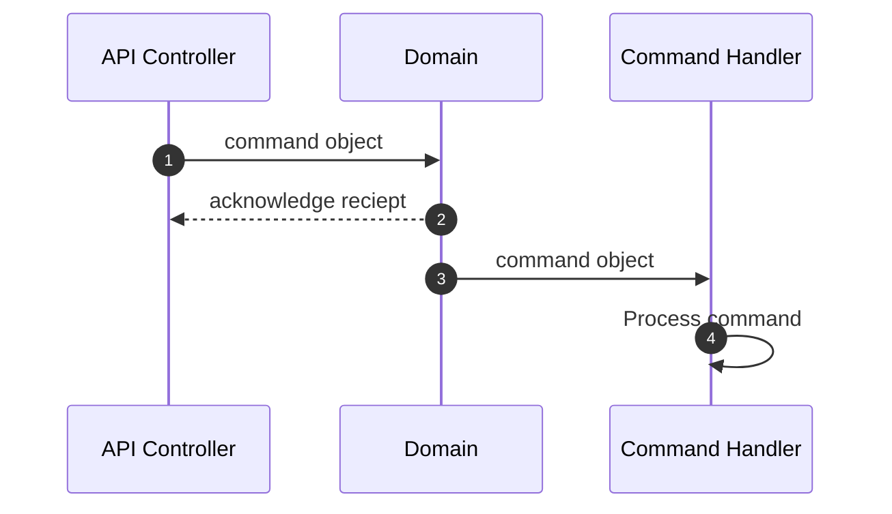

# Commands

Commands represent actions or operations that change the state of the system.
They encapsulate the intent to perform a specific task, often containing data necessary for the action, and are (typically) processed by command handlers to
ensure business rules and invariants are upheld.

In Protean, command objects are essentially DTOs (Data Transfer Objects) that
carry intent and information necessary to perform a specific action.

## Key Facts

- Commands are typically named using imperative verbs that clearly describe the intended action or change. E.g. CreateOrder, UpdateCustomerAddress,
ShipProduct, and CancelReservation.
- Commands are typically related to an aggregate, because aggregates are the
entry point for all modifications, ensuring consistency and enforcing business
rules.
- When commands represent a domain concept that spans across aggregates, one
aggregate takes the responsibility of processing the command and raising events
to eventually make the rest of the system consistent.

## Defining Commands

A command is defined with the `Domain.command` decorator:

```python hl_lines="13-16"
{! docs_src/guides/change-state/006.py !}
```

A command is always associated with an aggregate class with the `part_of`
option, as seen in the example above.

## Submitting Commands

Since a Protean domain constructs and manages the object graph of all
domain elements, you don't need to identify the appropriate Command Handler
for your commands.

You can simply submit the command to the domain for processing with
`domain.process`.

```shell
In [1]: command = PublishArticle(article_id="1")

In [2]: publishing.process(command)
```

## Workflow

Command objects are often instantiated by the API controller, which acts as the
entry point for external requests into the system. When a client makes a
request to the API, the controller receives this request and translates the
incoming data into the appropriate command object.

In Protean, the API controller submits the command to the `domain` object,
which then dispatches the command to the appropriate command handler. We will
explore how the domain identifies the command handler in the
[Command Handlers](./command-handlers.md) section.



## Immutability

Like Events, Commands in Protean are immutable. This means that once a
command is created, it cannot be changed.

```shell hl_lines="8-14"
In [1]: from datetime import datetime, timedelta

In [2]: publish_article_command = PublishArticle(article_id="1")

In [3]: publish_article_command
Out[3]: <PublishArticle: PublishArticle object ({'article_id': '1', 'published_at': '2024-05-28 17:47:35.570857+00:00'})>

In [4]: publish_article_command.published_at = datetime.now() - timedelta(hours=24)
...
IncorrectUsageError: {
    '_command': [
        'Command Objects are immutable and cannot be modified once created'
    ]
}
```