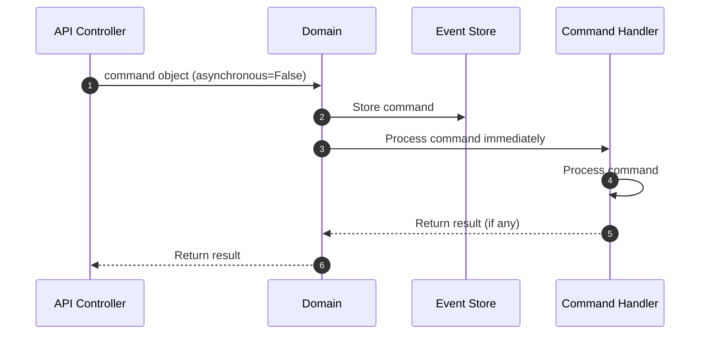
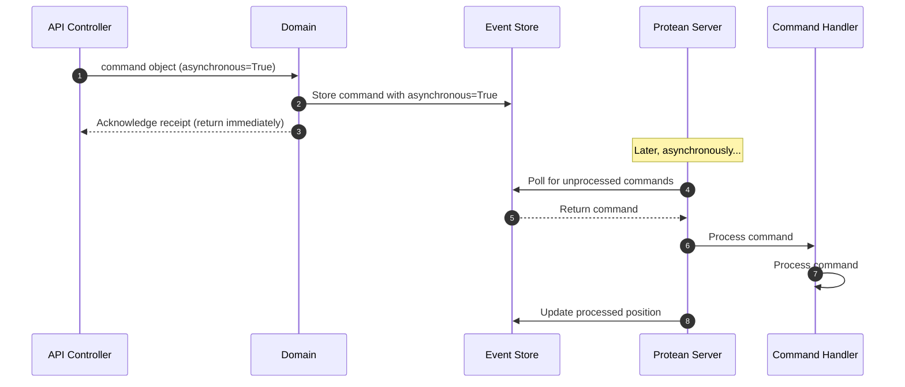

# Commands

<span class="pathway-tag pathway-tag-cqrs">CQRS</span> <span class="pathway-tag pathway-tag-es">ES</span>

Why not just call a method on an aggregate directly? In simple cases you can —
that's the DDD path with [Application Services](./application-services.md).
But as systems grow, you need to decouple *who requests a change* from
*how the change is executed*. Commands give you that separation: they can be
serialized, routed, processed asynchronously, retried, and audited — all
without the caller knowing the details.

Commands represent actions or operations that change the state of the system.
They encapsulate the intent to perform a specific task, containing the data
necessary for the action, and are processed by
[command handlers](./command-handlers.md) to ensure business rules and
invariants are upheld.

For background on what commands are and how they fit the architecture,
see [Commands concept](../../concepts/building-blocks/commands.md).

## Defining Commands

A command is defined with the `Domain.command` decorator:

```python hl_lines="13-16"
--8<-- "guides/change-state/006.py:full"
```

A command is always associated with an aggregate class with the `part_of`
option, as seen in the example above. You can use a class reference or a string
forward reference (`part_of="Article"`) when the aggregate is defined later in
the same module.

### Decorator options

| Option | Type | Default | Description |
|--------|------|---------|-------------|
| `part_of` | class or string | *required* | The aggregate this command targets. |
| `abstract` | bool | `False` | When `True`, the command serves as a base class and cannot be instantiated directly. |
| `aggregate_cluster` | class | derived from `part_of` | Explicitly set the aggregate cluster for stream routing. Rarely needed. |

## Submitting Commands

Since a Protean domain constructs and manages the object graph of all
domain elements, you don't need to identify the appropriate Command Handler
for your commands.

You can simply submit the command to the domain for processing with
`domain.process()`:

```shell
In [1]: command = PublishArticle(article_id="1")

In [2]: publishing.process(command)
```

### `domain.process()` parameters

| Parameter | Type | Default | Description |
|-----------|------|---------|-------------|
| `command` | command instance | *required* | The command to process. |
| `asynchronous` | `bool` or `None` | `None` | Override the domain's default processing mode. `None` uses the `command_processing` config. |
| `idempotency_key` | `str` or `None` | `None` | Caller-provided key for submission-level deduplication (requires Redis). |
| `raise_on_duplicate` | `bool` | `False` | When `True`, raises `DuplicateCommandError` on duplicate idempotency keys instead of silently returning the cached result. |
| `priority` | `int` or `None` | `None` | Processing priority for events produced by this command. When priority lanes are enabled, events below the threshold are routed to a backfill stream. |
| `correlation_id` | `str` or `None` | `None` | Correlation ID for distributed tracing. Propagated to all commands and events in the causal chain. Auto-generated if not provided. |
| `deadline` | `datetime` or `None` | `None` | Absolute time after which the command must not execute. Stored in metadata and propagated to downstream commands. Mutually exclusive with `timeout`. See [Deadlines and Timeouts](#deadlines-and-timeouts). |
| `timeout` | `timedelta` or `None` | `None` | Relative deadline (`now + timeout`), converted to an absolute deadline at submission. Mutually exclusive with `deadline`. |

Internally, `domain.process()` enriches the command with metadata, writes it
to the event store, and (for synchronous processing) dispatches it to the
appropriate command handler immediately.

---

!!! note "Advanced"
    The following sections cover idempotency and advanced command patterns.

## Idempotency

In distributed systems, the same command can arrive more than once due to
network retries, broker redelivery, user double-clicks, or saga retries.
Protean provides built-in support for **command idempotency** -- ensuring that
processing the same command multiple times produces the same effect as
processing it once.

### Idempotency Keys

When submitting a command, you can provide an **idempotency key** -- a unique
token that identifies the specific request:

```python
domain.process(
    PlaceOrder(order_id="ord-42", items=items),
    idempotency_key="req-abc-123",
)
```

If the same idempotency key is submitted again, `domain.process()` returns the
cached result from the first processing without invoking the handler again.
This makes retries safe -- a client that re-sends a request due to a timeout
gets the same response regardless of whether the original succeeded.

The idempotency key is stored in the command's metadata headers, not in the
command payload. This keeps the command's domain data clean:

```python
# In a handler, the key is accessible via metadata
key = command._metadata.headers.idempotency_key
```

!!!note
    Idempotency keys are **caller-provided**, following the model established
    by Stripe and other well-designed APIs. Protean does not auto-derive keys
    from command data -- only the caller knows whether a submission is a retry
    or a new intent.

### Duplicate Behavior

By default, duplicate submissions are silently acknowledged -- the caller
receives the same result as the first submission. When explicit feedback is
needed, use `raise_on_duplicate=True`:

```python
from protean.exceptions import DuplicateCommandError

try:
    domain.process(
        PlaceOrder(order_id="ord-42", items=items),
        idempotency_key="req-abc-123",
        raise_on_duplicate=True,
    )
except DuplicateCommandError as exc:
    original_result = exc.original_result
```

### Requirements

Submission-level deduplication requires a Redis instance. Configure the
connection in `domain.toml`:

```toml
[idempotency]
redis_url = "redis://localhost:6379/5"
ttl = 86400       # Success entries: 24 hours (default)
error_ttl = 60    # Error entries: 60 seconds (default)
```

Without Redis configured, `domain.process()` works normally -- no
deduplication occurs, and no errors are raised.

For a comprehensive treatment of idempotency patterns, including
subscription-level deduplication and handler-level strategies, see the
[Command Idempotency](../../patterns/command-idempotency.md) pattern guide.

## Synchronous vs Asynchronous Processing

Commands in Protean can be processed either synchronously or asynchronously:

- **Synchronous processing**: The command is processed immediately by the command handler when `domain.process()` is called. The execution flow is blocked until the command is fully processed.
- **Asynchronous processing**: The command is stored in the event store and later processed by a background worker. The `domain.process()` call returns immediately without waiting for the command to be fully processed.

You can control the processing mode in two ways:

### 1. Using the `asynchronous` parameter

When submitting a command, you can explicitly specify whether it should be processed synchronously or asynchronously:

```python
# Process synchronously (default is based on domain configuration)
domain.process(command, asynchronous=False)

# Process asynchronously
domain.process(command, asynchronous=True)
```

### 2. Domain Configuration

You can set the default processing mode for all commands in the domain configuration:

In domain.toml:

```
command_processing = "sync"  # or "async"
```

In code:

```python
# Configure default command processing as synchronous
domain.config["command_processing"] = "sync"  # or "async"
```

By default, Protean sets `command_processing` to `async` in the domain configuration.

### When to use each mode

- **Synchronous processing** is useful when:
  - You need immediate feedback from the command execution
  - You want to ensure the command was processed successfully before continuing
  - The operation is part of a transaction that needs to be completed atomically

- **Asynchronous processing** is beneficial when:
  - You want to improve UI responsiveness by not blocking the execution flow
  - The command processing might take a long time
  - You want to distribute load across background workers
  - You're implementing CQRS with event sourcing patterns

### How Asynchronous Processing Works

Asynchronous commands processing in Protean uses a server/engine component that:

1. Creates subscriptions for command handlers to listen to their respective command streams
2. Polls the event store for new commands that haven't been processed yet
3. Dispatches those commands to the appropriate handlers

To run the Protean server for processing asynchronous commands, use the CLI:

```shell
protean server --domain path/to/domain.py
```

See [CLI documentation](../../reference/cli/index.md) for more details about the server command and other available CLI options.

The server continually polls the event store for new commands that have the `asynchronous` flag set to `True` in their metadata. When found, it dispatches them to the appropriate handlers, keeping track of processed commands to avoid duplicate processing.

## Deadlines and Timeouts

A command represents an *intent* that may only be valid for a limited window.
A "charge this card before the checkout session expires" command should not
execute an hour later after a queue backlog drains. Protean lets you attach a
**deadline** to a command; if the deadline has passed by the time a handler is
about to run, the command is not executed.

### Setting a deadline

Pass either an absolute `deadline` or a relative `timeout` to
`domain.process()` (they are mutually exclusive):

```python
from datetime import datetime, timedelta, timezone

# Absolute deadline
domain.process(
    ChargeCard(order_id="ord-42"),
    deadline=datetime.now(timezone.utc) + timedelta(seconds=30),
)

# Relative timeout — converted to an absolute deadline at submission,
# so it survives queue delays
domain.process(ChargeCard(order_id="ord-42"), timeout=timedelta(seconds=30))
```

The deadline is stored on the command's metadata headers (not the payload),
and is readable in a handler:

```python
deadline = command._metadata.headers.deadline
```

### What happens when a command expires

The behavior differs by processing mode — a deliberate asymmetry:

| | Synchronous (`asynchronous=False`) | Asynchronous (default) |
|---|---|---|
| Contract | "Fail fast, caller decides" | "Don't run stale work" |
| On expiry | `domain.process()` raises `CommandExpiredError` **to the caller**, before the command is written to the event store | The command was already stored and acknowledged; the engine **skips** it (read position advances, so it is **not** retried) and emits a `handler.skipped` trace |
| Who observes the loss | The caller, immediately | Operators, via logs/traces/metrics |

```python
from protean.exceptions import CommandExpiredError

try:
    domain.process(cmd, asynchronous=False, deadline=past_deadline)
except CommandExpiredError as exc:
    exc.command_type  # the expired command's type string
    exc.deadline      # the deadline that was exceeded
```

An expired command **changes no state** — no aggregate is loaded, no invariant
is evaluated, no event is raised. Expiry is a delivery-layer policy, not a
domain-rule violation. The risk it introduces is *lost intent*: in the async
case the caller has already moved on, so expiries are surfaced via the
`protean.command.expired` metric (labelled by `command_type`) and the
`handler.skipped` trace. Alert on that metric if dropped commands matter to
your business.

### Propagation through the causal chain

When a handler dispatches a downstream command, that command inherits the
deadline of the message currently being processed — the whole causal chain is
bound by the original deadline unless a downstream call overrides it:

```python
@domain.command_handler(part_of=Order)
class OrderCommandHandler:
    @handle(PlaceOrder)
    def place(self, command: PlaceOrder):
        # ReserveStock inherits PlaceOrder's deadline automatically
        current_domain.process(ReserveStock(order_id=command.order_id))
```

### Default deadlines

For blanket protection you can configure a default validity window instead of
passing one on every call. Resolution precedence (highest wins):

1. Explicit `deadline`/`timeout` on `domain.process()`
2. Deadline inherited from the parent message in the causal chain
3. The handling command handler's `timeout` option
4. The domain-level `command_default_timeout` config
5. No deadline (the default — commands never expire)

```python
# Per-handler default (seconds or a timedelta)
@domain.command_handler(part_of=Order, timeout=30)
class OrderCommandHandler:
    ...
```

```toml
# Domain-wide default (seconds); None disables it
command_default_timeout = 30
```

Both defaults are **disabled** out of the box, so existing applications are
unaffected. A default deadline bounds *staleness*, not *failure* — pair it with
[retry/backoff](command-handlers.md#error-handling) and a dead-letter strategy
for a complete resilience story.

For the design rationale — why deadlines are opt-in, the sync/async trade-off,
and how this fits DDD — see the
[Expiring Stale Commands](../../patterns/expiring-stale-commands.md) pattern.

## Workflow

Command objects are often instantiated by the API controller, which acts as the
entry point for external requests into the system. When a client makes a
request to the API, the controller receives this request and translates the
incoming data into the appropriate command object.

In Protean, the API controller submits the command to the `domain` object,
which then dispatches the command to the appropriate command handler. We will
explore how the domain identifies the command handler in the
[Command Handlers](./command-handlers.md) section.

The workflow differs slightly depending on whether synchronous or asynchronous processing is used:

### Synchronous Command Flow


```mermaid
sequenceDiagram
  autonumber
  API Controller->>Domain: command object (asynchronous=False)
  Domain->>Event Store: Store command
  Domain->>Command Handler: Process command immediately
  Command Handler->>Command Handler: Process command
  Command Handler-->>Domain: Return result (if any)
  Domain-->>API Controller: Return result
```

### Asynchronous Command Flow


```mermaid
sequenceDiagram
  autonumber
  API Controller->>Domain: command object (asynchronous=True)
  Domain->>Event Store: Store command with asynchronous=True
  Domain-->>API Controller: Acknowledge receipt (return immediately)

  Note over Protean Server: Later, asynchronously...

  Protean Server->>Event Store: Poll for unprocessed commands
  Event Store-->>Protean Server: Return command
  Protean Server->>Command Handler: Process command
  Command Handler->>Command Handler: Process command
  Protean Server->>Event Store: Update processed position
```

## Immutability

Like Events, Commands in Protean are immutable. This means that once a
command is created, it cannot be changed.

```shell hl_lines="8-14"
In [1]: from datetime import datetime, timedelta

In [2]: publish_article_command = PublishArticle(article_id="1")

In [3]: publish_article_command
Out[3]: <PublishArticle: PublishArticle object ({'article_id': '1', 'published_at': '2024-05-28 17:47:35.570857+00:00'})>

In [4]: publish_article_command.published_at = datetime.now() - timedelta(hours=24)
...
IncorrectUsageError: 'Command Objects are immutable and cannot be modified once created'
}
```

## Relationship with Event Processing

Protean offers similar configuration options for events through:
- The `event_processing` domain configuration setting
- The ability to raise events with specific `asynchronous` flags

Events and commands in Protean follow the same processing patterns, enabling you to build consistent, predictable workflows. You can configure both to suit your specific domain needs:

```python
# Domain-wide configuration
domain.config["command_processing"] = "sync"  # or "async"
domain.config["event_processing"] = "async"   # or "sync"

# Per-instance control
domain.process(command, asynchronous=False)   # Override domain setting for a specific command
aggregate.raise_(event, asynchronous=True)    # Override domain setting for a specific event
```

This flexibility allows you to implement various architectural patterns like CQRS, Event Sourcing, and Workflow-driven architectures within your Protean applications.

---

!!! tip "See also"
    **Concept overview:** [Commands](../../concepts/building-blocks/commands.md) — The role of commands as immutable DTOs expressing intent.

    **Related guides:**

    - [Command Handlers](./command-handlers.md) — Processing commands and persisting state changes.
    - [Application Services](./application-services.md) — An alternative for synchronous use cases.

    **Patterns:**

    - [Command Idempotency](../../patterns/command-idempotency.md) — Ensuring commands can be safely retried without side effects.
