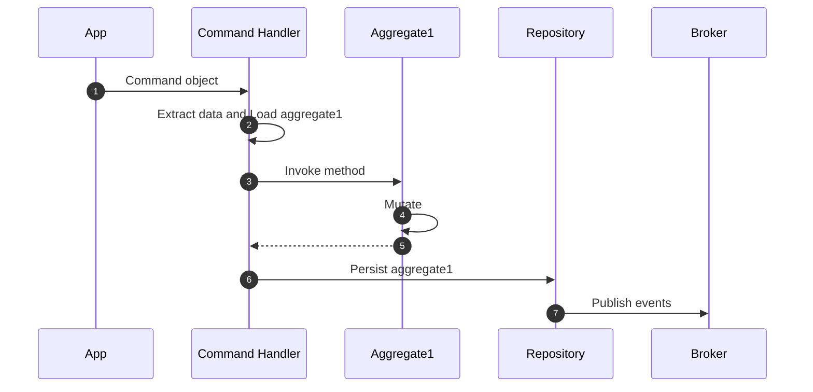
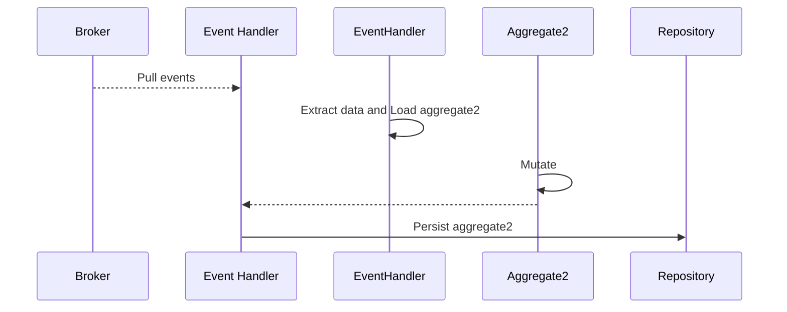

# Unit of Work

!!! abstract "Applies to: DDD · CQRS · Event Sourcing"


Protean encloses all changes to aggregates in a single transaction
automatically, within a `UnitOfWork` [context manager](https://docs.python.org/3/library/stdtypes.html#context-manager-types).

You will mostly never have to initialize a `UnitOfWork` context explicitly
by yourself, but if needed, you can do so explicitly by calling the `start()`
method and ending with `commit()` method, or using the `with` statement.

The following calls are equivalent in behavior:

```python
from protean import UnitOfWork

# Version 1
uow1 = UnitOfWork()
uow1.start()

# Do something

uow1.commit()
...

# Version 2
with UnitOfWork():
    # Do something
```

## `current_uow`

The current active `UnitOfWork` is accessible through
`protean.globals.current_uow` proxy. This is useful when you want to
explicitly control the scope of a unit of work. The `UnitOfWork`s `in_progress`
attribute indicates if the UoW is currently in progress in a code block's
context.

```python
from protean import UnitOfWork

# Version 1
uow1 = UnitOfWork()
uow1.start()

# `current_uow` is accessible here

uow1.commit()
...

# Version 2
with UnitOfWork():
    # `current_uow` is accessible here
```

## One Transaction, One Aggregate

**Never enclose updates to multiple aggregates in a single unit of work.**
Aggregates are transaction boundaries and no transaction should span across
multiple aggregates.

You would depend on eventual consistency principles to sync one aggregate state
in response to a state change in another aggregate, via domain events.

- **Step 1:** Mutate and persist Aggregate 1



- **Step 2:** Consume events, and mutate and persist Aggregate 2



!!!note
    Note that Protean still depends on the capabilities of the underlying
    database to support transactional functionality. While changes are flushed
    as a single unit, it is left to the database implementation to construct
    and manage sessions and commit transactions atomically.

