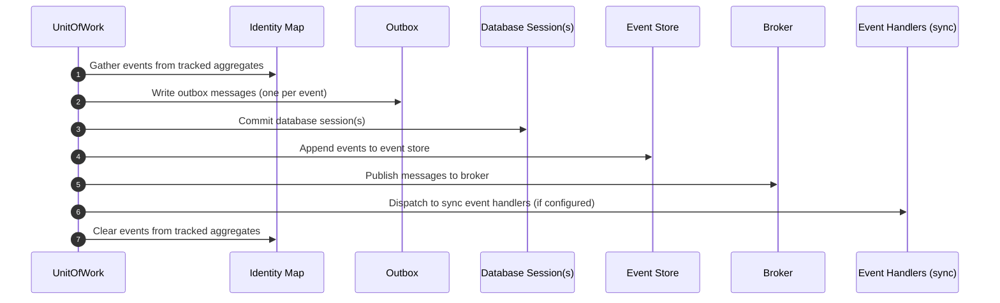
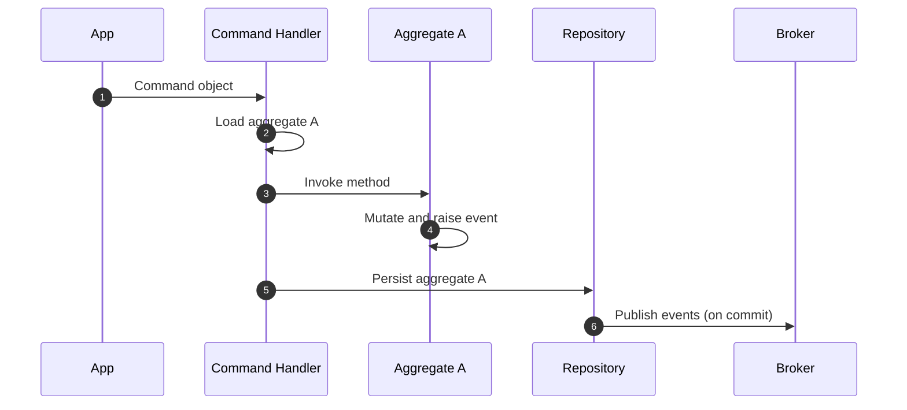
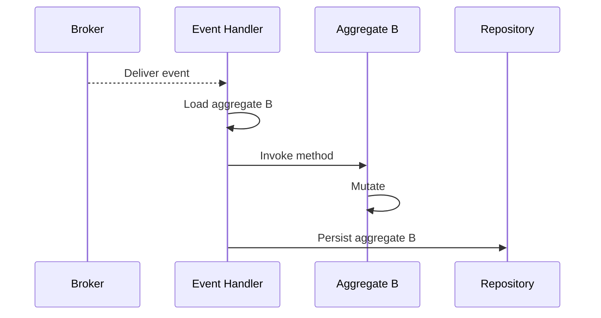

# Unit of Work

<span class="pathway-tag pathway-tag-ddd">DDD</span> <span class="pathway-tag pathway-tag-cqrs">CQRS</span> <span class="pathway-tag pathway-tag-es">ES</span>

Every meaningful state change in a Protean application — persisting an
aggregate, raising domain events, writing to the outbox — must happen
atomically. Either all of it commits, or none of it does. The Unit of Work
(UoW) is the mechanism that makes this guarantee.

In most application code you never interact with the UoW directly. The
`@handle` decorator on command/event handler methods and the `@use_case`
decorator on application service methods automatically wrap each invocation
in a UoW. Understanding how it works is still important, because it determines
when your changes are committed, what happens on failure, and how events reach
the outside world.

## Who creates the UoW?

You almost never need to create a UoW yourself. Protean's decorators handle it
for you:

| Decorator | Creates UoW? | Details |
|-----------|-------------|---------|
| `@handle` on command handler methods | Yes | Each handler method runs inside its own UoW. |
| `@handle` on event handler methods | Yes | Each handler method runs inside its own UoW. |
| `@use_case` on application service methods | Yes | Each use case method runs inside its own UoW. |
| `repository.add()` outside a handler | Yes | If no UoW is in progress, `add()` creates a temporary one, commits it immediately after persisting, then discards it. |

Because these decorators create a fresh UoW for every invocation, you get
transaction isolation by default — one handler failure cannot corrupt another
handler's in-progress changes.

### Manual UoW

For scripts, data migrations, shell sessions, and tests, you can create a UoW
explicitly:

```python
from protean import UnitOfWork

with UnitOfWork():
    repo = domain.repository_for(Order)
    order = repo.get(order_id)
    order.confirm()
    repo.add(order)
    # Commit happens automatically when the block exits successfully
```

You can also use the imperative API:

```python
uow = UnitOfWork()
uow.start()

try:
    repo = domain.repository_for(Order)
    order = repo.get(order_id)
    order.confirm()
    repo.add(order)
    uow.commit()
except Exception:
    uow.rollback()
    raise
```

!!!note
    The context manager form (`with UnitOfWork()`) is preferred — it
    handles commit and rollback automatically and cannot accidentally leave a
    UoW dangling.

## `current_uow`

The active UoW is accessible anywhere through the `current_uow` context
variable:

```python
from protean.globals import current_uow

if current_uow and current_uow.in_progress:
    # A UoW is active — changes will be committed when it exits
    ...
```

This is a thread-local proxy backed by a context stack. Each `start()` (or
`__enter__`) pushes a new UoW onto the stack, and each `commit()` or
`rollback()` pops it off.

## What happens during commit

When the UoW commits — either at the end of a `with` block or via an explicit
`uow.commit()` call — the following steps execute in order:


```mermaid
sequenceDiagram
    autonumber
    participant UoW as UnitOfWork
    participant IM as Identity Map
    participant OB as Outbox
    participant DB as Database Session(s)
    participant ES as Event Store
    participant BR as Broker
    participant EH as Event Handlers (sync)

    UoW->>IM: Gather events from tracked aggregates
    UoW->>OB: Write outbox messages (one per event)
    UoW->>DB: Commit database session(s)
    UoW->>ES: Append events to event store
    UoW->>BR: Publish messages to broker
    UoW->>EH: Dispatch to sync event handlers (if configured)
    UoW->>IM: Clear events from tracked aggregates
```

1. **Gather events** — The UoW walks its identity map and collects all
   domain events that aggregates have raised (via `self.raise_()`).

2. **Write outbox messages** — Each event is serialized and written to the
   outbox table as part of the same database transaction. The outbox ensures
   reliable delivery even if the broker is temporarily unavailable. Events
   inherit the current processing priority (normal or backfill).

3. **Commit database sessions** — The UoW commits every open database session.
   Each provider's session is committed independently. If a commit fails, a
   `TransactionError` is raised with diagnostic `extra_info` (original
   exception, session names, event/message counts).

4. **Append to event store** — After the database commit succeeds, events are
   appended to the event store for the permanent event log.

5. **Publish to broker** — Any messages registered during the transaction
   (via `uow.register_message()`) are published to their designated broker.

6. **Dispatch sync handlers** — If `event_processing` is set to `"sync"`,
   the UoW dispatches each event to its registered event handlers immediately.

7. **Clear events** — Events are cleared from the aggregates in the identity
   map so they are not re-processed.

## Rollback semantics

When an exception is raised inside a UoW block:

- **Context manager form** (`with UnitOfWork()`): The `__exit__` method
  detects the exception, calls `rollback()`, and re-raises the original
  exception. No partial state is committed.

- **If commit itself fails**: The UoW rolls back all sessions and raises a
  `TransactionError` wrapping the original exception.

- **Rollback scope**: Rollback reverses the database session changes. Events
  that were gathered but not yet committed are discarded. The identity map
  and message queue are cleared.

```python
from protean import UnitOfWork
from protean.exceptions import ValidationError

try:
    with UnitOfWork():
        repo = domain.repository_for(Order)
        order = repo.get(order_id)
        order.confirm()  # May raise ValidationError
        repo.add(order)
        # If confirm() or add() raises, rollback happens automatically
except ValidationError:
    # The UoW has already rolled back — no partial state was committed
    ...
```

## The identity map

The UoW maintains an **identity map** — a dictionary of all aggregates that
have been persisted via `repository.add()` during the current transaction.
The identity map serves two purposes:

1. **Event collection** — At commit time, the UoW walks the identity map to
   gather all events raised by tracked aggregates. Without the identity map,
   events raised between `add()` and `commit()` would be lost.

2. **Per-provider tracking** — Aggregates are grouped by their database
   provider, so the UoW can commit each provider's session independently.

## One transaction, one aggregate

**Never enclose updates to multiple aggregates in a single Unit of Work.**
Aggregates are consistency boundaries — each transaction should modify at most
one aggregate.

Cross-aggregate state changes are coordinated through domain events and
eventual consistency:

- **Step 1:** A command handler mutates and persists Aggregate A. The UoW
  commits the changes and dispatches the events raised by Aggregate A.

- **Step 2:** An event handler (running in its own UoW) reacts to the event,
  loads Aggregate B, mutates it, and persists the changes.


```mermaid
sequenceDiagram
  autonumber
  App->>Command Handler: Command object
  Command Handler->>Command Handler: Load aggregate A
  Command Handler->>Aggregate A: Invoke method
  Aggregate A->>Aggregate A: Mutate and raise event
  Command Handler->>Repository: Persist aggregate A
  Repository->>Broker: Publish events (on commit)
```


```mermaid
sequenceDiagram
  Broker-->>Event Handler: Deliver event
  Event Handler->>Event Handler: Load aggregate B
  Event Handler->>Aggregate B: Invoke method
  Aggregate B->>Aggregate B: Mutate
  Event Handler->>Repository: Persist aggregate B
```

This pattern ensures that each aggregate is always persisted in its own
transaction, preventing partial-update anomalies.

## Multi-provider sessions

When your domain uses multiple database providers (e.g., PostgreSQL for
transactional data, Elasticsearch for search), the UoW manages a separate
session for each provider. At commit time, each provider's session is committed
independently. This means that a failure in one provider's commit does not
roll back another provider's already-committed changes.

## Database transaction capabilities

The UoW relies on the underlying database provider's transaction support.

- **Full transactions** (e.g., PostgreSQL, SQLite): Changes are atomic —
  commit succeeds entirely or rolls back entirely.
- **Simulated transactions** (e.g., Memory adapter in tests): The UoW manages
  the identity map and event collection, but rollback does not undo persisted
  changes. A debug-level log message notes this limitation.
- **No transaction support**: The UoW logs a warning and proceeds. Changes are
  persisted but not guaranteed to be atomic.

## Optimistic concurrency

When the event store detects a version conflict during commit (another
transaction modified the same aggregate stream), the UoW raises an
`ExpectedVersionError`. This is Protean's optimistic concurrency mechanism —
the first writer wins, and subsequent writers must retry with the latest
version.

## Errors during commit

If the database commit fails for reasons other than version conflicts, the UoW
raises a `TransactionError` with diagnostic information:

```python
from protean.exceptions import TransactionError

try:
    with UnitOfWork():
        ...
except TransactionError as exc:
    # exc.extra_info contains:
    #   - original_exception: exception class name
    #   - original_message: error message
    #   - sessions: list of provider names involved
    #   - events_count: number of events that were pending
    #   - messages_count: number of broker messages pending
    ...
```

---

!!! tip "See also"
    **Related guides:**

    - [Persist Aggregates](./persist-aggregates.md) — Save and update aggregates through repositories.
    - [Command Handlers](./command-handlers.md) — Each handler method runs within an implicit Unit of Work.
    - [Application Services](./application-services.md) — Use `@use_case` for automatic Unit of Work management.
