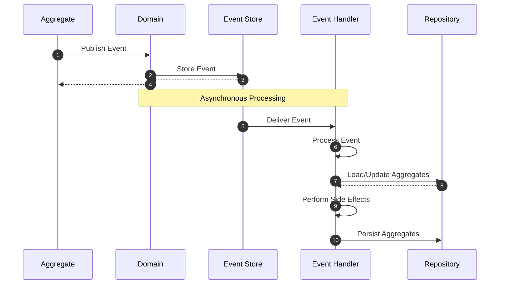

# Event Handlers

Event handlers consume events raised in an aggregate and help sync the state of
the aggregate with other aggregates and other systems. They are the preferred
mechanism to update multiple aggregates.

## Defining an Event Handler

Event Handlers are defined with the `Domain.event_handler` decorator. Below is
a simplified example of an Event Handler connected to `Inventory` aggregate
syncing stock levels corresponding to changes in the `Order` aggregate.

```python hl_lines="26-27 44"
{! docs_src/guides/consume-state/001.py !}
```

1. `Order` aggregate fires `OrderShipped` event on book being shipped.

2. Event handler picks up the event and updates stock levels in `Inventory`
aggregate.

Simulating a hypothetical example, we can see that the stock levels were
decreased in response to the `OrderShipped` event.

```shell hl_lines="21"
In [1]: order = Order(book_id=1, quantity=10, total_amount=100)

In [2]: domain.repository_for(Order).add(order)
Out[2]: <Order: Order object (id: 62f8fa8d-2963-4539-bd21-860d3bab639e)>

In [3]: inventory = Inventory(book_id=1, in_stock=100)

In [4]: domain.repository_for(Inventory).add(inventory)
Out[4]: <Inventory: Inventory object (id: 9272d70f-b796-417d-8f30-e01302d9f1a9)>

In [5]: order.ship_order()

In [6]: domain.repository_for(Order).add(order)
Out[6]: <Order: Order object (id: 62f8fa8d-2963-4539-bd21-860d3bab639e)>

In [7]: stock = domain.repository_for(Inventory).get(inventory.id)

In [8]: stock.to_dict()
Out[8]: {
 'book_id': '1',
 'in_stock': 90,
 'id': '9272d70f-b796-417d-8f30-e01302d9f1a9'
 }
```

## Event Handler Workflow

Event handlers follow an asynchronous, fire-and-forget pattern. When an event is published, event handlers process it without returning any values to the caller.



1. **Aggregate Publishes Event**: An action in an aggregate triggers an event to be published.
2. **Domain Stores Event**: The domain stores the event in the event store.
3. **Event Store Confirms Storage**: The event store confirms the event has been stored.
4. **Domain Returns to Aggregate**: The domain returns control to the aggregate.
5. **Event Store Delivers Event**: Asynchronously, the event store delivers the event to all subscribed event handlers.
6. **Event Handler Processes Event**: The event handler receives and processes the event.
7. **Event Handler Loads/Updates Aggregates**: If needed, the event handler loads and updates relevant aggregates.
8. **Repository Returns Data**: The repository returns requested data to the event handler.
9. **Event Handler Performs Side Effects**: The event handler may perform additional side effects (sending emails, updating other systems, etc.).
10. **Event Handler Persists Data and Optionally Raises Events**: The event handler persists the mutated aggregate, which can also raise events.

## Return Values from Event Handlers

Event handlers in Protean follow the standard CQRS pattern where event handlers do not return values to the caller. This deliberate design choice ensures:

1. **Decoupling**: The publisher of events remains completely decoupled from the consumers.
2. **Asynchronous Processing**: Events can be processed in the background without blocking.
3. **Multiple Consumers**: Multiple event handlers can process the same event independently.

If an event handler needs to communicate information as part of its processing, it should:
- Emit new events 
- Update relevant aggregates that can be queried later
- Log information for monitoring purposes

This approach maintains a clean separation between the command and query sides of a system.

## Configuration Options

- **`part_of`**: The aggregate to which the event handler is connected.
- **`stream_category`**: The event handler listens to events on this stream
category. The stream category defaults to
[the category of the aggregate](../domain-definition/aggregates.md#stream_category)
associated with the handler.

An Event Handler can be part of an aggregate, and have the stream category of
a different aggregate. This is the mechanism for an aggregate to listen to
another aggregate's events to sync its own state.
- **`source_stream`**: When specified, the event handler only consumes events
generated in response to events or commands from this original stream.
For example, `EmailNotifications` event handler listening to `OrderShipped`
events can be configured to generate a `NotificationSent` event only when the
`OrderShipped` event (in stream `orders`) is generated in response to a
`ShipOrder` (in stream `manage_order`) command.
