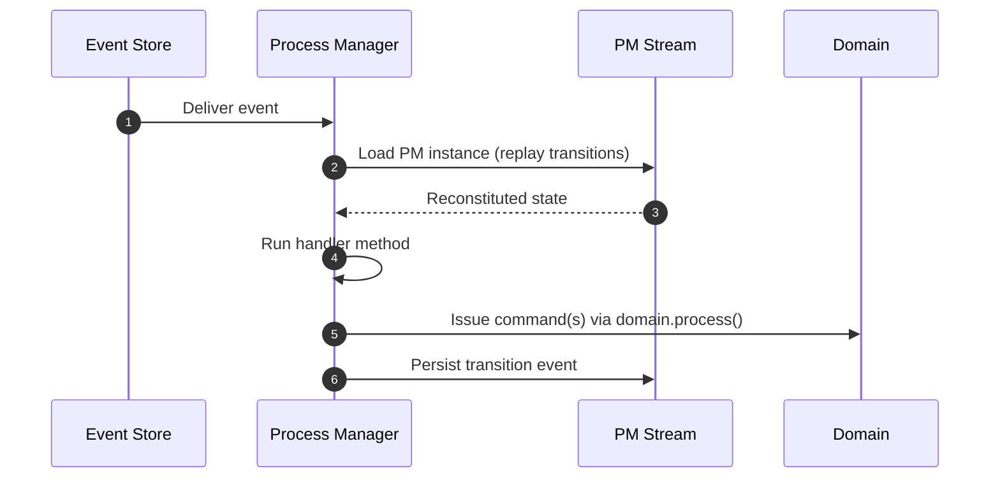

# Process Managers

!!! abstract "Applies to: CQRS · Event Sourcing"

Some business processes span multiple aggregates and take multiple steps to
complete — an order fulfillment flow that moves through payment, inventory
reservation, and shipping, for example. Event handlers work for simple
one-step reactions, but when you need to track where you are in a multi-step
workflow and decide what to do next, you need a process manager.

Process managers coordinate multi-step business processes that span multiple
aggregates. They react to domain events from different streams, maintain their
own state, and issue commands to drive other aggregates forward.

## Defining a Process Manager

Process managers are defined with the `Domain.process_manager` decorator. Each
handler method uses the `@handle` decorator with additional parameters for
lifecycle management and event correlation.

```python hl_lines="12-13 18 23 28"
{! docs_src/guides/consume-state/process-managers/001.py !}
```

1. `start=True` marks this handler as the entry point — it creates a new PM
   instance when the event arrives.

2. `correlate="order_id"` extracts `event.order_id` to identify which PM
   instance should handle each event.

3. `end=True` automatically marks the PM as complete after the handler runs.

4. `mark_as_complete()` explicitly marks the PM as complete from within a
   handler.

## Process Manager Workflow



1. **Event arrives**: The event store delivers an event from a subscribed stream.
2. **Load instance**: The framework extracts the correlation value from the event
   and loads the PM instance by replaying its transition events from the PM's own
   stream.
3. **Run handler**: The matched handler method executes with the PM's current
   state available.
4. **Issue commands**: The handler can issue commands to drive other aggregates.
5. **Persist transition**: After the handler completes, the framework captures
   the PM's field state as a transition event and appends it to the PM's stream.

## Correlation

Correlation determines which PM instance handles each event. Every handler must
declare a `correlate` parameter.

### String Correlation

The simplest form — the PM field name matches the event field name:

```python
@handle(OrderPlaced, start=True, correlate="order_id")
def on_order_placed(self, event: OrderPlaced) -> None:
    self.order_id = event.order_id
```

Here, `event.order_id` is extracted and used to find or create the PM instance.

### Dictionary Correlation

When the PM field name differs from the event field name, use a dictionary:

```python
@handle(ExternalPaymentReceived, correlate={"order_id": "ext_order_ref"})
def on_payment_received(self, event: ExternalPaymentReceived) -> None:
    ...
```

This extracts `event.ext_order_ref` and maps it to the PM's `order_id` field.

## Lifecycle Management

### Starting a Process

Exactly one handler must be marked with `start=True`. When a start event
arrives and no PM instance exists for that correlation value, a new instance
is created. If a non-start event arrives with no existing PM, it is silently
skipped.

### Completing a Process

There are two ways to mark a PM as complete:

**Using `end=True`** — the PM is automatically marked complete after the handler
runs:

```python
@handle(PaymentFailed, correlate="order_id", end=True)
def on_payment_failed(self, event: PaymentFailed) -> None:
    self.status = "cancelled"
```

**Using `mark_as_complete()`** — call explicitly within a handler for
conditional completion:

```python
@handle(ShipmentDelivered, correlate="order_id")
def on_shipment_delivered(self, event: ShipmentDelivered) -> None:
    self.status = "completed"
    self.mark_as_complete()
```

### Completed Process Managers Skip Events

Once a PM is marked complete, any subsequent events for that correlation value
are silently skipped. No new transition is persisted and no handler runs.

## Issuing Commands

Process managers drive other aggregates forward by issuing commands:

```python
{! docs_src/guides/consume-state/process-managers/003.py !}
```

Commands issued inside a handler are committed atomically as part of the same
Unit of Work.

## Configuration Options

### Handler Options

- **`stream_categories`**: List of stream categories the PM subscribes to.
  Events from all listed categories are delivered to the PM's handlers.

    ```python
    @domain.process_manager(
        stream_categories=["ecommerce::order", "ecommerce::payment", "ecommerce::shipping"]
    )
    class OrderFulfillmentPM:
        ...
    ```

- **`aggregates`**: Alternative to `stream_categories` — specify aggregates
  and Protean infers the stream categories from their stream configurations.

    ```python
    @domain.process_manager(aggregates=[Order, Payment, Shipping])
    class OrderFulfillmentPM:
        ...
    ```

### Subscription Options

Process managers support the same subscription configuration as
[event handlers](./event-handlers.md#subscription-options):

- **`subscription_type`**: `"stream"` or `"event_store"`
- **`subscription_profile`**: `"production"`, `"fast"`, `"batch"`, `"debug"`,
  `"projection"`
- **`subscription_config`**: Dictionary of specific configuration options

See [Server → Configuration](../../reference/server/configuration.md) for details.

## Error Handling

Process managers can define a `handle_error` class method for custom error
handling, following the same pattern as
[event handlers](./event-handlers.md#error-handling):

```python
@domain.process_manager(stream_categories=["ecommerce::order", "ecommerce::payment"])
class OrderFulfillmentPM:
    ...

    @classmethod
    def handle_error(cls, exc: Exception, message):
        logger.error(f"PM failed to process {message.type}: {exc}")
```

## Transition Events

After each handler runs, Protean auto-generates a transition event that
captures:

- **`state`**: A dictionary snapshot of all PM field values
- **`handler_name`**: The name of the handler method that ran
- **`is_complete`**: Whether the PM is marked complete

These transition events are stored in the PM's own stream
(`<pm_stream_category>-<correlation_value>`) and are used to reconstitute the
PM's state when loading.

---

!!! tip "See also"
    **Concept overview:** [Process Managers](../../concepts/building-blocks/process-managers.md) — Coordinating multi-step business processes across aggregates.

    **Patterns:**

    - [Coordinating Long-Running Processes](../../patterns/coordinating-long-running-processes.md) — Patterns for orchestrating multi-step workflows.
