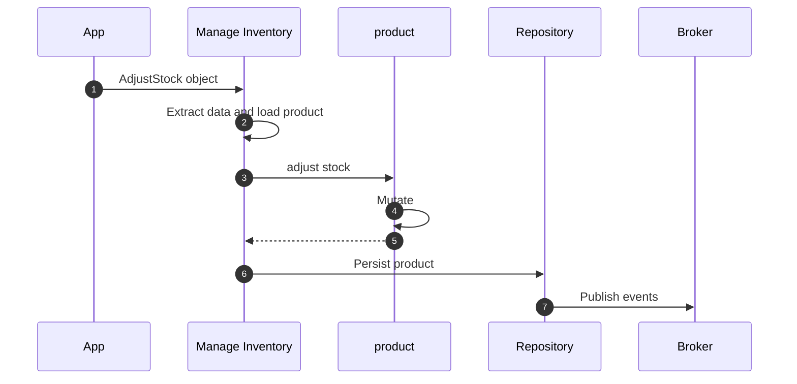
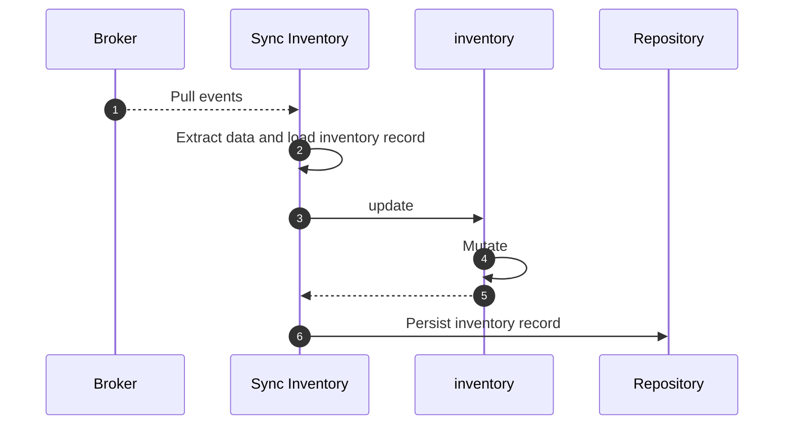

# Projections

Projections, a.k.a Read models, are representations of data optimized for querying
and reading purposes. It is designed to provide data in a format that makes it
easy and efficient to read, often tailored to the specific needs of a
particular view or user interface.

Projections are typically populated in response to Domain Events raised in the
domain model.

## Defining a Projection

Projections are defined with the `Domain.projection` decorator.

```python hl_lines="15-19"
--8<-- "guides/consume-state/002.py:68:74"
```

## Projection Configuration Options

Projections in Protean can be configured with several options passed directly to the projection decorator:

```python
@domain.projection(
    provider="postgres",      # Database provider to use
    schema_name="product_inventory",  # Custom schema/table name
    limit=50                  # Default limit for queries
)
class ProductInventory:
    # Projection fields and methods
    pass
```

### Storage Options

Projections can be stored in either a database or a cache, but not both simultaneously:

- **Database Storage**: Use the `provider` parameter to specify which database provider to use.
  ```python
  @domain.projection(provider="postgres")  # Connect to a PostgreSQL database
  class ProductInventory:
      # Projection fields and methods
      pass
  ```

- **Cache Storage**: Use the `cache` parameter to specify which cache provider to use.
  ```python
  @domain.projection(cache="redis")  # Store projection data in Redis cache
  class ProductInventory:
      # Projection fields and methods
      pass
  ```

When both `cache` and `provider` parameters are specified, the `cache` parameter takes precedence
and the `provider` parameter is ignored.

### Additional Options

All options are passed directly to the projection decorator:

```python
@domain.projection(
    abstract=False,          # If True, indicates this projection is an abstract base class
    database_model="custom_model",    # Custom model name for storage
    order_by=("name",),      # Default ordering for query results
    schema_name="inventory", # Custom schema/table name
    limit=100                # Default query result limit (set to None for no limit)
)
class ProductInventory:
    # Projection fields and methods
    pass
```

## Querying Projections

Projections are optimized for querying. You can use the repository pattern to query projections:

```python
# Get a single projection record by ID
inventory = repository.get(ProductInventory, id=1)

# Query projection with filters
low_stock_items = repository._dao.filter(
    ProductInventory, 
    quantity__lt=10,
    limit=20
)
```

## Projection Projection Strategies

There are different strategies for keeping projections up-to-date with your domain model:

1. **Event-driven**: Respond to domain events to update projections (recommended)
2. **Periodic Refresh**: Schedule periodic rebuilding of projections from source data
3. **On-demand Calculation**: Generate projections when they are requested 

The event-driven approach is usually preferred as it ensures projections are updated in near real-time.

## Workflow

`ManageInventory` Command Handler handles `AdjustStock` command, loads the
product and updates it, and then persists the product, generating domain
events.



The events are then consumed by the event handler that loads the projection record
and updates it.



## Supported Field Types

Projections can only contain basic field types. References, Associations, and ValueObjects 
are not supported in projections. This is because projections are designed to be flattened, 
denormalized representations of data.

## Example

Below is a full-blown example of a projection `ProductInventory` synced with the
`Product` aggregate with the help of `ProductAdded` and `StockAdjusted` domain
events.

```python hl_lines="68-74 115-127 129-136"
{! docs_src/guides/consume-state/001.py !}
```
