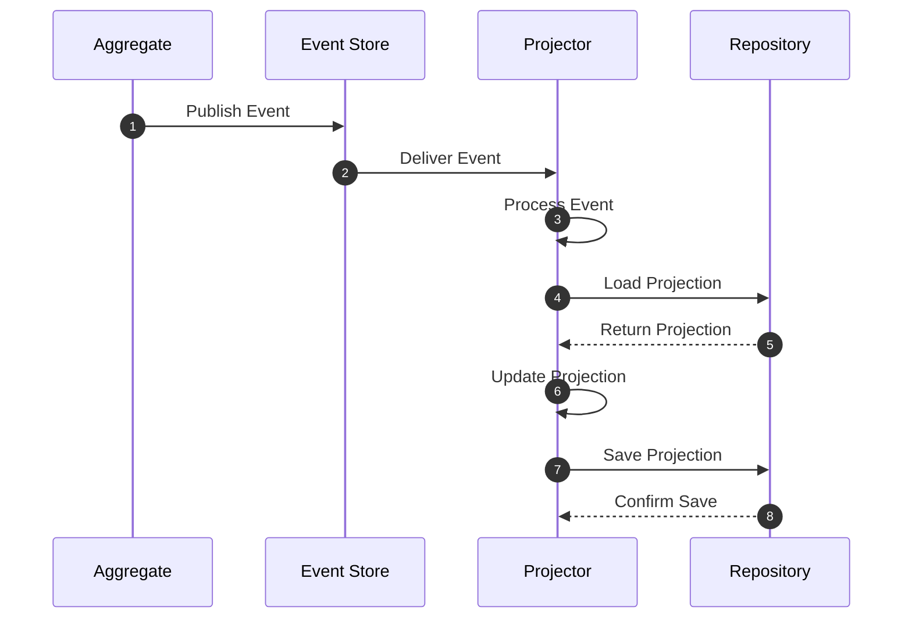
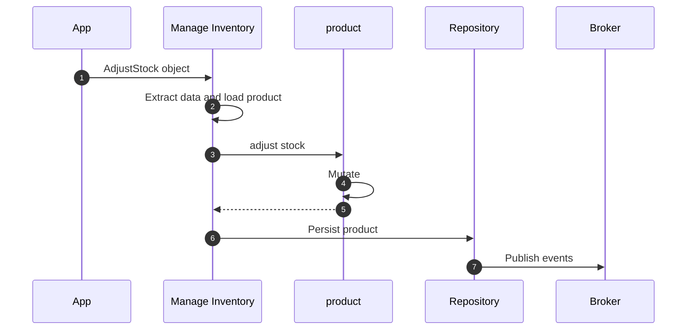
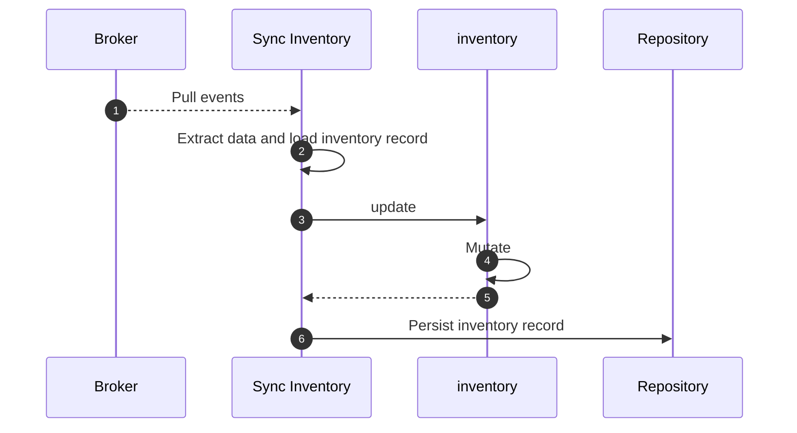

# Managing Projections

!!! abstract "Applies to: CQRS · Event Sourcing"


Why not just query the aggregate directly? You can — but aggregates are
designed for consistency, not for read performance. Loading a full aggregate
graph just to display a dashboard row is wasteful. Projections solve this by
maintaining a separate, flattened view that is shaped for the query, not for
the write model. They're the "read side" of CQRS.

Projections (a.k.a. read models) are representations of data optimized for
querying and reading purposes. They are designed to provide data in a format
that is easy and efficient to read, often tailored to the specific needs of a
particular view or user interface.

Projections are populated in response to domain events raised in the
domain model.

## Projections

### Defining a Projection

Projections are defined with the `Domain.projection` decorator.

```python hl_lines="1-2"
--8<-- "guides/consume-state/002.py:65:75"
```

### Projection Configuration Options

Projections in Protean can be configured with several options passed directly to the projection decorator:

```python
@domain.projection(
    provider="postgres",      # Database provider to use
    schema_name="product_inventory",  # Custom schema/table name
    limit=50                  # Default limit for queries
)
class ProductInventory:
    # Projection fields and methods
    pass
```

#### Storage Options

Projections can be stored in either a database or a cache, but not both simultaneously:

- **Database Storage**: Use the `provider` parameter to specify which database provider to use.
  ```python
  @domain.projection(provider="postgres")  # Connect to a PostgreSQL database
  class ProductInventory:
      # Projection fields and methods
      pass
  ```

- **Cache Storage**: Use the `cache` parameter to specify which cache provider to use.
  ```python
  @domain.projection(cache="redis")  # Store projection data in Redis cache
  class ProductInventory:
      # Projection fields and methods
      pass
  ```

When both `cache` and `provider` parameters are specified, the `cache` parameter takes precedence
and the `provider` parameter is ignored.

#### Additional Options

All options are passed directly to the projection decorator:

```python
@domain.projection(
    abstract=False,          # If True, indicates this projection is an abstract base class
    database_model="custom_model",    # Custom model name for storage
    order_by=("name",),      # Default ordering for query results
    schema_name="inventory", # Custom schema/table name
    limit=100                # Default query result limit (set to None for no limit)
)
class ProductInventory:
    # Projection fields and methods
    pass
```

### Querying Projections

Projections are optimized for querying. Use `domain.view_for()` to get a
read-only interface for any projection:

```python
view = domain.view_for(ProductInventory)

# Single lookup by identifier
item = view.get("abc-123")

# Fluent filtering via ReadOnlyQuerySet
results = view.query.filter(
    stock_quantity__lt=10
).order_by("name").all()

for item in results:
    print(f"{item.name}: {item.stock_quantity} remaining")

# Convenience single-item lookup by criteria
item = view.find_by(product_id="abc-123")

# Total count and existence checks
total = view.count()
found = view.exists("abc-123")
```

The `query` property returns a `ReadOnlyQuerySet` that supports all read
operations — `filter()`, `exclude()`, `order_by()`, `limit()`, `offset()`,
and `all()` — but blocks mutations (`update`, `delete`) to enforce CQRS
read/write separation.

```python
# Pagination
page = view.query.order_by("name").limit(20).offset(40).all()
page.total       # Total matching records across all pages
page.has_next    # True if more pages exist
page.has_prev    # True if previous pages exist

# Single result
first_item = view.query.filter(
    product_id="abc-123"
).first
```

`ReadView` does not expose `add()`, `_dao`, or any mutation methods — it is
safe to pass to API endpoints and query handlers without risking accidental
writes.

For write operations (used inside projectors), continue using
`domain.repository_for()`:

```python
repo = domain.repository_for(ProductInventory)
repo.add(inventory_record)
```

!!! note
    `domain.view_for()` is specifically for projections. To query aggregates,
    use [repositories](../change-state/retrieve-aggregates.md) with custom
    query methods.

#### Cache-backed projections

When a projection is stored in a cache (Redis, in-memory), `view.get()`,
`view.count()`, and `view.exists()` work as expected. However, `view.query`
and `view.find_by()` raise `NotSupportedError` because cache backends are
key-value stores and do not support field-based filtering.

#### Three levels of projection access

Protean provides three levels of projection access, each suited to
different use cases:

| Level | Entry point | Returns | Use when |
|-------|-------------|---------|----------|
| **ReadView** | `domain.view_for(Proj)` | `ReadView` | Default for endpoints and query handlers — read-only by design |
| **Raw** | `domain.connection_for(Proj)` | DB/cache connection | Escape hatch — technology-specific queries (SQL, ES DSL, Redis) |
| **Repository** | `domain.repository_for(Proj)` | `BaseRepository` | Inside projectors — when you need to write |

#### Raw connection access

When you need to run technology-specific queries that cannot be expressed
through `QuerySet` — such as SQL aggregations, Elasticsearch DSL, or Redis
`SCAN` commands — use `domain.connection_for()`:

```python
conn = domain.connection_for(OrderSummary)
# conn is the raw SQLAlchemy session, Elasticsearch client,
# Redis client, etc., depending on the projection's backing store
```

The method automatically routes to the correct provider or cache based on
the projection's configuration. For database-backed projections it returns
the database provider's connection; for cache-backed projections it returns
the cache client.

### Query — Named Read Intents

For structured, validated read requests, define a Query domain element using
the `Domain.query` decorator:

```python
@domain.query(part_of=ProductInventory)
class GetLowStockItems:
    threshold = Integer(default=10)
    category = String()
```

Queries are immutable DTOs that capture the parameters for a read operation.
They are registered with the domain, discoverable in `domain.registry.queries`,
and validated on construction — giving the read side the same structure as
commands give the write side.

#### Defining a Query

A query must be associated with a projection via `part_of`:

```python
@domain.query(part_of=OrderSummary)
class GetOrdersByCustomer:
    customer_id = Identifier(required=True)
    status = String(choices=["pending", "shipped", "delivered"])
    page = Integer(default=1, min_value=1)
    page_size = Integer(default=20, min_value=1, max_value=100)
```

Queries support all basic field types (`String`, `Integer`, `Float`,
`Identifier`, `Boolean`, `DateTime`, `List`) as well as `ValueObject` fields.
Like commands, they reject References and Associations.

#### Query vs Command

| Aspect | Command | Query |
|--------|---------|-------|
| Purpose | Change state | Read state |
| Targets | Aggregate | Projection |
| Metadata | Full (headers, stream, correlation) | None |
| Event store | Persisted and routed | Not persisted |
| Immutable | Yes | Yes |
| Validated | Yes | Yes |

#### Usage

Queries are constructed and passed to query handlers (see Step 5) for
processing:

```python
query = GetOrdersByCustomer(customer_id="C-123", status="shipped", page=2)

# Serialization
query.to_dict()
# {'customer_id': 'C-123', 'status': 'shipped', 'page': 2, 'page_size': 20}
```

---

## Projectors

Projectors are specialized event handlers responsible for maintaining projections by listening to domain events and updating projection data accordingly. They provide the bridge between your domain events and read models, ensuring projections stay synchronized with changes in your domain.

### Defining a Projector

Projectors are defined using the `Domain.projector` decorator and must be associated with a specific projection:

```python hl_lines="1-2"
--8<-- "guides/consume-state/002.py:88:117"
```

### Projector Configuration Options

Projectors can be configured with several options:

```python
@domain.projector(
    projector_for=ProductInventory,     # Required: The projection to maintain
    aggregates=[Product, Order],        # Aggregates to listen to
    stream_categories=["product", "order"]  # Alternative to aggregates
)
class ProductInventoryProjector:
    # Event handler methods
    pass
```

#### Required Configuration

- **`projector_for`**: The projection class that this projector maintains. This parameter is mandatory and establishes the relationship between the projector and its target projection.

#### Event Source Configuration

You must specify either `aggregates` or `stream_categories` (but not both):

- **`aggregates`**: A list of aggregate classes whose events this projector should handle. Protean automatically derives the [stream categories](../../concepts/async-processing/stream-categories.md) from the specified aggregates.

- **`stream_categories`**: A list of [stream category](../../concepts/async-processing/stream-categories.md) names to listen to. This provides more fine-grained control over which event streams the projector monitors.

### Event Handling with `@on`

Projectors use the `@on` decorator (an alias for `@handle`) to specify which events they respond to:

```python hl_lines="5 21"
--8<-- "guides/consume-state/002.py:88:117"
```

### Multiple Event Handlers

A single projector can handle multiple events, and multiple projectors can handle the same event:

```python
@domain.projector(projector_for=OrderSummary, aggregates=[Order])
class OrderSummaryProjector:
    @on(OrderCreated)
    def on_order_created(self, event: OrderCreated):
        # Create order summary
        pass
    
    @on(OrderShipped)
    def on_order_shipped(self, event: OrderShipped):
        # Update shipping status
        pass
    
    @on(OrderCancelled)
    def on_order_cancelled(self, event: OrderCancelled):
        # Mark as cancelled
        pass

@domain.projector(projector_for=ShippingReport, aggregates=[Order])
class ShippingReportProjector:
    @on(OrderShipped)  # Same event, different projector
    def on_order_shipped(self, event: OrderShipped):
        # Update shipping metrics
        pass
```

### Projector Registration

Projectors can be registered with the domain with the `Domain.projector` decorator:

#### Decorator Registration

```python
@domain.projector(projector_for=ProductInventory, aggregates=[Product])
class ProductInventoryProjector:
    # Event handler methods
    pass
```

### Error Handling in Projectors

Projectors should handle errors gracefully to ensure system resilience:

```python
@domain.projector(projector_for=ProductInventory, aggregates=[Product])
class ProductInventoryProjector:
    @on(ProductAdded)
    def on_product_added(self, event: ProductAdded):
        try:
            repository = domain.repository_for(ProductInventory)
            
            # Check if inventory already exists
            try:
                existing = repository.get(event.product_id)
                # Handle duplicate case
                return
            except NotFoundError:
                pass  # Expected case - create new inventory
            
            inventory = ProductInventory(
                product_id=event.product_id,
                name=event.name,
                price=event.price,
                stock_quantity=event.stock_quantity,
            )
            
            repository.add(inventory)
            
        except Exception as e:
            # Log error and potentially raise for retry mechanisms
            logger.error(f"Failed to process ProductAdded event: {e}")
            raise
```

### Projector Workflow

The projector workflow follows this sequence:


```mermaid
sequenceDiagram
  autonumber
  Aggregate->>Event Store: Publish Event
  Event Store->>Projector: Deliver Event
  Projector->>Projector: Process Event
  Projector->>Repository: Load Projection
  Repository-->>Projector: Return Projection
  Projector->>Projector: Update Projection
  Projector->>Repository: Save Projection
  Repository-->>Projector: Confirm Save
```

1. **Aggregate Publishes Event**: Domain events are published when aggregates change state
2. **Event Store Delivers Event**: The event store routes events to registered projectors
3. **Projector Processes Event**: The projector receives and begins processing the event
4. **Load Projection**: If updating existing data, the projector loads the current projection
5. **Update Projection**: The projector applies changes based on the event data
6. **Save Projection**: The updated projection is persisted to storage

## Projection Update Strategies

There are different strategies for keeping projections up-to-date with your domain model:

1. **Event-driven**: Respond to domain events to update projections (recommended)
2. **Periodic Refresh**: Schedule periodic rebuilding of projections from source data
3. **On-demand Calculation**: Generate projections when they are requested 

The event-driven approach is usually preferred as it ensures projections are updated in near real-time.

## Workflow

`ManageInventory` Command Handler handles `AdjustStock` command, loads the
product and updates it, and then persists the product, generating domain
events.


```mermaid
sequenceDiagram
  autonumber
  App->>Manage Inventory: AdjustStock object
  Manage Inventory->>Manage Inventory: Extract data and load product
  Manage Inventory->>product: adjust stock
  product->>product: Mutate
  product-->>Manage Inventory: 
  Manage Inventory->>Repository: Persist product
  Repository->>Broker: Publish events
```

The events are then consumed by a projector that loads the `inventory` projection
record and updates it.


```mermaid
sequenceDiagram
  autonumber
  Broker-->>Sync Inventory: Pull events
  Sync Inventory->>Sync Inventory: Extract data and load inventory record
  Sync Inventory->>inventory: update
  inventory->>inventory: Mutate
  inventory-->>Sync Inventory: 
  Sync Inventory->>Repository: Persist inventory record
```

## Supported Field Types

Projections support basic field types (`String`, `Integer`, `Float`,
`Identifier`, `DateTime`, `Boolean`, etc.) and `ValueObject` fields.
References and Associations (`HasOne`, `HasMany`) are not supported.

ValueObject fields preserve domain semantics in your projections while being
stored as flattened shadow fields for efficient querying:

```python
@domain.projection
class OrderSummary(BaseProjection):
    order_id = Identifier(identifier=True)
    customer_name = String(max_length=100)
    total_amount = Float()
    shipping_address = ValueObject(Address)  # Stored as shipping_address_street, etc.
```

You can query on individual shadow fields:

```python
results = domain.view_for(OrderSummary).query.filter(
    shipping_address_city="Springfield"
).all()
```

## Best Practices

When working with projectors, consider these best practices:

### Idempotency

Projectors should be idempotent to handle duplicate events gracefully:

```python
@domain.projector(projector_for=UserProfile, aggregates=[User])
class UserProfileProjector:
    @on(UserRegistered)
    def on_user_registered(self, event: UserRegistered):
        repository = domain.repository_for(UserProfile)
        
        # Check if profile already exists
        try:
            existing_profile = repository.get(event.user_id)
            # Profile already exists, skip creation
            return
        except NotFoundError:
            pass  # Expected case - create new profile
        
        profile = UserProfile(
            user_id=event.user_id,
            email=event.email,
            name=event.name
        )
        repository.add(profile)
```

### Event Ordering

Be aware that events may not always arrive in the expected order. Design projectors to handle out-of-order events:

```python
@domain.projector(projector_for=OrderStatus, aggregates=[Order])
class OrderStatusProjector:
    @on(OrderCreated)
    def on_order_created(self, event: OrderCreated):
        repository = domain.repository_for(OrderStatus)
        
        # Use event timestamp to handle ordering
        status = OrderStatus(
            order_id=event.order_id,
            status="CREATED",
            last_updated=event._metadata.timestamp
        )
        repository.add(status)
    
    @on(OrderShipped)
    def on_order_shipped(self, event: OrderShipped):
        repository = domain.repository_for(OrderStatus)
        status = repository.get(event.order_id)
        
        # Only update if this event is newer
        if event._metadata.timestamp > status.last_updated:
            status.status = "SHIPPED"
            status.last_updated = event._metadata.timestamp
            repository.add(status)
```

---

## Advanced Usage

### Cross-Aggregate Projections

Projectors can listen to events from multiple aggregates to create comprehensive views:

```python
@domain.projector(
    projector_for=CustomerOrderSummary, 
    aggregates=[Customer, Order, Payment]
)
class CustomerOrderSummaryProjector:
    @on(CustomerRegistered)
    def on_customer_registered(self, event: CustomerRegistered):
        # Initialize customer summary
        pass
    
    @on(OrderPlaced)
    def on_order_placed(self, event: OrderPlaced):
        # Update order count and total
        pass
    
    @on(PaymentProcessed)
    def on_payment_processed(self, event: PaymentProcessed):
        # Update payment status
        pass
```

### Stream Categories

For more granular control, use [stream categories](../../concepts/async-processing/stream-categories.md) instead of aggregates:

```python
@domain.projector(
    projector_for=SystemMetrics,
    stream_categories=["user", "order", "payment", "inventory"]
)
class SystemMetricsProjector:
    @on(UserRegistered)
    def on_user_registered(self, event: UserRegistered):
        # Update user metrics
        pass
    
    @on(OrderPlaced)
    def on_order_placed(self, event: OrderPlaced):
        # Update order metrics
        pass
```

## Complete Example

Below is a comprehensive example showing projections and projectors working together to maintain multiple read models from a single aggregate:

```python hl_lines="65-75 77-85 88-117 120-147"
--8<-- "guides/consume-state/002.py:full"
```

This example demonstrates:

- **Multiple Projections**: `ProductInventory` for detailed inventory tracking and `ProductCatalog` for simplified browsing
- **Multiple Projectors**: Each projection has its own dedicated projector
- **Event Handling**: Both projectors respond to the same events but update different projections
- **Real-time Updates**: Projections are automatically updated when domain events occur
- **Different Data Formats**: Each projection optimizes data for its specific use case

## Testing Projectors

Testing projectors is straightforward since they respond to domain events. Here's how to test them effectively:

### Unit Testing Projector Methods

Test individual projector methods by creating events and calling the methods directly:

```python
import pytest
from protean import Domain

def test_product_inventory_projector_on_product_added():
    domain = Domain()
    # ... register domain elements
    
    with domain.domain_context():
        # Create test event
        event = ProductAdded(
            product_id="test-123",
            name="Test Product",
            description="A test product",
            price=99.99,
            stock_quantity=10
        )
        
        # Create projector instance
        projector = ProductInventoryProjector()
        
        # Call the handler method
        projector.on_product_added(event)
        
        # Verify projection was created
        repository = domain.repository_for(ProductInventory)
        inventory = repository.get("test-123")
        
        assert inventory.name == "Test Product"
        assert inventory.stock_quantity == 10
```

### Integration Testing with Events

Test the complete flow by raising events from aggregates:

```python
def test_projector_integration():
    domain = Domain()
    # ... register domain elements
    
    with domain.domain_context():
        # Create and persist aggregate
        product = Product.create(
            name="Integration Test Product",
            description="Testing projector integration",
            price=149.99,
            stock_quantity=25
        )
        
        product_repo = domain.repository_for(Product)
        product_repo.add(product)  # This triggers events
        
        # Verify projections were updated
        inventory_repo = domain.repository_for(ProductInventory)
        catalog_repo = domain.repository_for(ProductCatalog)
        
        inventory = inventory_repo.get(product.id)
        catalog = catalog_repo.get(product.id)
        
        assert inventory.name == "Integration Test Product"
        assert catalog.in_stock == "YES"
```

### Testing Error Scenarios

Test how projectors handle error conditions:

```python
def test_projector_handles_missing_projection():
    domain = Domain()
    # ... register domain elements
    
    with domain.domain_context():
        event = StockAdjusted(
            product_id="non-existent",
            quantity=-5,
            new_stock_quantity=0
        )
        
        projector = ProductInventoryProjector()
        
        # Should handle missing projection gracefully
        with pytest.raises(NotFoundError):
            projector.on_stock_adjusted(event)
```

---

!!! tip "See also"
    **Concept overviews:**

    - [Projections](../../concepts/building-blocks/projections.md) — Read-optimized views in CQRS.
    - [Projectors](../../concepts/building-blocks/projectors.md) — Specialized handlers that maintain projections.

    **Patterns:**

    - [Design Events for Consumers](../../patterns/design-events-for-consumers.md) — Structuring events so projectors can build reliable read models.
    - [Idempotent Event Handlers](../../patterns/idempotent-event-handlers.md) — Ensuring projectors handle replayed events correctly.
