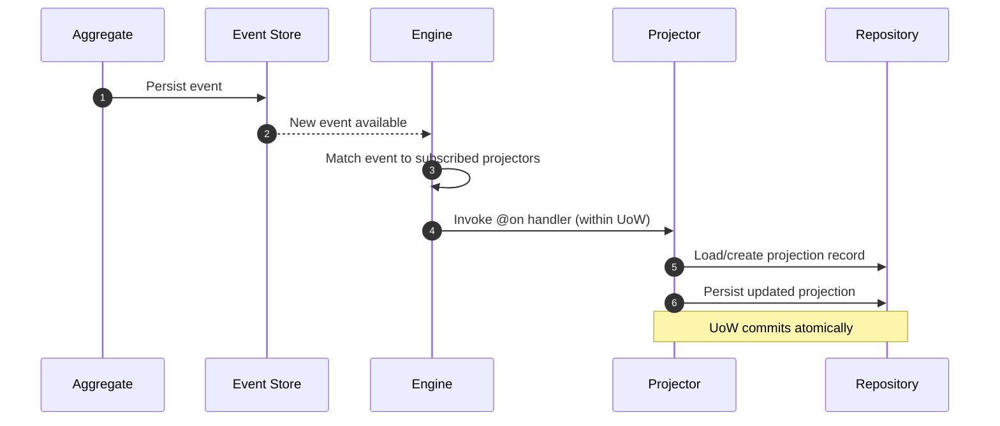

# Projectors

<span class="pathway-tag pathway-tag-cqrs">CQRS</span> <span class="pathway-tag pathway-tag-es">ES</span>

Projectors are specialized event handlers responsible for maintaining
[projections](./projections.md) by listening to domain events and updating
projection data accordingly. They bridge your domain events and read models,
ensuring projections stay synchronized with changes in your domain.

## How Projectors Work

When an aggregate raises an event, the following sequence occurs:



1. An aggregate raises an event and is persisted. The event is written to the
   event store.
2. The Protean Engine's subscription detects the new event.
3. The engine matches the event to all projectors subscribed to that stream
   category.
4. Each matching `@on` handler is invoked within its own Unit of Work.
5. The handler loads or creates the projection record via
   `current_domain.repository_for()`.
6. Changes to the projection are committed atomically when the UoW completes.

If the handler raises an exception, the UoW rolls back and the event may
be retried depending on the subscription configuration.

## Defining a Projector

Projectors are defined using the `Domain.projector` decorator and must be
associated with a specific projection via `projector_for`:

```python hl_lines="1-2"
--8<-- "guides/consume-state/002.py:88:117"
```

You must also specify which events to listen to, via either `aggregates` (a
list of aggregate classes — Protean derives the
[stream categories](../../concepts/async-processing/stream-categories.md)
automatically) or `stream_categories` (a list of stream category names for
more fine-grained control). When both are specified, `stream_categories` takes
precedence.

!!! note "Required: `projector_for`"
    Every projector must specify `projector_for` — the projection class it
    maintains. Omitting it raises `IncorrectUsageError`.

## Event Handling with `@on`

Projectors use the `@on` decorator (an alias for `@handle`) to specify which
events they respond to:

```python hl_lines="5 21"
--8<-- "guides/consume-state/002.py:88:117"
```

A single projector can handle multiple events, and multiple projectors can
handle the same event:

```python
@domain.projector(projector_for=OrderSummary, aggregates=[Order])
class OrderSummaryProjector:
    @on(OrderCreated)
    def on_order_created(self, event: OrderCreated):
        # Create order summary
        pass

    @on(OrderShipped)
    def on_order_shipped(self, event: OrderShipped):
        # Update shipping status
        pass

    @on(OrderCancelled)
    def on_order_cancelled(self, event: OrderCancelled):
        # Mark as cancelled
        pass

@domain.projector(projector_for=ShippingReport, aggregates=[Order])
class ShippingReportProjector:
    @on(OrderShipped)  # Same event, different projector
    def on_order_shipped(self, event: OrderShipped):
        # Update shipping metrics
        pass
```

## Cross-Aggregate Projections

Projectors can listen to events from multiple aggregates to create
comprehensive views:

```python
@domain.projector(
    projector_for=CustomerOrderSummary,
    aggregates=[Customer, Order, Payment]
)
class CustomerOrderSummaryProjector:
    @on(CustomerRegistered)
    def on_customer_registered(self, event: CustomerRegistered):
        # Initialize customer summary
        pass

    @on(OrderPlaced)
    def on_order_placed(self, event: OrderPlaced):
        # Update order count and total
        pass

    @on(PaymentProcessed)
    def on_payment_processed(self, event: PaymentProcessed):
        # Update payment status
        pass
```

For more granular control, use
[stream categories](../../concepts/async-processing/stream-categories.md)
instead of aggregates:

```python
@domain.projector(
    projector_for=SystemMetrics,
    stream_categories=["user", "order", "payment", "inventory"]
)
class SystemMetricsProjector:
    @on(UserRegistered)
    def on_user_registered(self, event: UserRegistered):
        # Update user metrics
        pass

    @on(OrderPlaced)
    def on_order_placed(self, event: OrderPlaced):
        # Update order metrics
        pass
```

## Idempotency

Projectors should be idempotent to handle duplicate events gracefully:

```python
from protean import current_domain
from protean.exceptions import ObjectNotFoundError

@domain.projector(projector_for=UserProfile, aggregates=[User])
class UserProfileProjector:
    @on(UserRegistered)
    def on_user_registered(self, event: UserRegistered):
        repository = current_domain.repository_for(UserProfile)

        # Check if profile already exists
        try:
            existing_profile = repository.get(event.user_id)
            # Profile already exists, skip creation
            return
        except ObjectNotFoundError:
            pass  # Expected case - create new profile

        profile = UserProfile(
            user_id=event.user_id,
            email=event.email,
            name=event.name
        )
        repository.add(profile)
```

## Event Ordering

Be aware that events may not always arrive in the expected order. Design
projectors to handle out-of-order events:

```python
@domain.projector(projector_for=OrderStatus, aggregates=[Order])
class OrderStatusProjector:
    @on(OrderCreated)
    def on_order_created(self, event: OrderCreated):
        repository = current_domain.repository_for(OrderStatus)

        # Use event timestamp to handle ordering
        status = OrderStatus(
            order_id=event.order_id,
            status="CREATED",
            last_updated=event._metadata.timestamp
        )
        repository.add(status)

    @on(OrderShipped)
    def on_order_shipped(self, event: OrderShipped):
        repository = current_domain.repository_for(OrderStatus)
        status = repository.get(event.order_id)

        # Only update if this event is newer
        if event._metadata.timestamp > status.last_updated:
            status.status = "SHIPPED"
            status.last_updated = event._metadata.timestamp
            repository.add(status)
```

## Error Handling

Projectors should handle errors gracefully to ensure system resilience:

```python
@domain.projector(projector_for=ProductInventory, aggregates=[Product])
class ProductInventoryProjector:
    @on(ProductAdded)
    def on_product_added(self, event: ProductAdded):
        try:
            repository = current_domain.repository_for(ProductInventory)

            # Check if inventory already exists
            try:
                existing = repository.get(event.product_id)
                # Handle duplicate case
                return
            except ObjectNotFoundError:
                pass  # Expected case - create new inventory

            inventory = ProductInventory(
                product_id=event.product_id,
                name=event.name,
                price=event.price,
                stock_quantity=event.stock_quantity,
            )

            repository.add(inventory)

        except Exception as e:
            # Log error and potentially raise for retry mechanisms
            logger.error(f"Failed to process ProductAdded event: {e}")
            raise
```

## Handling Deletions

When a projection record should be removed in response to an event, use
`repository.remove()`:

```python
@domain.projector(projector_for=ActiveOrder, aggregates=[Order])
class ActiveOrderProjector:
    @on(OrderPlaced)
    def on_order_placed(self, event: OrderPlaced):
        repository = current_domain.repository_for(ActiveOrder)
        repository.add(ActiveOrder(
            order_id=event.order_id,
            customer_name=event.customer_name,
            status="placed",
        ))

    @on(OrderDelivered)
    def on_order_delivered(self, event: OrderDelivered):
        repository = current_domain.repository_for(ActiveOrder)
        order = repository.get(event.order_id)
        repository.remove(order)
```

## Complete Example

Below is a comprehensive example showing projections and projectors working
together to maintain multiple read models from a single aggregate:

```python hl_lines="65-75 77-85 88-117 120-147"
--8<-- "guides/consume-state/002.py:full"
```

This example demonstrates:

- **Multiple Projections**: `ProductInventory` for detailed inventory tracking
  and `ProductCatalog` for simplified browsing
- **Multiple Projectors**: Each projection has its own dedicated projector
- **Event Handling**: Both projectors respond to the same events but update
  different projections
- **Real-time Updates**: Projections are automatically updated when domain
  events occur

## Testing Projectors

### Unit Testing

Test individual projector methods by creating events and calling the methods
directly:

```python
import pytest
from protean import Domain

def test_product_inventory_projector_on_product_added():
    domain = Domain()
    # ... register domain elements

    with domain.domain_context():
        # Create test event
        event = ProductAdded(
            product_id="test-123",
            name="Test Product",
            description="A test product",
            price=99.99,
            stock_quantity=10
        )

        # Create projector instance
        projector = ProductInventoryProjector()

        # Call the handler method
        projector.on_product_added(event)

        # Verify projection was created
        repository = domain.repository_for(ProductInventory)
        inventory = repository.get("test-123")

        assert inventory.name == "Test Product"
        assert inventory.stock_quantity == 10
```

### Integration Testing

Test the complete flow by raising events from aggregates:

```python
def test_projector_integration():
    domain = Domain()
    # ... register domain elements

    with domain.domain_context():
        # Create and persist aggregate
        product = Product.create(
            name="Integration Test Product",
            description="Testing projector integration",
            price=149.99,
            stock_quantity=25
        )

        product_repo = domain.repository_for(Product)
        product_repo.add(product)  # This triggers events

        # Verify projections were updated via view_for (read-only)
        inventory_view = domain.view_for(ProductInventory)
        catalog_view = domain.view_for(ProductCatalog)

        inventory = inventory_view.get(product.id)
        catalog = catalog_view.get(product.id)

        assert inventory.name == "Integration Test Product"
        assert catalog.in_stock == "YES"
```

---

!!! tip "See also"
    **Concept overviews:**

    - [Projections](../../concepts/building-blocks/projections.md) — Read-optimized views in CQRS.
    - [Projectors](../../concepts/building-blocks/projectors.md) — Specialized handlers that maintain projections.

    **Patterns:**

    - [Design Events for Consumers](../../patterns/design-events-for-consumers.md) — Structuring events so projectors can build reliable read models.
    - [Idempotent Event Handlers](../../patterns/idempotent-event-handlers.md) — Ensuring projectors handle replayed events correctly.
