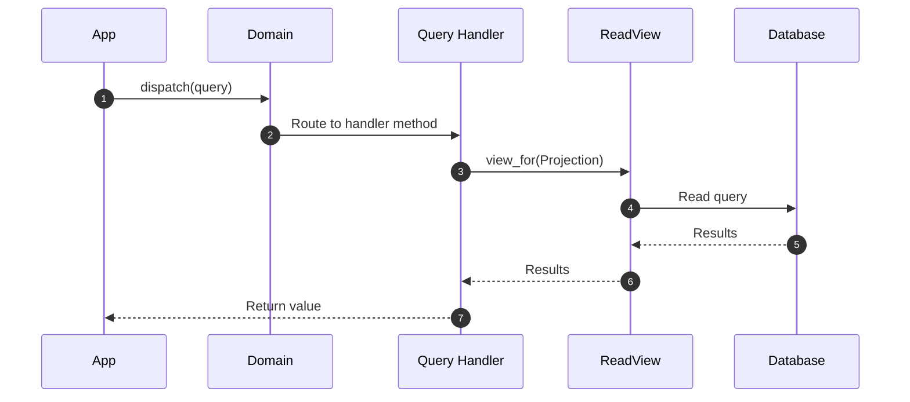

# Query Handlers

!!! abstract "Applies to: CQRS"

Queries carry read intent, and query handlers process them. They receive a
query, access the right projection through a ReadView, and return the result.
Query handlers are the read-side mirror of command handlers, completing the
CQRS pipeline.

## Key Facts

- Query handlers are associated with a **projection** (not an aggregate).
- Handler methods use the `@read` decorator, which does **not** wrap in a
  UnitOfWork.
- Queries are dispatched with `domain.dispatch(query)`, mirroring
  `domain.process(command)` on the write side.
- Handler methods always return values.
- Each query is handled by exactly one handler method.

## Defining a Query Handler

Query handlers are defined with the `@domain.query_handler` decorator:

```python
from protean import current_domain, read
from protean.core.projection import BaseProjection
from protean.core.query import BaseQuery
from protean.core.query_handler import BaseQueryHandler
from protean.fields import Float, Identifier, Integer, String


@domain.projection
class OrderSummary(BaseProjection):
    order_id = Identifier(identifier=True)
    customer_name = String(max_length=100)
    status = String(max_length=20)
    total_amount = Float()


@domain.query(part_of=OrderSummary)
class GetOrdersByCustomer(BaseQuery):
    customer_id = Identifier(required=True)
    status = String()
    page = Integer(default=1)
    page_size = Integer(default=20)


@domain.query(part_of=OrderSummary)
class GetOrderById(BaseQuery):
    order_id = Identifier(required=True)


@domain.query_handler(part_of=OrderSummary)
class OrderSummaryQueryHandler(BaseQueryHandler):
    @read(GetOrdersByCustomer)
    def get_by_customer(self, query):
        view = current_domain.view_for(OrderSummary)
        results = view.query.filter(
            customer_id=query.customer_id
        )
        if query.status:
            results = results.filter(status=query.status)
        return results.all()

    @read(GetOrderById)
    def get_by_id(self, query):
        view = current_domain.view_for(OrderSummary)
        return view.get(query.order_id)
```

### The `@read` Decorator

The `@read` decorator marks methods as query handlers. It accepts a single
argument -- the query class to handle:

```python
@read(GetOrdersByCustomer)
def get_by_customer(self, query):
    ...
```

Unlike `@handle`, the `@read` decorator:

- Does **not** wrap execution in a UnitOfWork
- Does **not** accept `start`, `correlate`, or `end` parameters
- Is intended exclusively for query handlers

## Dispatching Queries

Dispatch queries with `domain.dispatch()`:

```python
# From an API endpoint or application layer
result = domain.dispatch(
    GetOrdersByCustomer(customer_id="cust-123", status="shipped")
)
```

`domain.dispatch()` resolves the registered query handler, invokes the
correct method, and returns the result directly.

### Comparison with `domain.process()`

| Aspect | `domain.process(command)` | `domain.dispatch(query)` |
|--------|--------------------------|-------------------------|
| Side | Write | Read |
| UoW | Yes | No |
| Returns | Optional | Always |
| Async | Supported | No (synchronous only) |
| Idempotency | Supported | Not needed |

## Workflow



1. **Application dispatches query**: The API layer creates a query object and
   calls `domain.dispatch()`.
2. **Domain routes to handler**: The domain resolves the registered query
   handler and calls the matching `@read`-decorated method.
3. **Handler accesses ReadView**: The handler method uses
   `domain.view_for()` to get a read-only facade over the projection.
4. **Results returned**: The handler returns results, which pass through
   `domain.dispatch()` back to the caller.

## Three Levels of Read Access

Protean provides three levels of read abstraction:

| Level | API | When to Use |
|-------|-----|-------------|
| **Pipeline** | `domain.dispatch(query)` | Named queries with validation, structured read logic |
| **Direct** | `domain.query_for(Projection)` | Simple filtering without handler ceremony |
| **Raw** | `domain.connection_for(Projection)` | Complex queries needing database-specific features |

Query handlers operate at Level 1, providing the most structured approach.
Use `domain.query_for()` (Level 2) for simple lookups that don't need a
handler. Use `domain.connection_for()` (Level 3) when you need the raw
database or cache client for technology-specific queries.

## Error Handling

`domain.dispatch()` raises `IncorrectUsageError` when:

- The argument is not a query instance
- The query class is not registered in the domain
- No query handler is registered for the query

```python
from protean.exceptions import IncorrectUsageError

try:
    result = domain.dispatch(GetOrdersByCustomer(customer_id="123"))
except IncorrectUsageError as e:
    # Handle missing handler or unregistered query
    ...
```
