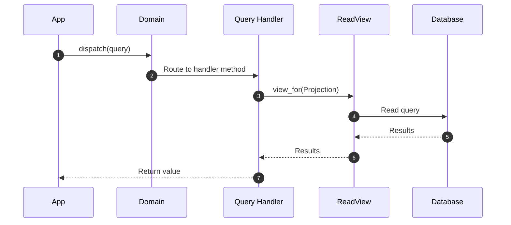

# Query Handlers

<span class="pathway-tag pathway-tag-cqrs">CQRS</span>

Queries carry read intent, and query handlers process them. They receive a
query, access the right projection through a ReadView, and return the result.
Query handlers are the read-side mirror of command handlers, completing the
CQRS pipeline.

For background on how query handlers complete the CQRS read pipeline, see
[Query Handlers concept](../../concepts/building-blocks/query-handlers.md).

## Defining Queries

A query is an immutable DTO representing a read intent. Queries are defined
with the `@domain.query` decorator and must be associated with a projection
via `part_of`:

```python
from protean.fields import Identifier, Integer, String


@domain.query(part_of=OrderSummary)
class GetOrdersByCustomer:
    customer_id = Identifier(required=True)
    status = String()
    page = Integer(default=1)
    page_size = Integer(default=20)
```

Queries are immutable once created — attempting to modify a field after
construction raises `IncorrectUsageError`. Fields support the same validation
constraints as other domain elements (`required`, `max_length`, `min_value`,
`max_value`, `choices`). Invalid inputs raise `ValidationError` at
construction time, before the query reaches the handler.

### Query Naming Conventions

Name queries with the intent they represent — typically starting with `Get`,
`Find`, `List`, or `Search`:

| Pattern | Example | Use when |
|---------|---------|----------|
| `Get<Entity>By<Criteria>` | `GetOrdersByCustomer` | Filtered lookup returning multiple results |
| `Get<Entity>ById` | `GetOrderById` | Single-record lookup by identifier |
| `List<Entity>` | `ListActiveProducts` | Listing with optional filters |
| `Search<Entity>` | `SearchOrders` | Full-text or complex multi-field search |

### Decorator Options

| Option | Default | Description |
|--------|---------|-------------|
| **`part_of`** | — | **Required.** The projection class this query targets |
| `abstract` | `False` | When `True`, the query cannot be instantiated — use as a base class |

## Defining a Query Handler

Query handlers are defined with the `@domain.query_handler` decorator:

```python
from protean import current_domain, read
from protean.fields import Float, Identifier, Integer, String


@domain.projection
class OrderSummary:
    order_id = Identifier(identifier=True)
    customer_name = String(max_length=100)
    status = String(max_length=20)
    total_amount = Float()


@domain.query(part_of=OrderSummary)
class GetOrdersByCustomer:
    customer_id = Identifier(required=True)
    status = String()
    page = Integer(default=1)
    page_size = Integer(default=20)


@domain.query(part_of=OrderSummary)
class GetOrderById:
    order_id = Identifier(required=True)


@domain.query_handler(part_of=OrderSummary)
class OrderSummaryQueryHandler:
    @read(GetOrdersByCustomer)
    def get_by_customer(self, query):
        view = current_domain.view_for(OrderSummary)
        results = view.query.filter(
            customer_id=query.customer_id
        )
        if query.status:
            results = results.filter(status=query.status)
        return results.all()

    @read(GetOrderById)
    def get_by_id(self, query):
        view = current_domain.view_for(OrderSummary)
        return view.get(query.order_id)
```

### The `@read` Decorator

The `@read` decorator marks methods as query handlers. It accepts a single
argument -- the query class to handle:

```python
@read(GetOrdersByCustomer)
def get_by_customer(self, query):
    ...
```

Unlike `@handle`, the `@read` decorator:

- Does **not** wrap execution in a UnitOfWork
- Does **not** accept `start`, `correlate`, or `end` parameters
- Is intended exclusively for query handlers

## Dispatching Queries

Dispatch queries with `domain.dispatch()`:

```python
# From an API endpoint or application layer
result = domain.dispatch(
    GetOrdersByCustomer(customer_id="cust-123", status="shipped")
)
```

`domain.dispatch()` resolves the registered query handler, invokes the
correct method, and returns the result directly.

### Comparison with `domain.process()`

| Aspect | `domain.process(command)` | `domain.dispatch(query)` |
|--------|--------------------------|-------------------------|
| Side | Write | Read |
| UoW | Yes | No |
| Returns | Optional | Always |
| Async | Supported | No (synchronous only) |
| Idempotency | Supported | Not needed |

## Workflow



1. **Application dispatches query**: The API layer creates a query object and
   calls `domain.dispatch()`.
2. **Domain routes to handler**: The domain resolves the registered query
   handler and calls the matching `@read`-decorated method.
3. **Handler accesses ReadView**: The handler method uses
   `domain.view_for()` to get a read-only facade over the projection.
4. **Results returned**: The handler returns results, which pass through
   `domain.dispatch()` back to the caller.

## Three Levels of Read Access

Protean provides three levels of read abstraction:

| Level | API | When to Use |
|-------|-----|-------------|
| **Pipeline** | `domain.dispatch(query)` | Named queries with validation, structured read logic |
| **Direct** | `domain.view_for(Projection).query` | Simple filtering without handler ceremony |
| **Raw** | `domain.connection_for(Projection)` | Complex queries needing database-specific features |

Query handlers operate at Level 1, providing the most structured approach.
Use `domain.view_for().query` (Level 2) for simple lookups that don't need a
handler. Use `domain.connection_for()` (Level 3) when you need the raw
database or cache client for technology-specific queries.

## Error Handling

`domain.dispatch()` raises `IncorrectUsageError` when:

- The argument is not a query instance
- The query class is not registered in the domain
- No query handler is registered for the query

Within handler methods, common runtime errors include:

| Exception | When it occurs |
|-----------|----------------|
| `ValidationError` | Query field validation fails at construction (missing required field, invalid value) |
| `ObjectNotFoundError` | `view.get(identifier)` finds no matching record |
| `NotSupportedError` | `view.query` or `view.find_by()` called on a cache-backed projection |

```python
from protean.exceptions import IncorrectUsageError, ObjectNotFoundError

try:
    result = domain.dispatch(GetOrderById(order_id="nonexistent"))
except ObjectNotFoundError:
    # No projection record with this identifier
    ...
except IncorrectUsageError as e:
    # Handle missing handler or unregistered query
    ...
```

### `@handle` vs. `@read`

Both decorators route messages to handler methods, but they serve different
sides of CQRS:

| Aspect | `@handle` | `@read` |
|--------|-----------|---------|
| Used in | Command handlers, event handlers | Query handlers only |
| UoW wrapping | Yes — rolls back on error | No — read-only, no transaction |
| Side effects | Expected (persist aggregates, raise events) | None — reads only |
| Parameters | `start`, `correlate`, `end` for lifecycle control | None beyond the query class |

---

!!! tip "See also"
    **Concept overview:** [Query Handlers](../../concepts/building-blocks/query-handlers.md) — How query handlers process read intents in CQRS.

    **Related guides:**

    - [Projections](./projections.md) — The read models that query handlers operate on.
    - [Event Handlers](./event-handlers.md) — The write-side consumer counterpart.
