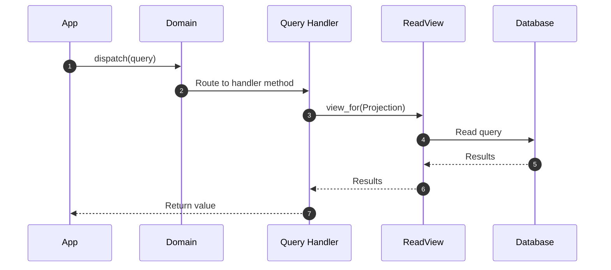

# Query Handlers

<span class="pathway-tag pathway-tag-cqrs">CQRS</span>

Queries carry read intent, and query handlers process them. They receive a
query, access the right projection through a ReadView, and return the result.
Query handlers are the read-side mirror of command handlers, completing the
CQRS pipeline.

For background on how query handlers complete the CQRS read pipeline, see
[Query Handlers concept](../../concepts/building-blocks/query-handlers.md).

## Defining Queries

A query is an immutable DTO representing a read intent. Queries are defined
with the `@domain.query` decorator and must be associated with a projection
via `part_of`:

```python
--8<-- "guides/consume-state/query-handlers/001.py:query"
```

Queries are immutable once created, attempting to modify a field after
construction raises `IncorrectUsageError`. Fields support the same validation constraints as
other domain elements (`required`, `max_length`, `min_value`, `max_value`, `choices`). Invalid inputs raise `ValidationError` at
construction time, before the query reaches the handler.

### Query Naming Conventions

Name queries with the intent they represent, typically starting with `Get`,
`Find`, `List`, or `Search`:

| Pattern | Example | Use when |
|---------|---------|----------|
| `Get<Entity>By<Criteria>` | `GetOrdersByCustomer` | Filtered lookup returning multiple results |
| `Get<Entity>ById` | `GetOrderById` | Single-record lookup by identifier |
| `List<Entity>` | `ListActiveProducts` | Listing with optional filters |
| `Search<Entity>` | `SearchOrders` | Full-text or complex multi-field search |

### Decorator Options

| Option | Default | Description |
|--------|---------|-------------|
| **`part_of`** | — | **Required.** The projection class this query targets |
| `abstract` | `False` | When `True`, the query cannot be instantiated, use as a base class |

## Defining a Query Handler

Query handlers are defined with the `@domain.query_handler` decorator:

```python
--8<-- "guides/consume-state/query-handlers/001.py:handler"
```

### The `@read` Decorator

The `@read` decorator marks methods as query handlers. It accepts a single
argument, the query class to handle:

```python
# fragment
@read(GetOrdersByCustomer)
def get_by_customer(self, query):
    ...
```

Unlike `@handle`, the `@read` decorator:

- Does **not** wrap execution in a UnitOfWork
- Does **not** accept `start`, `correlate`, or `end` parameters
- Is intended exclusively for query handlers

## Dispatching Queries

Dispatch queries with `domain.dispatch()`:

```python
--8<-- "guides/consume-state/query-handlers/001.py:dispatch"
```

`domain.dispatch()` resolves the registered query handler, invokes the
correct method, and returns the result directly.

### Typing the dispatch result

By default `domain.dispatch()` returns `Any`. A query can declare the type its
handler returns by subscripting `BaseQuery`, and then `dispatch` resolves to
that type at the call site:

```python hl_lines="16 34-35"
--8<-- "guides/consume-state/query-handlers/002.py:typed"
```

The result type must match what the handler returns; the query declares it once,
next to its fields. This is plain typing, so it works under both mypy and pyright
with no plugin. Declaring the result type is optional: a query that does not
subscript `BaseQuery` keeps dispatching to `Any`, and runtime behavior is
identical either way. See [ADR-0043](../../adr/0043-typed-query-dispatch.md).

### Comparison with `domain.process()`

| Aspect | `domain.process(command)` | `domain.dispatch(query)` |
|--------|--------------------------|-------------------------|
| Side | Write | Read |
| UoW | Yes | No |
| Returns | Optional | Always |
| Async | Supported | No (synchronous only) |
| Idempotency | Supported | Not needed |

## Workflow


```mermaid
sequenceDiagram
  autonumber
  App->>Domain: dispatch(query)
  Domain->>Query Handler: Route to handler method
  Query Handler->>ReadView: view_for(Projection)
  ReadView->>Database: Read query
  Database-->>ReadView: Results
  ReadView-->>Query Handler: Results
  Query Handler-->>App: Return value
```

1. **Application dispatches query**: The API layer creates a query object and
   calls `domain.dispatch()`.
2. **Domain routes to handler**: The domain resolves the registered query
   handler and calls the matching `@read`-decorated method.
3. **Handler accesses ReadView**: The handler method uses
   `domain.view_for()` to get a read-only facade over the projection.
4. **Results returned**: The handler returns results, which pass through
   `domain.dispatch()` back to the caller.

## Three Levels of Read Access

Protean provides three levels of read access to projections:

| Level | Entry point | When to use |
|-------|-------------|-------------|
| **Pipeline** | `domain.dispatch(query)` | Named queries with validation and structured read logic |
| **Facade** | `domain.view_for(Projection)` | Read-only projection access without handler ceremony |
| **Raw** | `domain.connection_for(Projection)` | Technology-specific queries (SQL, Elasticsearch DSL, Redis) |

Query handlers operate at Level 1, the most structured approach. Use
`domain.view_for(Projection)` (Level 2) for read-only lookups that don't need a
handler. It returns a `ReadView`, and `view.query` gives you a chainable
`ReadOnlyQuerySet` (a `QuerySet` subclass whose `update()`/`delete()` raise
`NotSupportedError`). Use `domain.connection_for(Projection)` (Level 3) when
you need the raw database or cache client for technology-specific queries.

To *write* to a projection (inside a projector), use
`domain.repository_for(Projection)`. That is the write path, not a read level.

## Error Handling

`domain.dispatch()` raises `IncorrectUsageError` when:

- The argument is not a query instance
- The query class is not registered in the domain
- No query handler is registered for the query

Within handler methods, common runtime errors include:

| Exception | When it occurs |
|-----------|----------------|
| `ValidationError` | Query field validation fails at construction (missing required field, invalid value) |
| `ObjectNotFoundError` | `view.get(identifier)` finds no matching record |
| `NotSupportedError` | `view.query` or `view.find_by()` called on a cache-backed projection |

```python
--8<-- "guides/consume-state/query-handlers/002.py:errors"
```

### `@handle` vs. `@read`

Both decorators route messages to handler methods, but they serve different
sides of CQRS:

| Aspect | `@handle` | `@read` |
|--------|-----------|---------|
| Used in | Command handlers, event handlers | Query handlers only |
| UoW wrapping | Yes, rolls back on error | No, read-only, no transaction |
| Side effects | Expected (persist aggregates, raise events) | None, reads only |
| Parameters | `start`, `correlate`, `end` for lifecycle control | None beyond the query class |

Using `@handle` on a query-handler method is **not permitted**, `domain.init()` raises `IncorrectUsageError`
(naming `@read`), because a query handler must be a stateless read with no
UnitOfWork. Use `@read` for every query-handler method.

---

!!! tip "See also"
    **Concept overview:** [Query Handlers](../../concepts/building-blocks/query-handlers.md): How query handlers process read intents in CQRS.

    **Related guides:**

    - [Projections](./projections.md): The read models that query handlers operate on.
    - [Event Handlers](./event-handlers.md): The write-side consumer counterpart.
