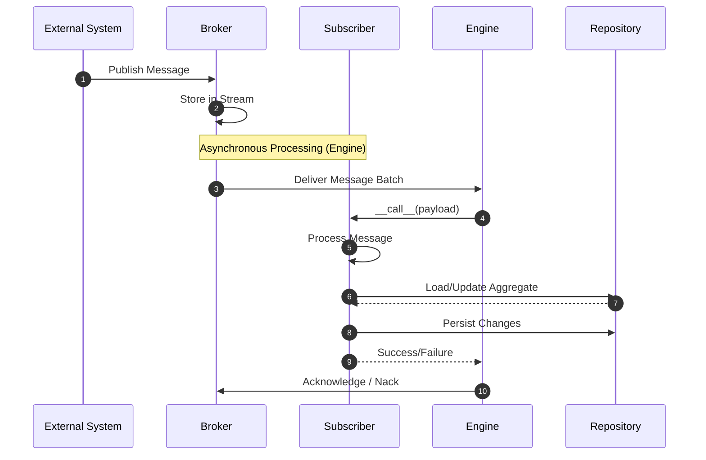

# Subscribers

!!! abstract "Applies to: DDD · CQRS · Event Sourcing"


Subscribers consume messages from external message brokers and other systems
outside the domain boundary. They bridge external messaging infrastructure and
the domain's internal handling, serving as the entry point for inter-system
integration at the messaging level.

!!!note "Subscribers vs. Event Handlers"
    **Event handlers** consume domain events from the internal event store and
    are associated with an aggregate via `part_of`. Use them to react to changes
    within your bounded context.

    **Subscribers** consume raw `dict` payloads from external brokers and are
    associated with a `stream`. Use them to consume messages from external
    systems like payment gateways, shipping providers, or third-party webhooks.

    See [Event Handlers](event-handlers.md) for handling domain events.

## Key Facts

- Subscribers are registered with the `@domain.subscriber` decorator and must
  specify a `stream` name.
- Subscribers consume raw `dict` payloads from external message brokers, not
  typed domain events.
- Each subscriber must implement the `__call__(self, payload: dict)` method,
  which is invoked for every message on the stream.
- Subscribers are associated with a **broker** (defaults to `"default"`) and a
  **stream** (required).
- In synchronous mode (`message_processing = "sync"`), subscribers are invoked
  immediately when a message is published. In asynchronous mode (the default),
  they are processed by the [Protean Engine](../server/index.md).
- Subscribers support error recovery through an optional `handle_error`
  classmethod.
- Unlike event handlers, subscribers do not use the `@handle` decorator for
  event-type dispatch -- they receive all messages on their stream through a
  single `__call__` method.

## Defining a Subscriber

Subscribers are defined with the `Domain.subscriber` decorator:

```python hl_lines="23-33"
{! docs_src/guides/consume-state/003.py !}
```

1. `@domain.subscriber(stream="payment_gateway")` registers this class as a
   subscriber listening to the `"payment_gateway"` broker stream. The default
   broker is used since no `broker` parameter is specified.

2. The `__call__` method receives a raw `dict` payload. The structure of the
   payload depends entirely on what the external system publishes.

3. The subscriber loads the relevant aggregate from the repository, applies
   business logic, and persists the changes.

## Subscriber Workflow



1. **External System Publishes Message**: An external system sends a message to
   the broker on a named stream.

1. **Broker Stores Message**: The broker stores the message in the stream for
   later consumption.

1. **Engine Delivers Messages**: The Protean Engine's broker subscription polls
   the broker for new messages in batches.

1. **Engine Invokes Subscriber**: For each message, the engine instantiates the
   subscriber and calls its `__call__` method with the raw `dict` payload.

1. **Subscriber Processes Message**: The subscriber extracts data from the
   payload and performs business logic.

1. **Load/Update Aggregate**: The subscriber may load and modify aggregates
   through repositories.

1. **Persist Changes**: Modified aggregates are persisted.

1. **Acknowledge/Nack**: On success, the message is acknowledged. On failure,
   it is negatively acknowledged for potential reprocessing.

## Configuration Options

### `stream` (required)

The name of the broker stream this subscriber listens to. This must be
specified; omitting it raises an `IncorrectUsageError`.

```python
@domain.subscriber(stream="external_orders")
class ExternalOrderSubscriber:
    def __call__(self, payload: dict) -> None:
        ...
```

### `broker` (optional, default: `"default"`)

The name of the broker to use, as configured in the domain configuration. If
not specified, the subscriber uses the `"default"` broker.

```python
# Uses the default broker
@domain.subscriber(stream="order_events")
class OrderSubscriber:
    def __call__(self, payload: dict) -> None:
        ...

# Uses a specific named broker
@domain.subscriber(stream="analytics_events", broker="analytics")
class AnalyticsSubscriber:
    def __call__(self, payload: dict) -> None:
        ...
```

!!!note
    The broker name must correspond to a broker configured in your domain
    configuration. If the specified broker has not been configured, Protean
    will raise a `ConfigurationError` during domain initialization.

    See [Brokers](../../adapters/broker/index.md) for details on configuring
    brokers.

## Processing Modes

### Synchronous Processing

When `message_processing` is set to `"sync"`, subscribers are invoked
immediately within the `publish()` call. This is useful for development,
testing, and simple applications.

```toml
# domain.toml
message_processing = "sync"
```

In sync mode, when a message is published to a broker stream, the broker looks
up all subscribers registered for that stream and invokes them inline before
returning.

### Asynchronous Processing

When `message_processing` is set to `"async"` (the default), messages are
stored in the broker and processed later by the Protean Engine. This is the
recommended mode for production.

```toml
# domain.toml
message_processing = "async"
```

In async mode, you must run the Protean server to process subscriber messages:

```bash
protean server
```

The engine creates a broker subscription for each registered subscriber,
managing consumer groups, message batching, and acknowledgment automatically.

Learn more in [Server](../server/index.md) and
[Subscriptions](../server/subscriptions.md).

## Error Handling

Subscribers support custom error handling through the optional `handle_error`
method. This method is called when an exception occurs during message
processing, allowing you to implement specialized error handling strategies.

### The `handle_error` Method

You can define a `handle_error` class method in your subscriber to handle
exceptions:

```python
@domain.subscriber(stream="payment_gateway")
class PaymentSubscriber:
    def __call__(self, payload: dict) -> None:
        # Processing logic that might raise exceptions
        ...

    @classmethod
    def handle_error(cls, exc: Exception, message: dict) -> None:
        """Custom error handling for message processing failures."""
        logger.error(f"Failed to process payment message: {exc}")
        # Perform recovery: store for retry, notify monitoring, etc.
        ...
```

### How It Works

1. When an exception occurs in a subscriber's `__call__` method, the Protean
   Engine catches it.
2. The engine logs detailed error information including stack traces.
3. The engine calls the subscriber's `handle_error` classmethod, passing:
   - The original exception that was raised
   - The message `dict` being processed when the exception occurred
4. After `handle_error` completes, processing continues with the next message.
5. The failed message is negatively acknowledged for potential reprocessing by
   the broker.

### Error Handler Failures

If an exception occurs within the `handle_error` method itself, the Protean
Engine will catch and log that exception as well, ensuring that the message
processing pipeline continues to function. This provides an additional layer
of resilience:

```python
@classmethod
def handle_error(cls, exc: Exception, message: dict) -> None:
    try:
        # Error handling logic that might itself fail
        ...
    except Exception as error_exc:
        # The engine will catch and log this secondary exception
        logger.error(f"Error handler failed: {error_exc}")
        # Processing continues regardless
```

### Best Practices

1. Make error handlers robust and avoid complex logic that might fail.
2. Use error handlers for logging, notification, and simple recovery.
3. Do not throw exceptions from error handlers unless absolutely necessary.
4. Consider implementing retry logic or dead-letter patterns for persistent
   failures.

## Subscribers vs. Event Handlers

| Aspect | Event Handler | Subscriber |
|--------|--------------|------------|
| **Decorator** | `@domain.event_handler` | `@domain.subscriber` |
| **Message source** | Internal event store | External message broker |
| **Association** | `part_of` an aggregate | `stream` on a broker |
| **Payload type** | Typed domain event objects | Raw `dict` payloads |
| **Dispatch** | `@handle(EventClass)` per event type | Single `__call__(payload)` for all messages |
| **Processing config** | `event_processing` | `message_processing` |
| **Use case** | React to domain changes within bounded context | Consume messages from external systems |

Use **event handlers** when you need to react to events raised by aggregates
within your domain. Use **subscribers** when you need to integrate with external
systems that publish messages to a broker.

## Complete Example

Below is a comprehensive example showing two subscribers processing webhooks
from different external systems -- a payment gateway and a shipping provider:

```python hl_lines="24-48 51-63"
{! docs_src/guides/consume-state/004.py !}
```

1. `PaymentWebhookSubscriber` listens to the `"payment_gateway"` stream on the
   default broker.

2. The `__call__` method receives the raw webhook payload, extracts the order
   ID and status, and updates the order accordingly.

3. The `handle_error` classmethod provides custom error handling. If `__call__`
   raises an exception, this method is invoked with the exception and the
   original message.

4. `ShippingUpdateSubscriber` listens to a different stream
   (`"shipping_updates"`), demonstrating that multiple subscribers can coexist,
   each consuming from their own stream.
