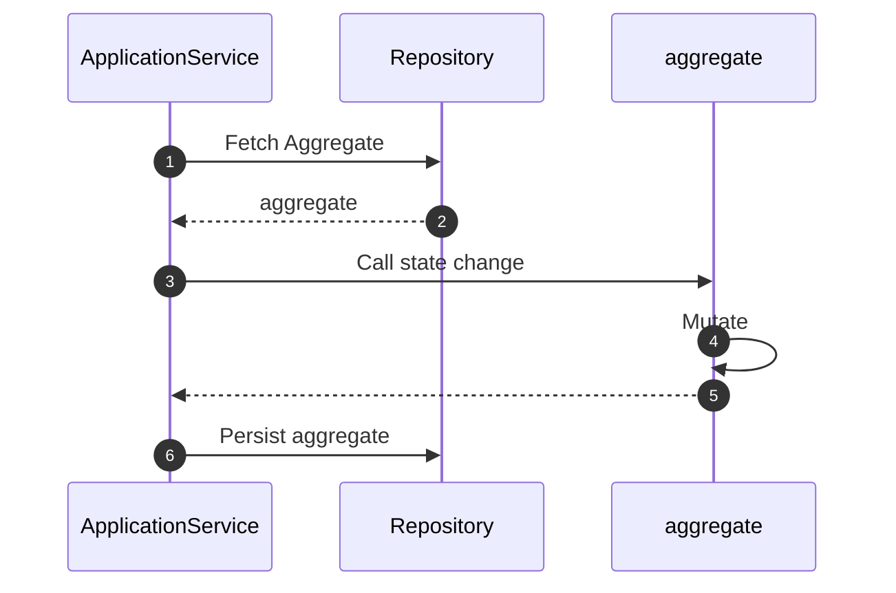

# Mutating Aggregates

!!! abstract "Applies to: DDD · CQRS · Event Sourcing"


The primary mechanism to modify the current state of a domain - to reflect
some action or event that has happened - is by mutating its state. Since
aggregates encapsulate all data and behavior of concepts in domain,
state changes are initiated by invoking state-changing methods on the aggregate.

## Typical Workflow

A typical workflow of a state change is depicted below:



An Application Service (or another element from the Application Layer, like
Command Handler or Event Handler) loads the aggregate from the repository.
It then invokes a method on the aggregate that mutates state. We will dive
deeper into the Application layer in a later section, but below is the
aggregate method that mutates state:

```python hl_lines="13-16 18-24"
--8<-- "guides/domain-behavior/002.py:10:33"
```

Also visible is the invariant (business rule) that the balance should never
be below the overdraft limit.

## Mutating State

Changing state within an aggregate is straightforward, in the form of attribute
updates. 

```python hl_lines="13"
--8<-- "guides/domain-behavior/002.py:16:33"
```

If the state change is successful, meaning it satisfies all
invariants defined on the model, the aggregate immediately reflects the
changes.

```shell hl_lines="8"
In [1]: account = Account(account_number="1234", balance=1000.0, overdraft_limit=50.0)

In [2]: account.withdraw(500.0)

In [3]: account.to_dict()
Out[3]: 
{'account_number': '1234',
 'balance': 500.0,
 'overdraft_limit': 50.0,
 'id': '73e6826c-cae0-4fbf-b42b-7edefc030968'}
```

If the change does not satisfy an invariant, exceptions are raised.

```shell hl_lines="3 7"
In [1]: account = Account(account_number="1234", balance=1000.0, overdraft_limit=50.0)

In [2]: account.withdraw(1100.0)
---------------------------------------------------------------------------
InsufficientFundsException                Traceback (most recent call last)
...
InsufficientFundsException: Balance cannot be below overdraft limit
```

## Event-Sourced Aggregates

For **event-sourced aggregates**, state is never mutated directly in
business methods. Instead, business methods raise events via `raise_()`,
and the framework automatically invokes the corresponding `@apply`
handler to perform the state change:

```python
@domain.aggregate(is_event_sourced=True)
class Order:
    status: String(max_length=20, default="PENDING")

    def confirm(self):
        # Don't set self.status here — raise an event instead
        self.raise_(OrderConfirmed(order_id=self.id))

    @apply
    def when_confirmed(self, event: OrderConfirmed):
        # State mutation happens here, triggered by raise_()
        self.status = "CONFIRMED"
```

This ensures the **same code path** runs whether the aggregate is
processing a live command or being reconstructed from stored events.

The `raise_()` method wraps the `@apply` call inside `atomic_change()`,
so invariants are checked before and after the state change — the
"always valid" guarantee is preserved.

See [Raising Events](raising-events.md#es-raise-apply) for full
details on the `raise_()` + `@apply` integration.

---

!!! tip "See also"
    **Concept overview:** [Aggregates](../../core-concepts/domain-elements/aggregates.md) — Aggregate consistency, invariants, and state management.

    **Patterns:**

    - [Encapsulate State Changes](../../patterns/encapsulate-state-changes.md) — Protecting aggregate internals with controlled mutation methods.
