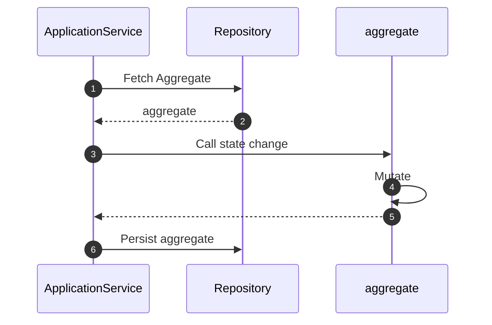

# Mutating Aggregates

The primary mechanism to modify the current state of a domain - to reflect
some action or event that has happened - is by mutating its state. Since
aggregates encapsulate all data and behavior of concepts in domain,
state changes are initiated by invoking state-changing methods on the aggregate.

## Typical Workflow

A typical workflow of a state change is depicted below:



An Application Service (or another element from the Application Layer, like
Command Handler or Event Handler) loads the aggregate from the repository.
It then invokes a method on the aggregate that mutates state. We will dive
deeper into the Application layer in a later section, but below is the
aggregate method that mutates state:

```python hl_lines="13-16 18-24"
--8<-- "guides/domain-behavior/002.py:10:33"
```

Also visible is the invariant (business rule) that the balance should never
be below the overdraft limit.

## Mutating State

Changing state within an aggregate is straightforward, in the form of attribute
updates. 

```python hl_lines="13"
--8<-- "guides/domain-behavior/002.py:16:33"
```

If the state change is successful, meaning it satisfies all
invariants defined on the model, the aggregate immediately reflects the
changes.

```shell hl_lines="8"
In [1]: account = Account(account_number="1234", balance=1000.0, overdraft_limit=50.0)

In [2]: account.withdraw(500.0)

In [3]: account.to_dict()
Out[3]: 
{'account_number': '1234',
 'balance': 500.0,
 'overdraft_limit': 50.0,
 'id': '73e6826c-cae0-4fbf-b42b-7edefc030968'}
```

If the change does not satisfy an invariant, exceptions are raised.

```shell hl_lines="3 7"
In [1]: account = Account(account_number="1234", balance=1000.0, overdraft_limit=50.0)

In [2]: account.withdraw(1100.0)
---------------------------------------------------------------------------
InsufficientFundsException                Traceback (most recent call last)
...
InsufficientFundsException: Balance cannot be below overdraft limit
```

## Raising Events

The aggregate also (preferably) raises one or more events to recort the state
change and to propagate the change within and beyond the bounded context.

```python hl_lines="15"
--8<-- "guides/domain-behavior/002.py:16:33"
```

The events are visible as part of the mutated aggregate. When we review the
Application Layer, we will also talk about how these events are dispatched
automatically.

```shell hl_lines="8 12-13"
In [1]: account = Account(account_number="1234", balance=1000.0, overdraft_limit=50.0)

In [2]: account.withdraw(500.0)

In [3]: account.to_dict()
Out[3]: 
{'account_number': '1234',
 'balance': 500.0,
 'overdraft_limit': 50.0,
 'id': '37fc8d10-1209-41d2-a6fa-4f7312912212'}

In [4]: account._events
Out[4]: [<AccountWithdrawn: AccountWithdrawn object ({'account_number': '1234', 'amount': 500.0})>]
```