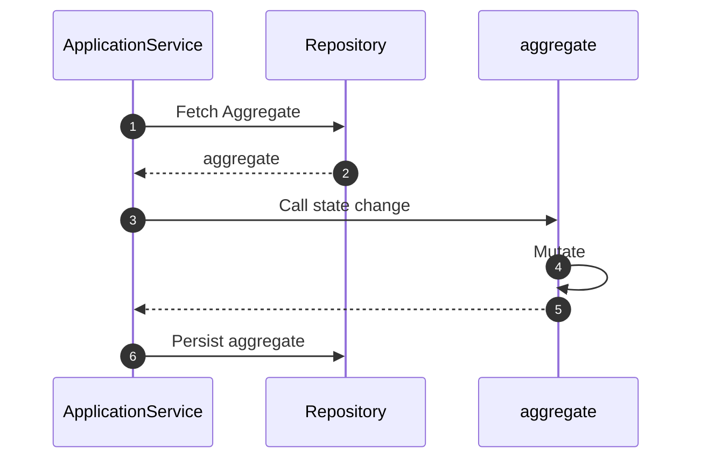

# Mutating Aggregates

<span class="pathway-tag pathway-tag-ddd">DDD</span> <span class="pathway-tag pathway-tag-cqrs">CQRS</span> <span class="pathway-tag pathway-tag-es">ES</span>

In DDD, aggregates are not passive data containers — they are the guardians of
business rules. If external code could freely set fields on an aggregate
(the "anemic domain model" anti-pattern), invariants would be bypassed and the
aggregate could silently drift into an invalid state. Instead, state changes
happen through **methods on the aggregate** that encapsulate the business logic,
enforce invariants, and raise events.

## Typical Workflow

A typical workflow of a state change is depicted below:


```mermaid
sequenceDiagram
  autonumber
  ApplicationService->>Repository: Fetch Aggregate
  Repository-->>ApplicationService: aggregate
  ApplicationService->>aggregate: Call state change
  aggregate->>aggregate: Mutate
  aggregate-->>ApplicationService:
  ApplicationService->>Repository: Persist aggregate
```

An Application Service (or another element from the Application Layer, like
[Command Handler](../change-state/command-handlers.md) or
[Event Handler](../consume-state/event-handlers.md)) loads the aggregate from
the repository. It then invokes a method on the aggregate that mutates state.
Below is the aggregate method that mutates state:

```python hl_lines="13-16 18-24"
--8<-- "guides/domain-behavior/002.py:10:33"
```

Also visible is the invariant (business rule) that the balance should never
be below the overdraft limit.

## Mutating State

Changing state within an aggregate is straightforward, in the form of attribute
updates.

```python hl_lines="13"
--8<-- "guides/domain-behavior/002.py:16:33"
```

If the state change is successful, meaning it satisfies all
invariants defined on the model, the aggregate immediately reflects the
changes.

```shell hl_lines="8"
In [1]: account = Account(account_number="1234", balance=1000.0, overdraft_limit=50.0)

In [2]: account.withdraw(500.0)

In [3]: account.to_dict()
Out[3]:
{'account_number': '1234',
 'balance': 500.0,
 'overdraft_limit': 50.0,
 'id': '73e6826c-cae0-4fbf-b42b-7edefc030968'}
```

If the change does not satisfy an invariant, exceptions are raised.

```shell hl_lines="3 7"
In [1]: account = Account(account_number="1234", balance=1000.0, overdraft_limit=50.0)

In [2]: account.withdraw(1100.0)
---------------------------------------------------------------------------
InsufficientFundsException                Traceback (most recent call last)
...
InsufficientFundsException: Balance cannot be below overdraft limit
```

## How It Works {#how-it-works}

Every field assignment on an aggregate or entity (`self.x = value`) is
intercepted by `__setattr__`, which runs a full validation cycle:

1. **Pre-invariants fire** — `@invariant.pre` methods check whether the
   current state allows the proposed change.
2. **Protean validates the assignment** — the field's type, constraints
   (`required`, `max_length`, `choices`, etc.) are enforced. If validation
   fails, a `ValidationError` is raised and the assignment never takes
   effect.
3. **Post-invariants fire** — `@invariant.post` methods verify the aggregate
   remains in a valid state after the change.
4. **The entity is marked as changed** — Protean's internal `_EntityState`
   tracks the mutation so the Unit of Work knows to persist it.

This means that **every individual assignment** triggers the full invariant
cycle. If you need to change multiple fields together (where intermediate
states would be invalid), use `atomic_change`:

```python
from protean import atomic_change

with atomic_change(order):
    order.total_amount = 120.0
    order.add_items(
        OrderItem(product_id="3", quantity=2, price=10.0, subtotal=20.0)
    )
```

Within `atomic_change`, pre-invariants fire on entry, individual assignment
checks are suspended, and post-invariants fire on exit. See
[Invariants — Atomic Changes](invariants.md#atomic-changes) for details.

### Identifier Immutability

Identifier fields (marked with `identifier=True` or using the `Auto`/
`Identifier` field type) cannot be changed once set. Attempting to reassign
an identifier raises `InvalidOperationError`:

```shell
In [1]: account.id = "new-id"
...
InvalidOperationError: Identifiers cannot be changed once set
```

### Child Entity Mutations

When a child entity's attribute is changed, the **root aggregate's** invariants
fire — not just the entity's own. This ensures cross-entity business rules are
always enforced, even when mutations happen deep in the aggregate cluster.

## Event-Sourced Aggregates

For **event-sourced aggregates**, state is never mutated directly in
business methods. Instead, business methods raise events via `raise_()`,
and the framework automatically invokes the corresponding `@apply`
handler to perform the state change:

```python
@domain.aggregate(is_event_sourced=True)
class Order:
    status: String(max_length=20, default="PENDING")

    def confirm(self):
        # Don't set self.status here — raise an event instead
        self.raise_(OrderConfirmed(order_id=self.id))

    @apply
    def when_confirmed(self, event: OrderConfirmed):
        # State mutation happens here, triggered by raise_()
        self.status = "CONFIRMED"
```

This ensures the **same code path** runs whether the aggregate is
processing a live command or being reconstructed from stored events.

The `raise_()` method wraps the `@apply` call inside `atomic_change()`,
so invariants are checked before and after the state change — the
"always valid" guarantee is preserved.

See [Raising Events](raising-events.md#es-raise-apply) for full
details on the `raise_()` + `@apply` integration.

---

!!! tip "See also"
    **Concept overview:** [Aggregates](../../concepts/building-blocks/aggregates.md) — Aggregate consistency, invariants, and state management.

    **Related guides:**

    - [Invariants](invariants.md) — Business rules that enforce aggregate consistency.
    - [Raising Events](raising-events.md) — Recording and propagating state changes as domain events.
    - [Validations](validations.md) — Field-level constraints enforced during mutation.

    **Patterns:**

    - [Encapsulate State Changes](../../patterns/encapsulate-state-changes.md) — Protecting aggregate internals with controlled mutation methods.
    - [Aggregate State Machines](../../patterns/aggregate-state-machines.md) — Modeling aggregate lifecycle transitions.
    - [Thin Handlers, Rich Domain](../../patterns/thin-handlers-rich-domain.md) — Keeping business logic in the aggregate, not the handler.
