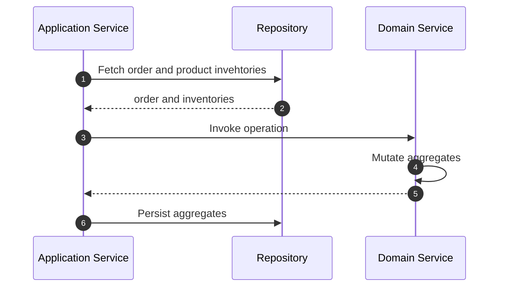

# Domain Services

Domain services act as orchestrators, centralizing complex domain logic that
doesn't neatly fit within an entity or aggregate. They encapsulate business
rules and domain decisions that need multiple aggregates as input.

Domain services free us from having to shoehorn business logic into aggregate
clusters. This keeps domain objects focused on their core state and behavior,
while domain services handle the broader workflows and complex interactions
within the domain.

Even though Domain services can access multiple aggregates, they are not meant
to propagate state changes in more than one aggregate. A combination of
Application Services, Events, and eventual consistency sync aggregates when a
transaction spans beyond an aggregate's boundary. We will discuss these aspects
more thoroughly in the Application Layer section.

## Key Facts

- **Stateless:** Domain services are stateless - they don’t hold any internal
state between method calls. They operate on the state provided to them through
their method parameters.
- **Encapsulate Business Logic:** Domain Services encapsulate complex business
logic or operations that involve multiple aggregate, specifically, logic that
doesn't naturally fit within any single aggregate.
- **Pure Domain Concepts:** Domain services focus purely on domain logic and
cannot handle technical aspects like persistence or messaging, though they
mutate aggregates to a state that they is ready to be persisted. Technical
concerns are typically handled by invoking services like application services
or command/event handlers.

## Defining a Domain Service

A Domain Service is defined with the `Domain.domain_service` decorator, and
associated with at least two aggregates with the `part_of` option.

The service methods in a Domain Service can be structured in three flavors:

### 1. Class with class methods

If you don't have any invariants to be managed by the Domain Service, each
method in the Domain Service can simply be a class method, that receives all
the input necessary for performing the business function.

```python hl_lines="1-2"
--8<-- "guides/domain-behavior/008.py:88:98"
```

Invoking it is straight forward:

```shell
OrderPlacementService.place_order(order, inventories)
```

### 2. Class with instance methods

In this flavor, the Domain Service is instantiated with the aggregates and each
method performs a distinct business function.

```python hl_lines="1-2 9"
--8<-- "guides/domain-behavior/007.py:88:112"
```

You would then instantiate the Domain Service, passing the relevant aggregates
and invoke the methods on the instance.

```shell
service = OrderPlacementService(order, inventories)
service.place_order()
```

### 3. Callable class

If you have a single business function, you can simply model it as a callable
class:

```python hl_lines="1-2 9"
--8<-- "guides/domain-behavior/006.py:88:112"
```

```shell
service = OrderPlacementService(order, inventories)
service()
```

### Deciding between different flavors

The decision between a class with instance methods and a callable class boils
down to two factors:
1. How many business functions does the Domain Service have? If it has only one,
then a callable class is more elegant.
2. Do you have `pre` invariants that only apply to specific methods? Then it
makes sense to construct each method as a separate callable class. If your
invariant methods apply to all methods, then a class with instance methods is
preferable.

As usual, you will probably have not enough insight to take this decision
upfront. As your domain model matures, review regularly and decide on the best
way to model the Domain Service.

!!!note
    You can include private methods in a Domain Service class by prefixing the
    method name with an underscore. If you encounter a `RecursionError:
    maximum recursion depth exceeded` error, it is likely that a domain method
    is calling a private method, but the private method name is not prefixed
    with an underscore.

## Typical Workflow

Let us consider an example `OrderPlacementService` that places an order and
updates inventory stocks simultaneously. The typical workflow of a Domain
Service is below:



The application service loads the necessary aggregates through repositories,
and invokes the service method to place order. The service method executes
the business logic, mutates the aggregates, and returns them to the application
service, which then persists them again with the help of repositories.

## Invariants

Just like Aggregates and Entities, Domain Services can also have invariants.
These invariants are used to validate the state of the aggregates passed to
the service method. Unlike in Aggregates though, invariants in Domain Services
typically deal with validations that span across multiple aggregates.

`pre` invariants check the state of the aggregates before they are mutated,
while `post` invariants check the state after the mutation.

!!!note
   It is a good practice to step back and review the business logic placed in
   the Domain Service now and then. If an invariant does not use multiple
   aggregates, it is likely that it belongs within an aggregate and not in the
   service.

## A full-blown example

```python hl_lines="142-149"
{! docs_src/guides/domain-behavior/006.py !}
```

When an order is placed, `Order` status has to be `CONFIRMED` _and_ the stock
record of each product in `Inventory` has to be reduced.

This change could be performed with events, with `Order` generating an event
and `Inventory` aggregate consuming the event and updating its records. But
there is a possibility of encountering stock depleted issues if multiple
orders are placed at the same time.

So a Domain Service works best here because it updates the states of both
the `Order` aggregate as well as the `Inventory` aggregate in a single
transaction.

**IMPORTANT**: Even though the inventory aggregate is mutated here to ensure
all invariants are satisified, the Command Handler method invoking the Domain
Service should only persist the `Order` aggregate. The `Inventory` aggregate
will eventually be updated through the domain event `OrderConfirmed`.
