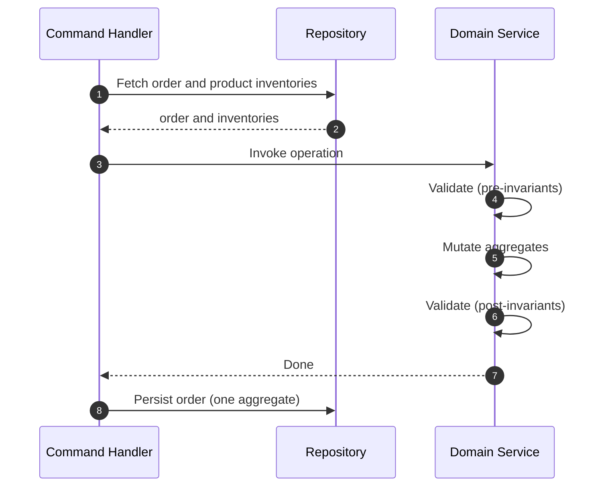

# Domain Services

<span class="pathway-tag pathway-tag-ddd">DDD</span> <span class="pathway-tag pathway-tag-cqrs">CQRS</span> <span class="pathway-tag pathway-tag-es">ES</span>

Some business operations naturally span two or more aggregates. For example,
placing an order requires confirming the order *and* reserving inventory — two
aggregates that must be validated together. If you put this logic in the
`Order` aggregate, it needs to know about `Inventory`; if you put it in the
command handler, business rules leak into the application layer. Domain
services solve this: they encapsulate **cross-aggregate business logic** in the
domain layer, where it belongs.

For background on when and why to use domain services, see
[Domain Services concept](../../concepts/building-blocks/domain-services.md).

!!!warning "Persist one aggregate, let events handle the rest"
    Even though a domain service mutates multiple aggregates to validate
    invariants, the command handler invoking the service should only persist
    **one** aggregate. The other aggregate's state will be updated eventually
    through domain events. This preserves the
    [one aggregate per transaction](../../patterns/one-aggregate-per-transaction.md)
    rule.

## Defining a Domain Service

A Domain Service is defined with the `Domain.domain_service` decorator, and
associated with at least two aggregates with the `part_of` option. The
`part_of` option is **required** and must be a list of **two or more**
aggregates — a domain service that operates on a single aggregate should be
logic on the aggregate itself.

The service methods in a Domain Service can be structured in three flavors:

### 1. Class with class methods

If you don't have any invariants to be managed by the Domain Service, each
method in the Domain Service can simply be a class method, that receives all
the input necessary for performing the business function.

```python hl_lines="1-2"
--8<-- "guides/domain-behavior/008.py:88:98"
```

Invoking it is straightforward:

```shell
OrderPlacementService.place_order(order, inventories)
```

!!!note
    The class-method flavor **cannot** have invariants, because invariants
    require an instance with stored state to validate against. If you need
    pre/post invariants, use the instance-method or callable-class flavor.

### 2. Class with instance methods

In this flavor, the Domain Service is instantiated with the aggregates and each
method performs a distinct business function.

```python hl_lines="1-2 9"
--8<-- "guides/domain-behavior/007.py:88:112"
```

You would then instantiate the Domain Service, passing the relevant aggregates
and invoke the methods on the instance.

```shell
service = OrderPlacementService(order, inventories)
service.place_order()
```

### 3. Callable class

If you have a single business function, you can simply model it as a callable
class:

```python hl_lines="1-2 9"
--8<-- "guides/domain-behavior/006.py:88:112"
```

```shell
service = place_order(order, inventories)
service()
```

### Deciding between flavors

| Criterion | Class methods | Instance methods | Callable class |
|-----------|:---:|:---:|:---:|
| Invariants needed | No | Yes | Yes |
| Multiple operations | Yes | Yes | No (single `__call__`) |
| Simplest for single operation | — | — | Yes |

The decision between instance methods and a callable class boils down to:

1. **How many business functions does the Domain Service have?** If only one,
   a callable class is more elegant.
2. **Do you have `pre` invariants that only apply to specific methods?** Then
   construct each method as a separate callable class. If invariants apply to
   all methods, a class with instance methods is preferable.

As your domain model matures, review regularly and decide on the best
way to model the Domain Service.

!!!note
    Invariants only wrap public methods and `__call__` — they skip dunder
    methods (other than `__call__`) and private methods (prefixed with `_`).
    If you encounter a `RecursionError: maximum recursion depth exceeded`,
    it is likely that a public method is calling another public method on the
    same instance. Extract the shared logic into a private method (prefixed
    with `_`) to break the cycle.

## Domain Service vs Application Service vs Command Handler

These three constructs coordinate behavior, but at different levels:

| Aspect | Domain Service | Application Service | Command Handler |
|--------|---------------|-------------------|-----------------|
| **Contains business logic** | Yes — cross-aggregate rules | No — orchestration only | No — orchestration only |
| **Operates on** | 2+ aggregates | 1 aggregate | 1 aggregate |
| **Has invariants** | Yes (`@invariant.pre`/`.post`) | No | No |
| **Invoked by** | Command handlers, app services | External callers (API, CLI) | `domain.process(command)` |
| **Returns values** | Optional | Yes (synchronous) | No (fire-and-forget) |

For detailed guidance, see the
[Application Service vs Command Handler](../../patterns/application-service-vs-command-handler.md)
pattern.

## Typical Workflow

Let us consider an example `OrderPlacementService` that places an order and
updates inventory stocks simultaneously. The typical workflow of a Domain
Service is below:


```mermaid
sequenceDiagram
  autonumber
  Command Handler->>Repository: Fetch order and product inventories
  Repository-->>Command Handler: order and inventories
  Command Handler->>Domain Service: Invoke operation
  Domain Service->>Domain Service: Validate (pre-invariants)
  Domain Service->>Domain Service: Mutate aggregates
  Domain Service->>Domain Service: Validate (post-invariants)
  Domain Service-->>Command Handler: Done
  Command Handler->>Repository: Persist order (one aggregate)
```

The handler loads the necessary aggregates through repositories, invokes the
domain service to perform the cross-aggregate operation, and then persists
only the primary aggregate. The other aggregate's state changes propagate
through domain events.

### Handler Integration Example

```python
@domain.command_handler(part_of=Order)
class OrderCommandHandler:
    @handle(PlaceOrder)
    def handle_place_order(self, command: PlaceOrder):
        order_repo = current_domain.repository_for(Order)
        inventory_repo = current_domain.repository_for(Inventory)

        # Load aggregates
        order = order_repo.get(command.order_id)
        inventories = [
            inventory_repo.get(item.product_id)
            for item in order.items
        ]

        # Invoke domain service — invariants run here
        service = place_order(order, inventories)
        service()

        # Persist only the primary aggregate
        order_repo.add(order)
```

## Invariants

Just like Aggregates and Entities, Domain Services can also have invariants.
These invariants validate the state of the aggregates passed to the service
method. Unlike in Aggregates, invariants in Domain Services typically deal
with validations that **span across multiple aggregates**.

`pre` invariants check the state of the aggregates before they are mutated,
while `post` invariants check the state after the mutation. When a pre-invariant
fails, a `ValidationError` is raised and the mutation never happens.

!!!note
   It is a good practice to step back and review the business logic placed in
   the Domain Service now and then. If an invariant does not use multiple
   aggregates, it is likely that it belongs within an aggregate and not in the
   service.

## A Full-Blown Example

```python hl_lines="105-149"
--8<-- "guides/domain-behavior/006.py:full"
```

When an order is placed, `Order` status has to be `CONFIRMED` _and_ the stock
record of each product in `Inventory` has to be reduced.

This change could be performed with events, with `Order` generating an event
and `Inventory` aggregate consuming the event and updating its records. But
there is a possibility of encountering stock-depleted issues if multiple
orders are placed at the same time.

So a Domain Service works best here because it validates the states of both
the `Order` aggregate and the `Inventory` aggregate together, enforcing
cross-aggregate invariants before any mutation occurs.

---

!!! tip "See also"
    **Concept overview:** [Domain Services](../../concepts/building-blocks/domain-services.md) — When and why to use domain services for cross-aggregate business logic.

    **Related guides:**

    - [Invariants](invariants.md) — Business rules enforced on aggregates, entities, and domain services.
    - [Aggregate Mutation](aggregate-mutation.md) — How state changes work inside aggregates.
    - [Command Handlers](../change-state/command-handlers.md) — Orchestrating state changes from commands.
    - [Application Services](../change-state/application-services.md) — Coordinating use cases.

    **Patterns:**

    - [One Aggregate per Transaction](../../patterns/one-aggregate-per-transaction.md) — Why domain services persist only one aggregate.
    - [Thin Handlers, Rich Domain](../../patterns/thin-handlers-rich-domain.md) — Keeping business logic in the domain, not handlers.
    - [Application Service vs Command Handler](../../patterns/application-service-vs-command-handler.md) — Choosing the right orchestration layer.
