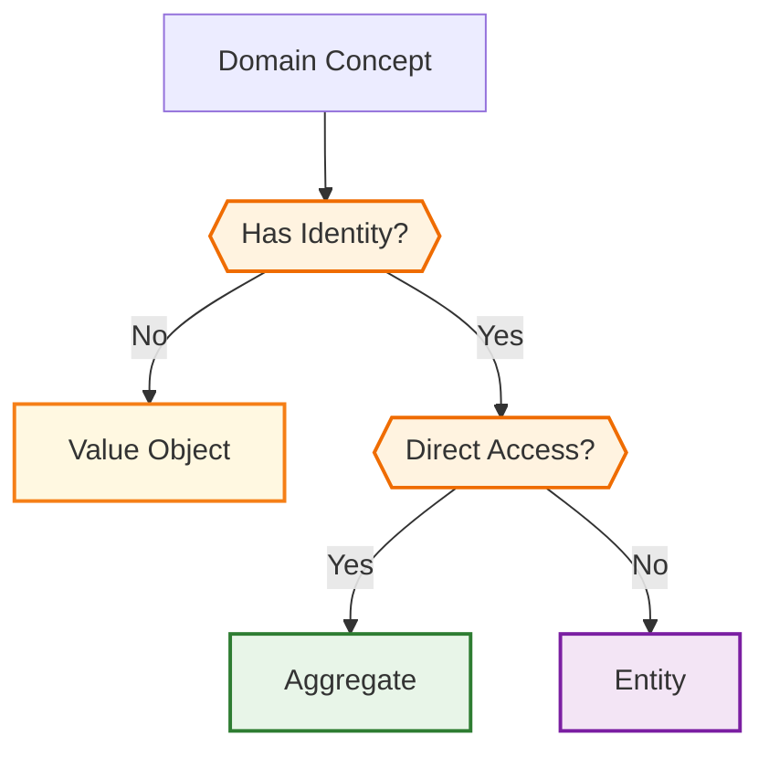

# Deciding Between Elements

One of the most critical decisions in Domain-Driven Design is choosing the right domain element type for your concepts. This guide provides practical checklists, examples, and decision flows to help you determine whether a domain concept should be modeled as an **Aggregate**, an **Entity**, or a **Value Object**.

## Understanding the Core Differences

### Aggregates
- **Purpose**: Act as consistency boundaries and transaction roots
- **Identity**: Have unique identity (like entities)
- **Mutability**: Mutable - can change state over time
- **Persistence**: Directly persisted and retrieved from storage
- **Access**: Accessed directly from outside the domain
- **Lifecycle**: Manage the lifecycle of contained entities and value objects

### Entities  
- **Purpose**: Represent domain concepts with unique identity
- **Identity**: Have unique identity that persists through state changes
- **Mutability**: Mutable - can change state over time
- **Persistence**: Persisted through their parent aggregate
- **Access**: Only accessible through their containing aggregate
- **Lifecycle**: Managed by their containing aggregate

### Value Objects
- **Purpose**: Represent descriptive aspects without identity
- **Identity**: No unique identity - defined by their attributes
- **Mutability**: Immutable - cannot be changed once created
- **Persistence**: Persisted as part of their containing entity/aggregate
- **Access**: Embedded within entities or aggregates
- **Lifecycle**: Managed by their containing entity/aggregate

## Decision Checklists

### Choose an Aggregate when:

- **It's a core business concept** - The concept is central to your domain and represents a significant business entity
- **It needs direct access** - External systems or application services need to interact with it directly
- **It manages a consistency boundary** - Business rules require that certain data changes happen together atomically
- **It controls other entities** - The concept needs to manage the lifecycle of related entities
- **It's a transaction root** - Operations on this concept and its related data should be transactional
- **It has complex business behavior** - The concept encapsulates significant business logic and rules
- **It generates domain events** - Changes to this concept trigger events that other parts of the system care about

### Choose an Entity when:

- **It has unique identity** - The concept has a distinct identity that remains the same throughout its lifecycle
- **Identity matters more than attributes** - Two instances with the same attributes but different identities are considered different
- **It belongs to an aggregate** - The concept is part of a larger aggregate's consistency boundary
- **It needs to change over time** - The concept's attributes can be modified while maintaining its identity
- **It has entity-specific behavior** - The concept has methods that operate on its own state
- **It's accessed through an aggregate** - The concept doesn't need direct external access

### Choose a Value Object when:

- **Identity doesn't matter** - Two instances with the same attributes are considered identical
- **It's descriptive** - The concept describes or measures something (e.g., money, address, email)
- **It should be immutable** - Once created, the concept's values shouldn't change
- **It encapsulates validation rules** - The concept has specific rules about what constitutes valid values
- **It's frequently shared** - Multiple entities might use the same value object instance
- **It represents a atomic concept** - The concept is meaningful only when all its attributes are considered together
- **It simplifies the domain model** - Using this concept as a value object reduces complexity

## Practical Examples

### E-commerce Domain Examples

#### Order (Aggregate)
```python
@domain.aggregate
class Order:
    order_number = String(max_length=20, required=True)
    customer_id = String(required=True)
    status = String(choices=['pending', 'confirmed', 'shipped'], default='pending')
    total_amount = ValueObject(Money)
    created_at = DateTime(default=datetime.utcnow)
```

**Why Aggregate?**

- ✅ Core business concept that needs direct access
- ✅ Controls consistency boundary (order items, payments, shipping)
- ✅ Transaction root for order-related operations
- ✅ Generates domain events (OrderCreated, OrderShipped, etc.)

#### OrderItem (Entity) 
```python
@domain.entity(part_of=Order)
class OrderItem:
    product_id = String(required=True)
    quantity = Integer(min_value=1, required=True)
    unit_price = ValueObject(Money)
    line_total = ValueObject(Money)
```

**Why Entity?**

- ✅ Has unique identity (different from other order items)
- ✅ Belongs to Order aggregate's consistency boundary
- ✅ Mutable (quantity, price can change)
- ✅ Accessed through Order aggregate

#### Money (Value Object)
```python
@domain.value_object  
class Money:
    amount = Decimal(required=True, min_value=0)
    currency = String(max_length=3, required=True)
    
    def add(self, other):
        if self.currency != other.currency:
            raise ValueError("Cannot add different currencies")
        return Money(amount=self.amount + other.amount, currency=self.currency)
```

**Why Value Object?**

- ✅ Identity doesn't matter (two $10 USD are identical)
- ✅ Immutable by design
- ✅ Encapsulates validation rules (currency matching)
- ✅ Frequently shared across entities
- ✅ Atomic concept (amount + currency together)

### Blog Domain Examples

#### Post (Aggregate)
```python
@domain.aggregate
class Post:
    title = String(max_length=200, required=True)
    content = Text()
    author_id = String(required=True)
    published_at = DateTime()
    status = String(choices=['draft', 'published'], default='draft')
```

#### Comment (Entity)
```python
@domain.entity(part_of=Post)  
class Comment:
    content = String(max_length=500, required=True)
    author_id = String(required=True)
    created_at = DateTime(default=datetime.utcnow)
```

#### Email (Value Object)
```python
@domain.value_object
class Email:
    address = String(max_length=255, required=True)
    
    def clean(self):
        if '@' not in self.address:
            raise ValidationError("Invalid email format")
```

## Common Code Smells and Anti-Patterns

### 🚩 Aggregate Red Flags

**Too Many Aggregates**
```python
# ❌ Bad: Making every entity an aggregate
@domain.aggregate
class User: ...

@domain.aggregate  
class Address: ...  # Should be Value Object

@domain.aggregate
class Phone: ...    # Should be Value Object
```

**God Aggregate**
```python
# ❌ Bad: Aggregate trying to manage too much
@domain.aggregate
class Order:
    # ... order fields ...
    customer_details = HasOne(Customer)      # Should reference by ID
    inventory_items = HasMany(InventoryItem) # Wrong aggregate boundary
    payment_processor = HasOne(PaymentGateway) # Infrastructure concern
```

**Missing Aggregate**
```python
# ❌ Bad: Entity without an aggregate
@domain.entity  # Missing part_of parameter
class Comment:
    content = String(max_length=500)
# Error: Entity needs to be associated with an Aggregate
```

### 🚩 Entity Red Flags

**Entity as Value Object**
```python
# ❌ Bad: Treating entities like value objects
def process_order(order_item_data):
    # Creating new entity instead of referencing existing one
    item = OrderItem(**order_item_data)  
    # Should retrieve existing entity by ID
```

**Direct Entity Access**
```python
# ❌ Bad: Accessing entity directly instead of through aggregate
item = repository.get_order_item(item_id)  # Wrong!
# Should be: order.get_item(item_id)
```

### 🚩 Value Object Red Flags

**Mutable Value Object**
```python
# ❌ Bad: Trying to modify value object
address = Address(street="123 Main St", city="NYC")
address.street = "456 Oak Ave"  # Will raise IncorrectUsageError
```

**Value Object with Identity**
```python
# ❌ Bad: Adding identity to value object
@domain.value_object
class Money:
    id = Auto()  # Will raise IncorrectUsageError
    amount = Decimal()
    currency = String()
```

**Primitive Obsession**
```python
# ❌ Bad: Using primitives instead of value objects
@domain.aggregate
class User:
    email = String()  # Should be ValueObject(Email)
    phone = String()  # Should be ValueObject(Phone) 
    address_line1 = String()  # Should be ValueObject(Address)
    address_line2 = String()
    city = String()
    postal_code = String()
```

## Team Decision Flow

Use this lightweight process for team discussions about domain element choices:

### Quick Reference

For rapid decisions, use this simplified flowchart:



### Step-by-Step Process

#### Step 1: Identity Check

Does this concept have a unique identity that matters to the business?

*If no → Consider Value Object (go to Step 4)*

*If yes → Continue to Step 2*

#### Step 2: Aggregate Boundary Check

Does this concept need to be accessed directly from outside the domain?

*If yes → Consider Aggregate (go to Step 3)*

*If no → Consider Entity (go to Step 5)*

#### Step 3: Aggregate Validation

- Is this a core business concept?
- Does it need to control a consistency boundary?
- Will it manage other entities/value objects?
- Does it generate important domain events?

*If 3+ yes → Aggregate. Otherwise, reconsider Entity.*

#### Step 4: Value Object Validation

- Can this be immutable?
- Is identity truly irrelevant?
- Does it describe or measure something?
- Are instances with same values identical?

*If 3+ yes → Value Object. Otherwise, reconsider Entity.*

#### Step 5: Entity Validation

- Does it belong to a clear aggregate?
- Does it need to change over time?
- Is identity more important than attributes?
- Does it have entity-specific behavior?

*If 3+ yes → Entity. Otherwise, reconsider the design.*

## When in Doubt

### Default Guidelines

1. **Start with Value Object** - If you're unsure, try modeling as a value object first. It's easier to promote to entity/aggregate later than to demote.

2. **Favor composition** - Prefer value objects embedded in entities over creating new entities.

3. **Question aggregates** - Only create aggregates when you have a clear business justification for direct access and consistency boundaries.

4. **Context matters** - The same concept might be different element types in different bounded contexts.

### Common Patterns

- **Person**: Usually Entity (has identity that matters)
- **Address**: Usually Value Object (descriptive, no identity)
- **Money/Price**: Always Value Object (amount + currency)
- **Email/Phone**: Usually Value Object (format validation)
- **Order/Invoice**: Usually Aggregate (transaction boundary)
- **Line Items**: Usually Entity (part of order/invoice)

!!!note
    Remember: These decisions aren't permanent. As your understanding of the domain evolves, you can refactor elements to better reflect the business reality. The key is to make informed decisions based on the business requirements and domain understanding rather than technical convenience.