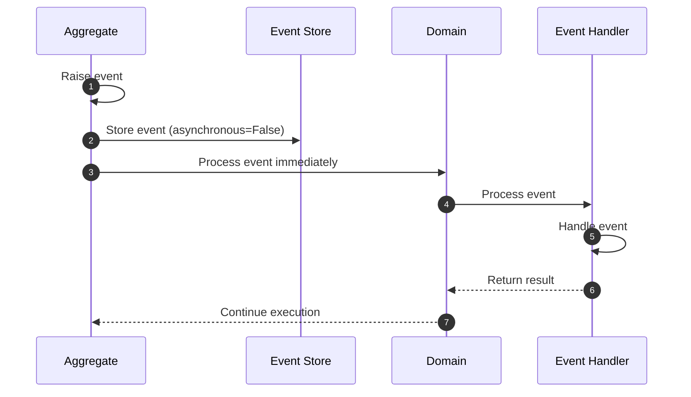
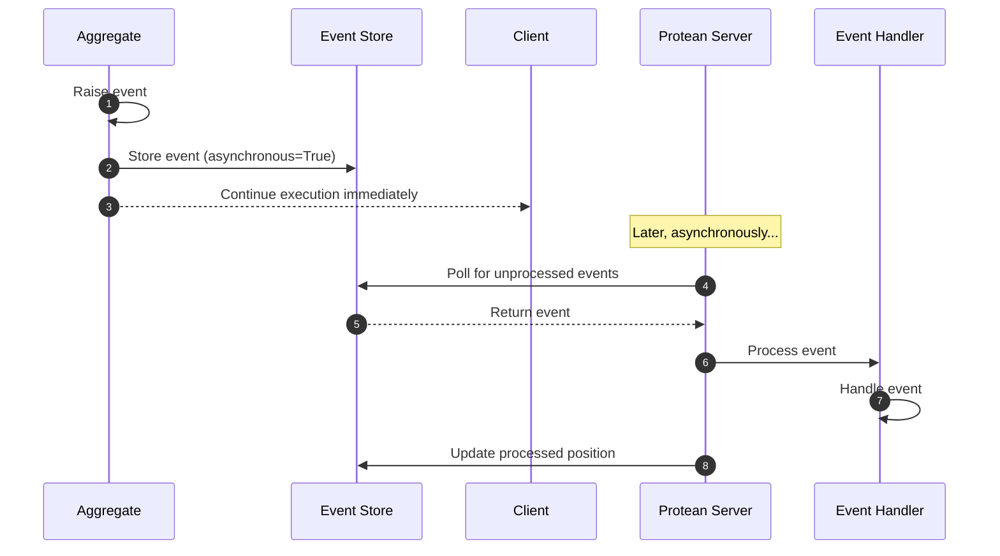

# Events

!!! abstract "Applies to: DDD · CQRS · Event Sourcing"


Most applications have a definite state - they reflect past user input and
interactions in their current state. It is advantageous to model these past
changes as a series of discrete events. Domain events happen to be those
activities that domain experts care about and represent what happened as-is.

In Protean, an `Event` is an immutable object that represents a significant
occurrence or change in the domain. Events are raised by aggregates to signal
that something noteworthy has happened, allowing other parts of the system to
react - and sync - to these changes in a decoupled manner.

## Defining Events

Event names should be descriptive and convey the specific change or occurrence
in the domain clearly, ensuring that the purpose of the event is immediately
understandable.  Events are named as past-tense verbs to clearly indicate
that an event has already occurred, such as `OrderPlaced` or `PaymentProcessed`.

You can define an event with the `Domain.event` decorator:

```python hl_lines="14-16 19-22 31-33 35-38"
{! docs_src/guides/domain-definition/events/001.py !}
```

Events are always connected to an Aggregate class, specified with the
`part_of` param in the decorator. An exception to this rule is when the
Event class has been marked _Abstract_.

---

## Synchronous vs Asynchronous Processing

Events in Protean can be processed either synchronously or asynchronously:

- **Synchronous processing**: The event is processed immediately when raised. Event handlers are called in the same execution flow, and the operation is blocked until all event handlers have completed.
- **Asynchronous processing**: The event is stored in the event store and processed later by a background worker. The operation continues without waiting for event handlers to complete.

### Domain Configuration

You can configure the event processing mode through the domain configuration:

```python
# Configure events to be processed synchronously
domain.config["event_processing"] = "sync"  # or "async"
```

In domain.toml:

```
event_processing = "sync"  # or "async"
```

By default, Protean sets `event_processing` to `async` in the domain configuration.

### Event Processing Workflows

The workflow for event processing differs based on whether synchronous or asynchronous mode is used:

#### Synchronous Event Flow



#### Asynchronous Event Flow



### How Asynchronous Processing Works

Asynchronous event processing in Protean uses the server/engine component that:

1. Creates subscriptions for event handlers to listen to their respective event streams
2. Polls the event store for new events that haven't been processed yet
3. Dispatches those events to the appropriate handlers

To run the Protean server for processing asynchronous events, use the CLI:

```shell
protean server --domain path/to/domain.py
```

See [CLI documentation](../cli/index.md) for more details about the server command and other available CLI options.

The server continually polls the event store for new events that have the `asynchronous` flag set to `True` in their metadata. When found, it dispatches them to the appropriate handlers, keeping track of processed events to avoid duplicate processing.

### When to use each mode

- **Synchronous processing** is useful when:
  - You need immediate consistency between different parts of your system
  - Event handlers perform essential operations that must complete before continuing
  - The operation is part of a transaction that needs to complete atomically

- **Asynchronous processing** is beneficial when:
  - You want to improve system responsiveness by not blocking the execution flow
  - Event handlers might take a long time to process
  - You want to distribute load across background workers
  - You're implementing event-driven or reactive architectures

### Relationship with Command Processing

Protean offers similar configuration options for commands through:
- The `command_processing` domain configuration setting
- The ability to specify the `asynchronous` parameter when processing commands

Both events and commands in Protean follow similar processing patterns, enabling you to build consistent, predictable workflows. You can configure both to suit your specific domain needs:

```python
# Domain-wide configuration
domain.config["event_processing"] = "async"   # or "sync"
domain.config["command_processing"] = "sync"  # or "async"
```

This flexibility allows you to implement various architectural patterns like CQRS, Event Sourcing, and Event-Driven Architecture within your Protean applications.

---

## Event Structure

An event is made of three parts:

### Headers

#### `trace_id`

The `trace_id` is a unique identifier of UUID format, that connects all
processing originating from a request. Trace IDs provide a detailed view of
the request's journey through the system. It helps in understanding the
complete flow of a request, showing each service interaction, the time taken,
and where any delays occur.

### Metadata

An event's metadata provides additional context about the event.

Sample metadata from an event:

```json
{
    "id": "test::user-411b2ceb-9513-45d7-9e03-bbc0846fae93-0",
    "type": "Test.UserLoggedIn.v1",
    "fqn": "tests.event.test_event_metadata.UserLoggedIn",
    "kind": "EVENT",
    "stream": "test::user-411b2ceb-9513-45d7-9e03-bbc0846fae93",
    "origin_stream": null,
    "timestamp": "2024-08-16 15:30:27.977101+00:00",
    "version": "v1",
    "sequence_id": "0"
}
```

#### `id`

The unique identifier of the event. The event ID is a structured string, of the
format `<domain-name>::<aggregate-name>-<aggregate-id>-<sequence_id>`.

The `id` value is simply an extension of the event's stream combined with the
`sequence_id`. Read the section on `sequence_id` to understand possible values.

#### `type`

Type of the event. Format is `<domain-name>.<event-class-name>.<event-version>`.
For e.g. `Shipping.OrderShipped.v1`.

#### `fqn`

Internal. The fully qualified name of the event. This is used by Protean to
resconstruct objects from messages.

#### `kind`

Internal. Represents the kind of object enclosed in an event store message.
Value is `EVENT` for Events. `Metadata` class is shared between Events and
Commands, so possible values are `EVENT` and `COMMAND`.

#### `stream` {#stream-category}

Name of the event stream. E.g. Stream `auth::user-1234` encloses messages
related to `User` aggregate in the `Auth` domain with identity `1234`.

The stream name follows the pattern `<domain>::<stream_category>-<aggregate_id>`, where:

- `domain` is the normalized domain name
- `stream_category` is the aggregate's [stream category](../essentials/stream-categories.md)
- `aggregate_id` is the unique identifier of the aggregate instance

All events for a specific aggregate instance are stored in its dedicated stream, enabling event sourcing and message ordering guarantees.

See the [Stream Categories](../essentials/stream-categories.md) guide for comprehensive details on how stream categories organize and route messages.

#### `origin_stream`

Name of the stream that originated this event or command. `origin_stream` comes
handy when correlating related events or understanding causality.

#### `timestamp`

The timestamp of event generation in ISO 8601 format.

#### `version`

The version of the event class used to generate the event.

#### `sequence_id`

The sequence ID is the version of the aggregate when the event was generated,
along with the sequence number of the event within the update.

For example, if the aggregate was updated twice, the first update would have a
sequence ID of `1.1`, and the second update would have a sequence ID of `2.1`.
If the next update generated two events, then the sequence ID of the second
event would be `3.2`.

If the aggregate is event-sourced, the `sequence_id` is a single integer of the
position of the event in its stream.

## Payload

The payload is a dictionary of key-value pairs that convey the information
about the event.

The payload is made available as the body of the event, which also includes
the event metadata. If you want to extract just the payload, you can use the
`payload` property of the event.

```shell hl_lines="22 24-25"
In [1]: user = User(id="1", email="<EMAIL>", name="<NAME>")

In [2]: user.login()

In [3]: event = user._events[0]

In [4]: event
Out[4]: <UserLoggedIn: UserLoggedIn object ({'_metadata': {'id': '002::user-1-0.1', 'type': '002.UserLoggedIn.v1', 'fqn': '002.UserLoggedIn', 'kind': 'EVENT', 'stream': '002::user-1', 'origin_stream': None, 'timestamp': '2024-07-18 22:02:32.522360+00:00', 'version': 'v1', 'sequence_id': '0.1'}, 'user_id': '1'})>

In [5]: event.to_dict()
Out[5]: 
{'_metadata': {'id': '002::user-1-0.1',
  'type': '002.UserLoggedIn.v1',
  'fqn': '002.UserLoggedIn',
  'kind': 'EVENT',
  'stream': '002::user-1',
  'origin_stream': None,
  'timestamp': '2024-07-18 22:02:32.522360+00:00',
  'version': 'v1',
  'sequence_id': '0.1'},
 'user_id': '1'}

In [6]: event.payload
Out[6]: {'user_id': '1'}
```

## Versioning

Because events serve as API contracts of an aggregate with the rest of the
ecosystem, they are versioned to signal changes to contract.

Events have a default version of **v1**.

You can override and customize the version with the `__version__` class
attribute:

```python hl_lines="3"
@domain.event(part_of=User)
class UserActivated:
    __version__ = "v2"

    user_id: Identifier(required=True)
    activated_at: DateTime(required=True)
```

When event schemas evolve (fields renamed, new required fields, changed
structure), you can register **upcasters** that transform old event payloads
to the current schema during deserialization. See the
[Event Upcasting guide](../event-upcasting.md) for details, and the
[Event Versioning and Evolution](../../patterns/event-versioning-and-evolution.md)
pattern for broader versioning strategies.

The configured version is reflected in `version` and `type` attributes of the
generated event's metadata:

```python hl_lines="32 49 55 70 76"
{! docs_src/guides/domain-definition/events/002.py !}
```

## Fact Events

A fact event encloses the entire state of the aggregate at that specific point
in time. It contains all of the attributes and values necessary to completely
describe the fact in the context of your business. You can think of a fact
event similarly to how you may think of a row in a database: a complete set of
data pertaining to the row at that point in time.

Fact events enable a pattern known as **Event-carried State Transfer**, which is
one of the best ways to asynchronously distribute immutable state to all
consumers who need it. With fact events, consumers do not have to build up the
state themselves from multiple delta event types, which can be risky and
error-prone, especially as data schemas evolve and change over time. Instead,
they rely on the owning service to compute and produce a fully detailed fact
event.

Fact events are generated automatically by the framework with the
`fact_events=True` option in the `domain.aggregate` decorator.

Read about generating fact events in the section on
[raising events](../domain-behavior/raising-events.md#fact-events).

## Immutability

Event objects are immutable - they cannot be changed once created. This is
important because events are meant to be used as a snapshot of the domain
state at a specific point in time.

```shell hl_lines="5 7-11"
In [1]: user = User(name='John Doe', email='john@doe.com', status='ACTIVE')

In [2]: renamed = UserRenamed(user_id=user.id, name="John Doe Jr.")

In [3]: renamed.name = "John Doe Sr."
...
IncorrectUsageError: 'Event/Command Objects are immutable and cannot be modified once created'
```

---

!!! tip "See also"
    **Concept overview:** [Events](../../core-concepts/domain-elements/events.md) — Domain events and their role in system communication.

    **Patterns:**

    - [Design Events for Consumers](../../patterns/design-events-for-consumers.md) — Structuring events so consumers can process them reliably.
