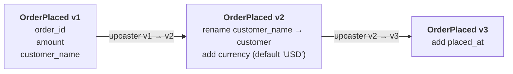

# Evolving events over time

Events are **immutable once stored** — but the code that reads them keeps
changing. A field gets renamed, a new attribute is added, an old event is
retired. Months later your service still has to decode events written by last
year's code, and a downstream consumer still expects last year's shape.

Protean gives you a complete toolkit for evolving an event safely from `v1` to
`vN` without breaking the events already on disk or the consumers already
running. This guide walks the whole lifecycle with **one running example** —
an `OrderPlaced` event that grows up over two rounds of change — and shows the
tooling at each step. Everything here is real output from the domain shown; you
can follow along without writing a line of code.

## The example: an `OrderPlaced` that grows up



Here is where we start — `OrderPlaced` at its original, implicit **version 1**:

```python
--8<-- "guides/evolving-events/001.py:20:24"
```

Over the rest of this guide we evolve it to version 3. Here is where we are
headed — the version-3 event; the sections below explain each change and add the
upcasters that make it work:

```python
--8<-- "guides/evolving-events/002.py:13:19"

--8<-- "guides/evolving-events/002.py:21:36"
```

## Add a field with a default (a backward-compatible change)

The safest change is adding a field that carries a **default**. Old events that
were written without it still decode — the default fills the gap. We add a
`currency`:

```python
currency = String(default="USD")
```

A field with a default is **optional** in Protean (the default supplies the
value when it is absent), and adding it is **fully compatible** under a schema
registry's rules: a new-schema reader supplies the default for old data, and an
old-schema reader ignores the added field. Protean records the default in the
generated JSON Schema; in Avro, the field becomes a nullable, null-first union
(Avro's mechanism for "may be absent").

!!! note "Schema compatibility vs. Protean's runtime"
    "An old reader ignores the added field" is a property of the *emitted
    schema* — what a Kafka/registry consumer sees, and what the compatibility
    verdict below measures. Protean's own runtime deserialization is **strict**
    by default (`extra="forbid"`): decoding a stored payload that carries a
    field the current class does not know raises unless you opt into
    [lenient mode](#read-legacy-payloads-leniently). A field you *added* is part
    of the current schema, so it decodes fine.

!!! tip "Rule of thumb"
    Adding an **optional** field, or a **field with a default**, never breaks
    anyone. Adding a **required field with no default** breaks readers of old
    data — they have no value to supply. Prefer a default.

## Rename a field with `renamed_from`

Renames are where naïve evolution goes wrong: a plain rename looks like
"remove the old field, add a new one", which breaks both directions. Declare the
rename instead, with `renamed_from`, and Protean treats it as a first-class
operation:

```python
customer = String(required=True, renamed_from=["customer_name"])
```

`renamed_from` does two things:

- **At read time**, Protean resolves a stored `customer_name` into `customer`,
  so old payloads deserialize into the new field.
- **In the emitted Avro schema**, the field carries an `aliases` entry, so an
  external consumer (Kafka, a schema registry) reading with the new schema also
  resolves the old name on the wire — not just inside Protean.

The compatibility checker reads `renamed_from` and reports a **rename**, not a
remove-plus-add (more on that [below](#check-compatibility-protean-ir-diff)).

## Bump the version and write upcasters

Renames and other structural changes need the version bumped so stored events
can be transformed on read. Set `__version__` and register an **upcaster** for
each hop. An upcaster rewrites the *stored payload* from one version to the next;
Protean chains them, so a `v1` payload is walked all the way up to the current
`v3` before your handler sees it.

```python
--8<-- "guides/evolving-events/002.py:55:60"


--8<-- "guides/evolving-events/002.py:63:67"
```

Protean validates the chain at `domain.init()`: a *broken* chain — upcasters
that exist but leave no path to the current version (a gap, a cycle, a duplicate
edge) — raises `ConfigurationError` immediately. If you bump `__version__` and
forget the upcasters entirely, `domain.init()` still succeeds, but `protean
check` reports an `UPCASTER_GAP` warning at build time so you catch it before a
stored `v1` payload fails to read in production. See the
[Event Upcasting guide](consume-state/event-upcasting.md) for the full mechanism.

## Deprecate and supersede an old event

Sometimes an event is replaced wholesale rather than versioned. Mark it
`deprecated` and point `superseded_by` at its replacement:

```python
--8<-- "guides/evolving-events/002.py:39:45"
```

Raising a deprecated event emits a `DeprecationWarning` at runtime that names the
replacement, so callers still producing the old event find out. The deprecation
metadata also flows into the IR, the event catalog, and the compatibility
checker's deprecation-aware removal rules.

## Read legacy payloads leniently

By default Protean is **strict**: a stored payload with a field that no longer
exists on the current event class raises a `DeserializationError`. That is the
right default — a silent field drop hides typos. When you are deliberately
reading old payloads that carry fields you have since removed, opt into lenient
deserialization, which ignores unknown fields (and records what it dropped in
event metadata for observability).

Turn it on for the whole domain via the `lenient_deserialization` config key in
`domain.toml`:

```toml
lenient_deserialization = true
```

…or per event, which overrides the config either way:

```python
@domain.event(part_of=Order, lenient=True)
class OrderPlaced(BaseEvent):
    ...
```

Reach for lenience only for the read path of genuinely legacy data — for
*structural* evolution, an upcaster is the precise tool.

## See the whole picture: `protean events catalog`

Once a domain has events at different versions, some deprecated, some with
upcaster chains, it helps to see them all at once. `protean events catalog`
lists every event with its version, deprecation and supersession status,
upcaster chain, and consumers — sourced from the IR, so it needs no running
event store:

```console
$ protean events catalog --domain ordering
                                            Event Catalog
┏━━━━━━━━━━━━━━┳━━━━━━━━━━━━━━━━━━━━━━━━━━┳━━━━━┳━━━━━━━━━━━━━━━━━━━━━━━━━━┳━━━━━━━━━━━━━━━┳━━━━━━━━━━━┳━━━━━━━━━━━━━━━━━━━━┓
┃ Event        ┃ Type                     ┃ Ver ┃ Deprecated               ┃ Superseded By ┃ Upcasters ┃ Consumers          ┃
┡━━━━━━━━━━━━━━╇━━━━━━━━━━━━━━━━━━━━━━━━━━╇━━━━━╇━━━━━━━━━━━━━━━━━━━━━━━━━━╇━━━━━━━━━━━━━━━╇━━━━━━━━━━━╇━━━━━━━━━━━━━━━━━━━━┩
│ OrderCreated │ Ordering.OrderCreated.v1 │   1 │ since 0.16, removal 0.19 │ OrderPlaced   │ -         │ -                  │
│ OrderPlaced  │ Ordering.OrderPlaced.v3  │   3 │ -                        │ -             │ v1→v2→v3  │ OrderNotifications │
└──────────────┴──────────────────────────┴─────┴──────────────────────────┴───────────────┴───────────┴────────────────────┘

2 event(s)
```

Add `--json` for a machine-readable dump (per-event version, upcasters,
consumers, and full fields including `renamed_from`) suitable for tooling. See
the [`protean events catalog` reference](../reference/cli/data/events.md).

## Emit schemas for a registry: `protean schema generate`

To publish contracts to an external registry, generate schemas from the IR.
`--format all` emits JSON Schema, Avro, and Protobuf side by side:

```console
$ protean schema generate --domain ordering --format all
```

The Avro schema shows the evolution machinery on the wire — note the `aliases`
on the renamed `customer` field, which is what makes the rename backward-readable
by an external Avro consumer:

```json title="OrderPlaced.v3.avsc"
{
  "fields": [
    { "name": "amount", "type": "long" },
    { "default": null, "name": "currency", "type": ["null", "string"] },
    {
      "aliases": ["customer_name"],
      "name": "customer",
      "type": "string"
    },
    { "name": "order_id", "type": { "logicalType": "uuid", "type": "string" } },
    {
      "default": null,
      "name": "placed_at",
      "type": ["null", { "logicalType": "timestamp-millis", "type": "long" }]
    }
  ],
  "name": "OrderPlaced",
  "namespace": "ordering",
  "type": "record"
}
```

The Protobuf schema for the same event:

```protobuf title="OrderPlaced.v3.proto"
syntax = "proto3";
package ordering;
import "google/protobuf/timestamp.proto";

message OrderPlaced {
  int64 amount = 1;
  optional string currency = 2;
  string customer = 3;
  string order_id = 4;
  optional google.protobuf.Timestamp placed_at = 5;
}
```

The JSON Schema carries the field default that Avro cannot express inline —
`currency` defaults to `"USD"`:

```json title="OrderPlaced.v3.json (excerpt)"
"currency": {
  "anyOf": [
    { "maxLength": 255, "type": "string" },
    { "type": "null" }
  ],
  "default": "USD"
}
```

See the [Schema Generation guide](compose-a-domain/schema-generation.md) for the
full output tree and format details.

## Check compatibility: `protean ir diff`

Finally, gate the change in CI. `protean ir diff` compares two IR snapshots
(your committed baseline against the current domain) and reports an **Avro-style
compatibility verdict** — `BACKWARD`, `FORWARD`, `FULL`, or `NONE` — matching the
rules a schema registry enforces on the emitted Avro:

```console
$ protean ir diff --left baseline.json --right current.json
...
Avro compatibility: BACKWARD
  breaks FORWARD: Field 'customer_name' renamed to 'customer' in EVENT 'ordering.OrderPlaced'
  breaks FORWARD: Type string changed for 'ordering.OrderPlaced': 'Ordering.OrderPlaced.v1' → 'Ordering.OrderPlaced.v3'
```

`BACKWARD` is exactly right for this evolution: a consumer on the **new** schema
can read **old** events — the Avro `aliases` entry resolves the renamed field on
the wire, and the added fields are optional or defaulted. A consumer still on the
**old** schema cannot yet read **new** events (it does not know the `customer`
name), which is why `FORWARD` breaks. The verdict measures the emitted **Avro**
schema — the same contract a registry enforces; Protean's **upcasters** do the
equivalent job on its own event-store replay path, a separate layer. The
line-by-line breakdown names which change breaks which direction, and under
`--format json` the report carries a per-event breakdown under `avro_verdicts`.
See the
[Compatibility Checking guide](compatibility-checking.md) to wire this into
pre-commit hooks and CI.

## Putting it together

| Change | How | Compatibility |
|--------|-----|---------------|
| Add an optional / defaulted field | just add it | `FULL` — nobody breaks |
| Add a required field, no default | avoid; give it a default | breaks `BACKWARD` |
| Rename a field | `renamed_from=[...]` + bump `__version__` + upcaster | `BACKWARD` (Avro `aliases`) |
| Change a field's type | new field or new event version + upcaster | `NONE` without an upcaster |
| Retire an event | `deprecated=` + `superseded_by=` | deprecation-aware removal |
| Read old payloads with dropped fields | `lenient_deserialization` (opt-in) | read-path escape hatch |

The throughline: **declare** your evolution (`renamed_from`, `__version__`,
`deprecated`, upcasters) rather than letting the diff infer it, then let
`events catalog`, `schema generate`, and `ir diff` show you — and your registry,
and your CI — exactly what changed and whether it is safe.

!!! tip "See also"
    - [Event Upcasting](consume-state/event-upcasting.md) — the upcaster mechanism in depth.
    - [Compatibility Checking](compatibility-checking.md) — pre-commit hooks, CI gating, strictness.
    - [Schema Generation](compose-a-domain/schema-generation.md) — JSON / Avro / Protobuf output.
    - [Event Versioning and Evolution](../patterns/event-versioning-and-evolution.md) — the *why*: strategies and trade-offs.
    - CLI reference: [`protean events catalog`](../reference/cli/data/events.md), [`protean schema generate`](../reference/cli/schema.md), [`protean ir diff`](../reference/cli/ir.md).
