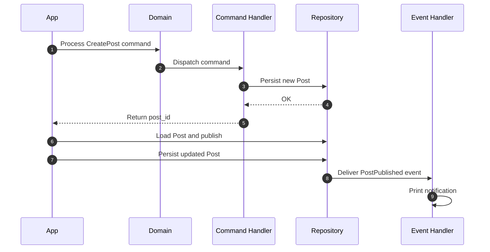

# Quickstart

Build your first domain with Protean in 5 minutes. You will model a simple
blog post system that creates posts via commands, publishes them, and reacts
to events — all running in-memory with no infrastructure required.

## Prerequisites

- Python 3.11+
- Protean installed ([Installation](./installation.md))

## Create a Domain

Every Protean application starts with a `Domain` — the container for all your
business logic.

Create a file called `blog.py` and add:

```python
from protean import Domain

domain = Domain()
```

That's it. Protean provides in-memory adapters for databases, brokers, and
event stores out of the box, so you can focus on your domain logic without
setting up any infrastructure.

## Define an Aggregate

Aggregates are the core building blocks — they hold state and enforce business
rules.

Let's model a `Post`:

```python hl_lines="4-5 8-18"
{! docs_src/guides/getting-started/quickstart.py [ln:1-26] !}
```

A few things to note:

- **Fields** like `String` and `Text` define the aggregate's data with
  built-in validation (`max_length`, `required`).
- **Methods** like `publish()` encapsulate behavior and
  raise events when state changes.
- **Invariants** enforce business rules that span multiple fields.
  Here, the `@invariant.post` decorator checks after every state change
  that a published post has a substantial body — something that field-level
  validation alone cannot express.

## Define an Event

Events represent things that *happened*. They are named in past tense and
are raised from within aggregates:

```python
{! docs_src/guides/getting-started/quickstart.py [ln:30-34] !}
```

The `part_of` option connects the event to its aggregate. Events are immutable
records — they capture facts about state changes.

## Define a Command and Handler

Commands represent *intent to change state*. They are named as imperative
verbs. A command handler receives the command and orchestrates the change:

```python
{! docs_src/guides/getting-started/quickstart.py [ln:38-53] !}
```

The command handler follows a simple pattern: receive a command, create or
load an aggregate, mutate state, and persist. Protean automatically wraps
each handler method in a transaction.

## React to Events

Event handlers process events after they occur — for side effects like
sending notifications, syncing other aggregates, or logging:

```python
{! docs_src/guides/getting-started/quickstart.py [ln:57-62] !}
```

Event handlers are decoupled from the aggregate that raised the event. In
production, they run asynchronously via the
[Protean server](../../concepts/async-processing/index.md).

## Put It All Together

Initialize the domain and run the full cycle — create a post via a command,
then publish it:

```python
{! docs_src/guides/getting-started/quickstart.py [ln:65-89] !}
```

Run it:

```shell
$ python blog.py
Post: Hello, Protean! (status: DRAFT)
Post published: Hello, Protean!
Updated: Hello, Protean! (status: PUBLISHED)
```

## What Just Happened?

Here's the flow that Protean orchestrated for you:



1. `domain.process()` routes the `CreatePost` command to its handler.
2. The handler creates a `Post` aggregate and persists it.
3. You load the post, call `publish()`, which changes status and raises a
   `PostPublished` event.
4. When you persist the updated post, the event is delivered to the
   `PostEventHandler`.

All of this runs in-memory — no database, no message broker, no event store.
When you're ready for production, swap in real adapters with
[configuration](../../reference/configuration/index.md).

## Full Source

Here is the complete example in a single file:

```python
{! docs_src/guides/getting-started/quickstart.py !}
```

## Next Steps

- [Set Up the Domain](../compose-a-domain/index.md) — learn about domain
  registration, initialization, and activation in depth.
- [Define Domain Elements](../domain-definition/index.md) — explore aggregates,
  entities, value objects, and fields.
- [Add Rules and Behavior](../domain-behavior/index.md) — add validations, invariants,
  and domain services.
- [Configuration](../../reference/configuration/index.md) — connect real databases,
  brokers, and event stores.

<!-- test -->
