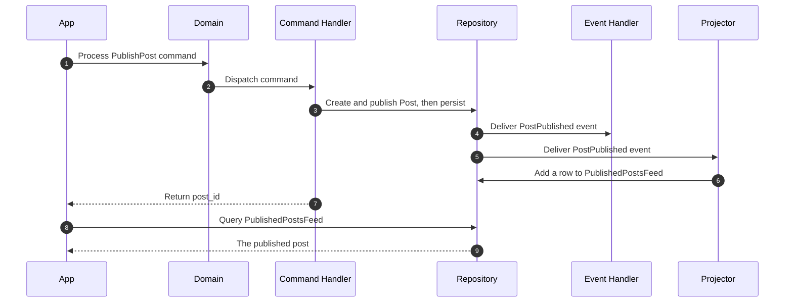

# Quickstart

Build your first Protean domain in a few minutes. You will model a blog
`Post`: a command publishes a post, an event handler reacts to the publish, a
projector keeps a read-optimized feed, and you query that feed to read the
post back. Everything runs in-memory, with no infrastructure to set up.

## Prerequisites

- Python 3.11+
- Protean installed ([Installation](./installation.md))

## Create a domain

Every Protean application starts with a `Domain`, the container for your
business logic.

Create a file called `blog.py` and add:

```python
--8<-- "reference_app/blog.py:imports"
```

Protean ships in-memory adapters for databases, brokers, and event stores, so
you can write your domain logic before you pick any infrastructure.

## Define an aggregate

Aggregates are the core building blocks. They hold state and enforce business
rules.

Here is the `Post`:

```python
--8<-- "reference_app/blog.py:aggregate"
```

`String` and `Text` are fields. They declare the aggregate's data and validate
it with options like `max_length` and `required`. The `publish()` method
changes the post's status and raises an event to record what happened.

## Define an event

Events record things that happened. They are named in the past tense and are
raised from inside aggregates:

```python
--8<-- "reference_app/blog.py:event"
```

The `part_of` option connects the event to its aggregate. `PostPublished`
carries the post's id and title, the facts a reader of the event needs.

## Define a command and handler

Commands carry the intent to change state. They are named as imperative verbs.
A command handler receives the command and makes the change:

```python
--8<-- "reference_app/blog.py:command"
```

`PostCommandHandler` creates a `Post` from the command, calls `publish()`, and
saves it through the repository. Protean wraps each handler method in a
transaction. `domain.process()` routes a `PublishPost` command to this handler.

## React to events

An event handler runs after an event, for side effects like sending a
notification or updating another part of the system:

```python
--8<-- "reference_app/blog.py:event_handler"
```

`PostEventHandler` prints a line when a post is published. It is decoupled from
the aggregate that raised the event. In production it runs asynchronously
through the [Protean server](../../concepts/async-processing/index.md).

## Build a read model

A projection is a read-optimized view, kept current by a projector that reacts
to events:

```python
--8<-- "reference_app/blog.py:projection"
```

`PublishedPostsFeed` holds one row per published post. The projector listens
for `PostPublished` and adds a row, so a query against the feed returns
published posts without loading the `Post` aggregate.

## Put it all together

Initialize the domain and run the full arc. The command publishes a post, and
the last lines query the feed and print what the projector recorded:

```python
--8<-- "reference_app/blog.py:usage"
```

Run it:

```shell
$ python blog.py
Event handled: post published (Hello, Protean!)
Post created: Hello, Protean! (status: PUBLISHED)
Published posts feed: 1 row(s)
  - Hello, Protean!
```

## What just happened?

Here is the flow that Protean ran for you:


```mermaid
sequenceDiagram
    autonumber
    participant App
    participant Domain
    participant Handler as Command Handler
    participant Repo as Repository
    participant EH as Event Handler
    participant Proj as Projector

    App->>Domain: Process PublishPost command
    Domain->>Handler: Dispatch command
    Handler->>Repo: Create and publish Post, then persist
    Repo->>EH: Deliver PostPublished event
    Repo->>Proj: Deliver PostPublished event
    Proj->>Repo: Add a row to PublishedPostsFeed
    Handler-->>App: Return post_id
    App->>Repo: Query PublishedPostsFeed
    Repo-->>App: The published post
```

1. `domain.process()` routes the `PublishPost` command to `PostCommandHandler`.
2. The handler creates a `Post`, calls `publish()`, which changes the status
   and raises a `PostPublished` event, and persists the post.
3. On commit, `PostPublished` reaches `PostEventHandler`, which prints the
   announcement, and `PublishedPostsFeedProjector`, which adds a row to
   `PublishedPostsFeed`.
4. You query `PublishedPostsFeed` and get the published post back.

All of this runs in-memory, with no database, message broker, or event store.
When you are ready for production, swap in real adapters with
[configuration](../../reference/configuration/index.md).

## Full source

Here is the complete example in a single file:

```python
--8<-- "reference_app/blog.py:quickstart"
```

## Where to go next

- [Set Up the Domain](../compose-a-domain/index.md): Learn about domain
  registration, initialization, and activation in depth.
- [Define Domain Elements](../domain-definition/index.md): Explore aggregates,
  entities, value objects, and fields.
- [Add Rules and Behavior](../domain-behavior/index.md): Add validations, invariants,
  and domain services.
- [Configuration](../../reference/configuration/index.md): Connect real databases,
  brokers, and event stores.

<!-- test -->
