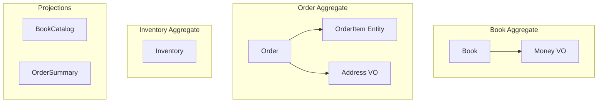
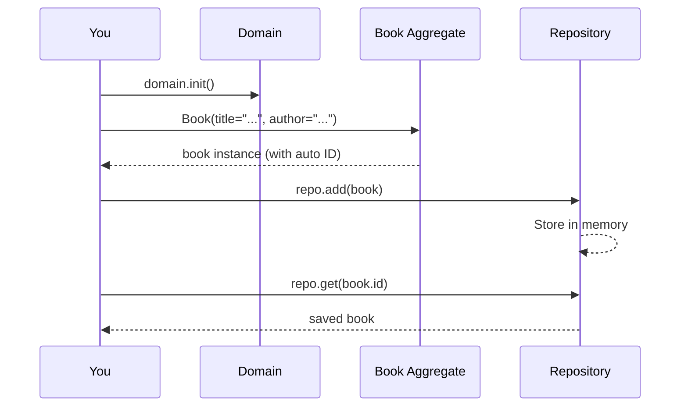

# Chapter 1: Your First Aggregate

In this chapter you will create the foundation of our online bookstore,
**Bookshelf**. By the end, you will have a working `Book` aggregate that
you can create, persist, and retrieve — all running in-memory with zero
infrastructure setup.

## What We're Building

Over the course of this tutorial we will build a complete online bookstore
that manages books, orders, and inventory. Here is a preview of the domain
model we are working toward:



We will start simple — just a `Book` aggregate with a few fields — and
layer on complexity chapter by chapter.

## Setting Up

Create a new directory for the project and install Protean:

```shell
mkdir bookshelf
cd bookshelf
pip install protean
```

Now create a file called `bookshelf.py`. Every Protean application begins
with a **Domain** — the central registry for all your business logic:

```python
from protean import Domain

domain = Domain()
```

Protean ships with in-memory adapters for databases, brokers, and event
stores, so you can focus entirely on domain modeling without setting up
any infrastructure.

## Defining the Book Aggregate

Aggregates are the core building blocks of a Protean domain. They hold
state, enforce business rules, and act as consistency boundaries — every
change to the data within an aggregate is persisted as a single unit.

Let's model a `Book`:

```python
{! docs_src/guides/getting-started/tutorial/ch01.py [ln:1-15] !}
```

A few things to note:

- The `@domain.aggregate` decorator registers `Book` with the domain.
- **Fields** define the aggregate's data. `String` and `Float` are two of
  the many field types Protean provides.
- `required=True` means the field must be present when creating a `Book`.
  `max_length` constrains the string length.
- Every aggregate automatically gets an `id` field — a unique identifier
  generated for you.

!!! info "What Is an Aggregate?"
    In Domain-Driven Design, an **aggregate** is a cluster of related
    objects treated as a single unit. The aggregate's root entity (here,
    `Book`) is the only entry point for modifications. This ensures that
    business rules are always enforced consistently.

    For now, our `Book` aggregate is simple — just the root entity with
    a few fields. In later chapters we will add child entities, value
    objects, and invariants to make it richer.

## Creating a Book

With the aggregate defined, let's create an instance. Add this to the
bottom of `bookshelf.py`:

```python
domain.init(traverse=False)

if __name__ == "__main__":
    with domain.domain_context():
        book = Book(
            title="The Great Gatsby",
            author="F. Scott Fitzgerald",
            isbn="9780743273565",
            price=12.99,
        )
        print(f"Created: {book.title} by {book.author}")
        print(f"ID: {book.id}")
```

Two important steps happen here:

1. **`domain.init()`** initializes the domain — resolving references,
   validating the model, and setting up adapters. The `traverse=False`
   flag tells Protean we have registered all elements ourselves (in a
   larger project with multiple files, you would omit this flag and let
   Protean auto-discover elements).

2. **`domain.domain_context()`** activates the domain for the current
   block. Inside this context, Protean knows which domain is active and
   can route operations correctly.

Run it:

```shell
$ python bookshelf.py
Created: The Great Gatsby by F. Scott Fitzgerald
ID: 5eb04301-f191-4bca-9e49-8e5a948f07f6
```

The ID is a UUID generated automatically. Every aggregate instance gets a
unique identity the moment it is created.

## Persisting and Retrieving

Creating a `Book` object gives you an in-memory instance, but it is not
persisted yet. To save and retrieve books, use a **repository**:

```python
{! docs_src/guides/getting-started/tutorial/ch01.py [ln:24-45] !}
```

- **`domain.repository_for(Book)`** returns a repository bound to the
  `Book` aggregate. You don't need to define one — Protean provides a
  default repository backed by the in-memory adapter.
- **`repo.add(book)`** persists the book. In the default in-memory
  adapter, this stores the object in a dictionary. With a real database,
  this would insert a row.
- **`repo.get(book.id)`** retrieves the book by its identifier.

!!! tip "No Database Required"
    Everything runs in-memory right now. When you are ready for a real
    database, you will swap in a different adapter through configuration
    — your domain code stays exactly the same. We will do this in
    [Chapter 12](12-persistence.md).

## Exploring in the Shell

Protean includes an interactive shell that pre-loads your domain. Try it:

```shell
$ protean shell --domain bookshelf
```

Inside the shell, the domain is already initialized and activated. You
can create books, persist them, and query — all interactively:

```python
>>> book = Book(title="1984", author="George Orwell", price=9.99)
>>> repo = domain.repository_for(Book)
>>> repo.add(book)
>>> retrieved = repo.get(book.id)
>>> retrieved.title
'1984'
```

The shell is a great way to experiment as you build out the domain.

## What Just Happened?

Let's recap the pieces and how they fit together:



1. You defined a **Domain** — the container for your business logic.
2. You defined a **Book aggregate** with fields that describe its data.
3. You **created** a Book instance, which got an auto-generated ID.
4. You **persisted** it through a repository and **retrieved** it back.

All of this ran in-memory with no infrastructure. In the next chapter,
we will explore the full field system and learn how identity works.

## Full Source

```python
{! docs_src/guides/getting-started/tutorial/ch01.py !}
```

## Next

[Chapter 2: Fields and Identity →](02-fields-and-identity.md)
