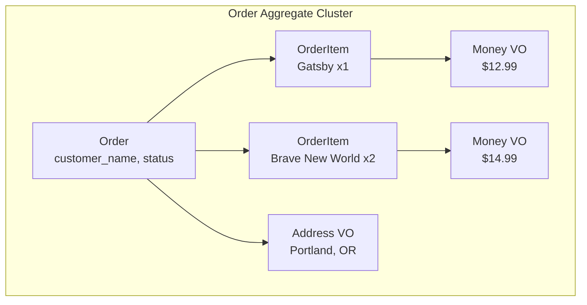

# Chapter 4: Entities and Associations

A bookstore doesn't just sell books — it takes orders. An order contains
line items, each referencing a book with a quantity and price. In this
chapter we introduce **entities** (child objects with identity) and
**associations** (relationships between objects) to build the `Order`
aggregate.

## Introducing Orders

Let's define the `Order` aggregate. An order belongs to a customer, has a
shipping address, a status, and a list of items:

```python
{! docs_src/guides/getting-started/tutorial/ch04.py [ln:52-59] !}
```

Notice two things:

- **`ValueObject(Address)`** — we reuse the `Address` value object from
  Chapter 3 for the shipping address.
- **`HasMany("OrderItem")`** — this declares that an Order *has many*
  OrderItem entities. The string reference `"OrderItem"` is resolved
  when the domain initializes.

## Entities: Objects with Identity

An `OrderItem` represents a single line in an order — which book, how
many, and at what price. Each item needs its own identity because you
might need to update or remove a specific line item:

```python
{! docs_src/guides/getting-started/tutorial/ch04.py [ln:63-68] !}
```

Key points:

- **`@domain.entity(part_of=Order)`** — this makes `OrderItem` a child
  entity that belongs to the `Order` aggregate. It cannot exist
  independently.
- **Auto-generated ID** — like aggregates, entities get an automatic
  identifier. Each line item has its own unique ID.
- **`ValueObject(Money)`** — entities can embed value objects too.

!!! info "Entity vs Value Object"
    Both are objects within an aggregate, but they differ in a fundamental
    way:

    - **Entities** have *identity*. Two order items with the same book and
      quantity are still *different* items if they have different IDs.
    - **Value Objects** have *no identity*. Two `Money(amount=12.99)` are
      interchangeable.

    Use entities when you need to track or reference individual items.
    Use value objects when only the values matter.

## Associations: Connecting Elements

The `HasMany` field creates a one-to-many relationship. An `Order` has
many `OrderItem` entities:

```python
items = HasMany("OrderItem")
```

You can pass items at creation time as a list, or add them afterward:

```python
# At creation time
order = Order(
    customer_name="Alice Johnson",
    items=[
        OrderItem(book_title="The Great Gatsby", quantity=1, ...),
        OrderItem(book_title="Brave New World", quantity=2, ...),
    ],
)

# After creation — method is add_<field_name>
order.add_items(
    OrderItem(book_title="Sapiens", quantity=1, ...)
)
```

## The Aggregate Cluster

An aggregate and its child entities form an **aggregate cluster** — a
unit of consistency that is always persisted and retrieved together:



When you call `repo.add(order)`, the order *and* all its items are
persisted as a single unit. When you call `repo.get(order.id)`, you get
the order with all its items loaded. This guarantees that the aggregate
is always in a consistent state.

## Building a Complete Order

Let's put it all together:

```python
{! docs_src/guides/getting-started/tutorial/ch04.py [ln:77-129] !}
```

Run it:

```shell
$ python bookshelf.py
Order for: Alice Johnson
Status: PENDING
Ship to: Portland, OR
Items (2):
  - The Great Gatsby x1 @ $12.99
    Item ID: a1b2c3d4-...
  - Brave New World x2 @ $14.99
    Item ID: e5f6g7h8-...

Retrieved order: Alice Johnson
Items: 2
After adding item: 3 items

All checks passed!
```

## Other Association Types

Protean provides three association types:

| Association | Description | Example |
|------------|-------------|---------|
| `HasMany` | One-to-many | Order → OrderItems |
| `HasOne` | One-to-one | User → Profile |
| `Reference` | A reference to another aggregate | OrderItem → Book (by ID) |

We have used `HasMany` here. The other types work similarly — `HasOne`
for a single child entity, and `Reference` for cross-aggregate links
(which store only the ID, not the full object).

!!! tip "Cross-Aggregate References"
    Notice that `OrderItem` stores `book_title` as a plain string rather
    than a reference to the `Book` aggregate. This is intentional —
    aggregates are independent consistency boundaries. They should not
    directly reference each other's objects. Instead, store the relevant
    data (title, price at time of purchase) within the order.

## Full Source

```python
{! docs_src/guides/getting-started/tutorial/ch04.py !}
```

## Summary

In this chapter you learned:

- **Entities** are child objects with identity, defined with
  `@domain.entity(part_of=...)`.
- **`HasMany`** creates a one-to-many relationship between an aggregate
  and its child entities.
- An **aggregate cluster** (the aggregate + its entities and VOs) is
  always persisted as a single unit.
- Entities can contain value objects and other fields, just like
  aggregates.

Our domain model is taking shape — we have `Book` and `Order` aggregates,
with `OrderItem` entities and `Money`/`Address` value objects. In the
next chapter, we will add **business rules** with invariants to make
sure our domain stays consistent.

## Next

[Chapter 5: Business Rules and Invariants →](05-business-rules.md)
