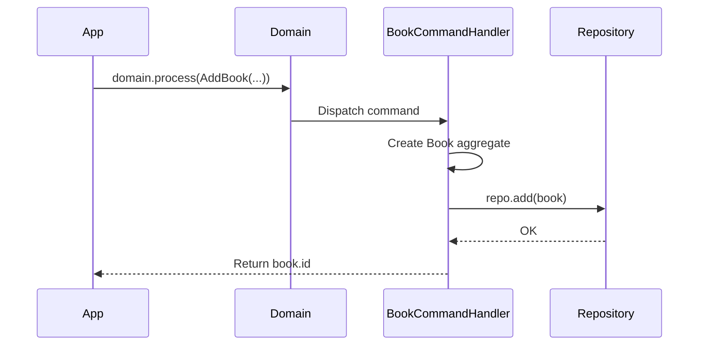

# Chapter 6: Commands and Command Handlers

So far we have been creating aggregates directly and persisting them
through repositories. In a real application, state changes come from
*outside* the domain — a user clicking "Add to Catalog," an API call
placing an order. **Commands** formalize these intentions, and **command
handlers** process them.

## Why Commands?

Commands separate *what should happen* from *how it happens*:

- The outside world says: "Add this book to the catalog"
- The domain decides: how to create the book, what rules to enforce,
  what events to raise

This separation gives you a clean boundary between your API layer and
your domain logic. It also enables asynchronous processing — commands
can be queued and processed later.

## Defining Commands

A command is an immutable data object that expresses intent. It is named
as an imperative — *do this*:

```python
{! docs_src/guides/getting-started/tutorial/ch06.py [ln:28-35] !}
```

Key points:

- **`@domain.command(part_of=Book)`** registers the command and associates
  it with the `Book` aggregate.
- Commands carry only the data needed to perform the action — no
  business logic.
- Commands are **immutable** — once created, they cannot be modified.

!!! info "Commands vs Aggregates"
    Commands have *similar* fields to aggregates, but they are not the
    same thing. A command carries the *request* data. The handler decides
    how to map that onto the aggregate. This indirection lets you change
    the aggregate's structure without breaking the command's contract.

## Command Handlers

A command handler receives a command and orchestrates the change:

```python
{! docs_src/guides/getting-started/tutorial/ch06.py [ln:39-53] !}
```

The pattern is always the same:

1. **Receive** the command
2. **Create or load** the aggregate
3. **Mutate** state
4. **Persist** through the repository

The `@handle(AddBook)` decorator tells Protean which command this method
processes. One handler class can have multiple `@handle` methods for
different commands.

## Processing Commands

To dispatch a command, use `domain.process()`:

```python
book_id = domain.process(
    AddBook(
        title="The Great Gatsby",
        author="F. Scott Fitzgerald",
        price_amount=12.99,
    )
)
```

Protean routes the command to the correct handler based on the command's
`part_of` aggregate and the handler's `@handle` decorator.

### Sync vs Async Processing

By default, commands are processed **asynchronously** — they are written
to a message store and a background server picks them up. For development
and testing, switch to **synchronous** processing:

```python
domain.config["command_processing"] = "sync"
```

With sync processing, `domain.process()` executes the handler immediately
and returns the result. We will use async processing when we set up the
Protean server in [Chapter 13](13-async-processing.md).

## The Unit of Work

Each command handler method runs inside an automatic **Unit of Work** —
a transaction boundary. If the handler completes successfully, changes
are committed. If it raises an exception, everything is rolled back.

You don't need to manage transactions yourself. This is one of the key
benefits of using commands and handlers — transactional consistency is
built in.

## Putting It Together

```python
{! docs_src/guides/getting-started/tutorial/ch06.py [ln:63-97] !}
```

Run it:

```shell
$ python bookshelf.py
Book added with ID: a3b2c1d0-...
Retrieved: The Great Gatsby by F. Scott Fitzgerald
Price: $12.99 USD

Total books: 2
  - The Great Gatsby
  - Brave New World

All checks passed!
```

The flow is clean:



## Full Source

```python
{! docs_src/guides/getting-started/tutorial/ch06.py !}
```

## Summary

In this chapter you learned:

- **Commands** are immutable data objects that express intent, named as
  imperatives (`AddBook`, `PlaceOrder`).
- **Command handlers** receive commands and orchestrate state changes,
  following the pattern: receive → create/load → mutate → persist.
- **`domain.process()`** dispatches a command to its handler.
- Each handler method runs in a **Unit of Work** — automatic transaction
  management.
- **Sync processing** runs immediately; **async** queues for the server.

Commands express *what* should happen. In the next chapter, we will add
**domain events** to record *what did happen*.

## Next

[Chapter 7: Domain Events →](07-events.md)
