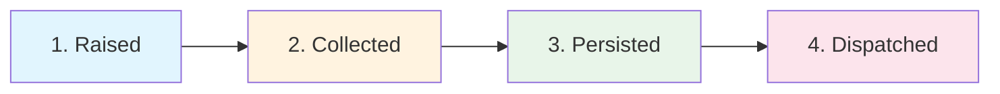

# Chapter 7: Domain Events — Things That Happened

Commands express *intent* — "add this book." Events record *facts* —
"a book was added." In this chapter we define domain events and raise
them from our aggregates.

## What Are Domain Events?

A domain event is an immutable record of something significant that
happened in the domain. Events are:

- **Named in past tense**: `BookAdded`, `OrderConfirmed`, `OrderShipped`
- **Immutable**: once created, they cannot be changed
- **Facts**: they represent things that already happened

Events vs Commands:

| Commands | Events |
|----------|--------|
| "Add this book" (intent) | "Book was added" (fact) |
| Imperative: `AddBook` | Past tense: `BookAdded` |
| One handler processes it | Many handlers can react |
| Can be rejected | Already happened |

## Defining Events

Events are defined just like commands — fields describe the relevant data
at the moment the event occurred:

```python
{! docs_src/guides/getting-started/tutorial/ch07.py [ln:54-60] !}
```

The `part_of=Book` associates this event with the Book aggregate cluster.
An event's fields should capture enough data for any handler to process
it without needing to query the aggregate.

### Order Events

Let's also define events for our Order aggregate:

```python
{! docs_src/guides/getting-started/tutorial/ch07.py [ln:99-117] !}
```

## Raising Events from Aggregates

Events are raised *inside* aggregate methods using `self.raise_()`:

```python
{! docs_src/guides/getting-started/tutorial/ch07.py [ln:30-50] !}
```

When you call `book.add_to_catalog()`, the event is not immediately
dispatched. It is **collected** on the aggregate. The event is dispatched
later, when the aggregate is persisted through the repository.

Similarly for orders:

```python
{! docs_src/guides/getting-started/tutorial/ch07.py [ln:69-91] !}
```

The `confirm()` and `ship()` methods each change state *and* raise an
event recording what happened.

## The Event Lifecycle

Events go through a clear lifecycle:



1. **Raised**: `self.raise_(BookAdded(...))` — the event is created
2. **Collected**: The event is stored on the aggregate's internal
   `_events` list
3. **Persisted**: When `repo.add(book)` is called, the aggregate and
   its events are saved
4. **Dispatched**: Events are delivered to handlers (synchronously or
   asynchronously)

This means events are never lost — they are only dispatched after the
aggregate has been successfully persisted.

## Event Metadata

Every event carries metadata beyond its declared fields:

```python
>>> event._metadata.id         # Unique event ID
>>> event._metadata.timestamp  # When the event was created
>>> event._metadata.type       # Fully qualified event type
```

Metadata is auto-generated and read-only. It is useful for logging,
tracing, and ordering events.

## Enriching Our Aggregates

Let's update the command handler to raise events when adding books:

```python
{! docs_src/guides/getting-started/tutorial/ch07.py [ln:128-144] !}
```

The handler now calls `book.add_to_catalog()` before persisting. This
raises the `BookAdded` event, which will be dispatched after the
repository commit.

## Putting It Together

```python
{! docs_src/guides/getting-started/tutorial/ch07.py [ln:152-193] !}
```

Run it:

```shell
$ python bookshelf.py
Book added: a3b2c1d0-...
Order confirmed: e5f6g7h8-...
Order shipped: e5f6g7h8-...

All checks passed!
```

Events are being raised and collected. But nothing is *reacting* to them
yet. In the next chapter we will add **event handlers** that process
these events to trigger side effects.

## Full Source

```python
{! docs_src/guides/getting-started/tutorial/ch07.py !}
```

## Summary

In this chapter you learned:

- **Domain events** are immutable records of things that happened, named
  in past tense.
- **`@domain.event(part_of=...)`** defines an event and associates it
  with an aggregate.
- **`self.raise_(...)`** raises an event inside an aggregate method.
- Events are **collected** on the aggregate and **dispatched** when the
  aggregate is persisted.
- Event **metadata** (id, timestamp, type) is auto-generated.

Events are raised but not yet consumed. In the next chapter we will
build **event handlers** that react to events — for notifications,
inventory tracking, and more.

## Next

[Chapter 8: Event Handlers →](08-event-handlers.md)
