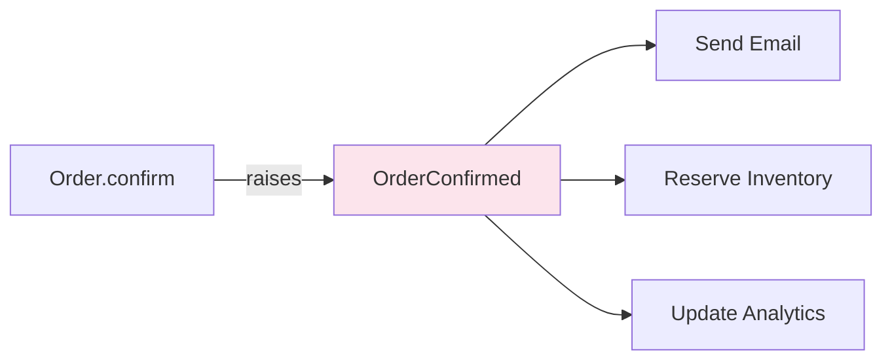
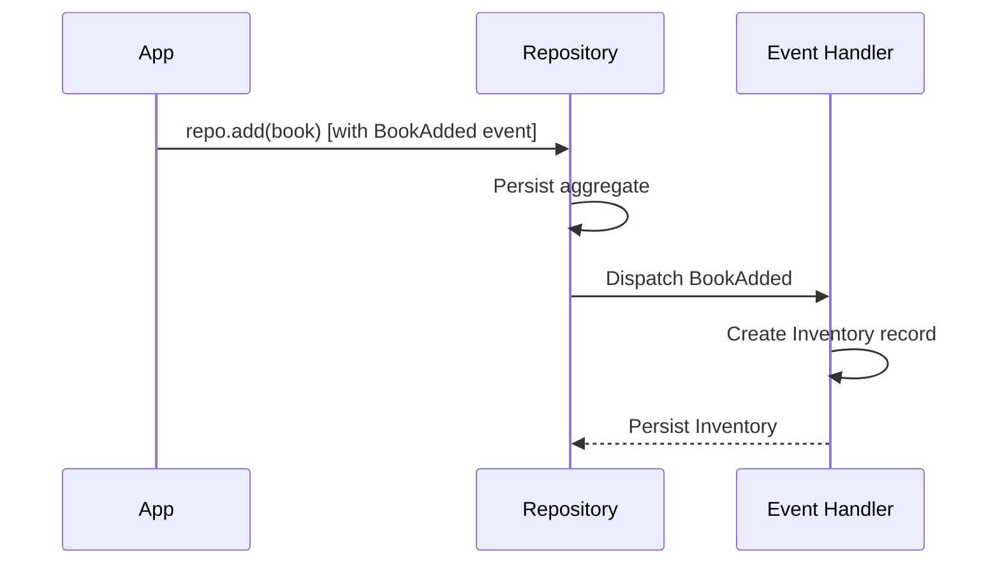

# Chapter 8: Event Handlers — Reacting to Change

In the previous chapter we raised events from our aggregates, but nothing
reacted to them. In this chapter we add **event handlers** — decoupled
components that process events to trigger side effects like sending
notifications or updating other aggregates.

## Why Event Handlers?

When an order is confirmed, several things should happen: send a
confirmation email, reserve inventory, update analytics. But the `Order`
aggregate should not know about any of these. Its job is to manage order
state, not send emails.

Event handlers solve this by *reacting* to events without coupling:



The aggregate raises the event. Handlers independently decide what to do
with it.

## Introducing the Inventory Aggregate

Before we build handlers, let's add a simple `Inventory` aggregate that
tracks stock for each book:

```python
{! docs_src/guides/getting-started/tutorial/ch08.py [ln:105-112] !}
```

We will use event handlers to keep inventory in sync automatically.

## Defining Event Handlers

An event handler is a class that processes one or more events:

```python
{! docs_src/guides/getting-started/tutorial/ch08.py [ln:116-126] !}
```

Key points:

- **`@domain.event_handler(part_of=Book)`** registers the handler within
  the Book aggregate's context.
- **`@handle(BookAdded)`** marks the method that processes `BookAdded`
  events.
- Inside the handler, we can create or update other aggregates — here we
  create an `Inventory` record for the new book.

### Multiple Handlers in One Class

A single handler class can process multiple events:

```python
{! docs_src/guides/getting-started/tutorial/ch08.py [ln:130-138] !}
```

Each `@handle` method processes a different event type. The handler
class acts as a logical grouping of related reactions.

## How Events Flow

When event processing is set to `"sync"`, events are dispatched
immediately after the aggregate is persisted:



The flow is:

1. You call `repo.add(book)` — the book had a pending `BookAdded` event
2. The repository persists the book
3. The repository dispatches pending events to handlers
4. The `BookEventHandler.on_book_added` creates an `Inventory` record

## Sync vs Async Processing

We have been using synchronous event processing:

```python
domain.config["event_processing"] = "sync"
```

In production, you will switch to **asynchronous** processing:

```python
domain.config["event_processing"] = "async"
```

With async processing, events are written to a message store (event store
or broker) and processed by the **Protean server** — a background process
that subscribes to event streams and dispatches to handlers.

This gives you:

- **Scalability**: handlers run in separate processes
- **Resilience**: failed handlers can retry
- **Decoupling**: event producers and consumers are independent

We will set this up in [Chapter 13](13-async-processing.md).

## End-to-End Flow

Let's trace the complete flow from adding a book to seeing inventory
created automatically:

```python
{! docs_src/guides/getting-started/tutorial/ch08.py [ln:168-208] !}
```

Run it:

```shell
$ python bookshelf.py
Adding book to catalog...
  [Inventory] Stocked 10 copies of 'The Great Gatsby'
  Inventory: The Great Gatsby, qty=10

Placing an order...
Confirming order...
  [Notification] Order e5f6... confirmed for Alice Johnson
Shipping order...
  [Notification] Order e5f6... shipped to Alice Johnson

All checks passed!
```

Notice how the inventory was created automatically when the book was
added, and notifications were triggered when the order was confirmed
and shipped — all through event handlers.

## Full Source

```python
{! docs_src/guides/getting-started/tutorial/ch08.py !}
```

## Summary

In this chapter you learned:

- **Event handlers** react to domain events, decoupling side effects
  from the aggregate that raised the event.
- **`@domain.event_handler(part_of=...)`** registers a handler, and
  **`@handle(EventClass)`** marks which events it processes.
- A single handler class can process **multiple events** with separate
  `@handle` methods.
- Handlers can create or modify other aggregates — enabling
  cross-aggregate coordination through events.
- **Sync processing** dispatches immediately; **async processing** runs
  handlers in a background server.

We have covered all the fundamental building blocks: aggregates, entities,
value objects, commands, events, and handlers. In the next part we will
add **services** for complex use case coordination and **projections**
for read-optimized views.

## Next

[Chapter 9: Application Services →](09-application-services.md)
