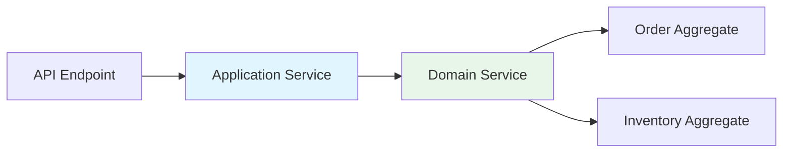

# Chapter 10: Domain Services — Cross-Aggregate Logic

"Place an order" is not just about the Order aggregate. It also involves
checking inventory, reserving stock, and possibly more. When business
logic spans **multiple aggregates**, a **domain service** encapsulates it.

## When Logic Spans Aggregates

An aggregate's methods operate on its own state. But some business
operations involve multiple aggregates:

- **Order fulfillment**: check Inventory stock → reserve items →
  confirm Order
- **Transfer between accounts**: debit one Account → credit another

These operations cannot live in a single aggregate. A domain service
coordinates them while keeping business rules explicit.

## Building the OrderFulfillmentService

```python
{! docs_src/guides/getting-started/tutorial/ch10.py [ln:69-104] !}
```

Key points:

- **`@domain.domain_service(part_of=[Order, Inventory])`** declares that
  this service spans two aggregates. The `part_of` must list *two or
  more* aggregates.
- The constructor receives aggregate instances and calls `super().__init__`
  with them.
- The `fulfill()` method orchestrates the business process: reserve stock
  for each item, then confirm the order.

## Invariants on Domain Services

Domain services support the same `@invariant.pre` and `@invariant.post`
decorators as aggregates:

```python
@invariant.pre
def all_items_must_be_in_stock(self):
    for item in self.order.items:
        inventory = next(
            (i for i in self.inventories if i.title == item.book_title),
            None,
        )
        if inventory is None or inventory.quantity < item.quantity:
            raise ValidationError(
                {"_service": [f"'{item.book_title}' is out of stock"]}
            )

@invariant.pre
def order_must_have_payment(self):
    if not self.order.payment_id:
        raise ValidationError(
            {"_service": ["Order must have a valid payment method"]}
        )
```

- **Pre-invariants** run before `fulfill()` — they prevent the operation
  if preconditions are not met.
- **Post-invariants** (not shown here) would validate the final state
  after the operation.

Invariants run automatically when any method on the service is called.
They are checked in the order they are defined.

## Using the Domain Service

```python
{! docs_src/guides/getting-started/tutorial/ch10.py [ln:108-148] !}
```

Run it:

```shell
$ python bookshelf.py
=== Fulfilling Order ===
Order status: CONFIRMED
Gatsby stock: 8
Brave New World stock: 4

=== Out of Stock Scenario ===
Caught: {'_service': ["'Brave New World' is out of stock"]}

=== Missing Payment Scenario ===
Caught: {'_service': ['Order must have a valid payment method']}

All checks passed!
```

The service enforces business rules *before* making any changes. If
stock is insufficient or payment is missing, nothing happens — no
partial updates.

## Domain Services vs Application Services

These two types of services have different purposes:

| Domain Services | Application Services |
|----------------|---------------------|
| Contain **business rules** | Contain **coordination logic** |
| Span multiple aggregates | Work with one aggregate |
| Have invariants (pre/post) | Have `@use_case` for transactions |
| Called by handlers or app services | Called by API/UI layer |
| Part of the domain model | Part of the application layer |

A typical flow:



The application service receives the request, loads the aggregates, and
passes them to the domain service. The domain service enforces rules and
orchestrates the changes.

## Full Source

```python
{! docs_src/guides/getting-started/tutorial/ch10.py !}
```

## Summary

In this chapter you learned:

- **Domain services** encapsulate business logic that spans multiple
  aggregates.
- **`@domain.domain_service(part_of=[Agg1, Agg2])`** declares the
  aggregates involved.
- Domain services support **invariants** — pre-conditions and
  post-conditions that run automatically.
- Domain services are distinct from application services: they contain
  *business rules*, not *coordination logic*.

We now have all the building blocks for changing state. In the next
chapter, we will build the *read side* — **projections** that provide
optimized views of our data.

## Next

[Chapter 11: Projections and Projectors →](11-projections.md)
