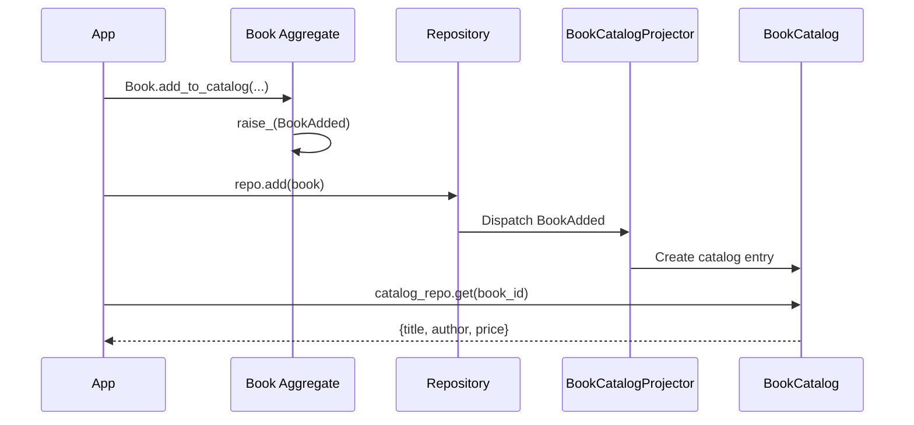

# Chapter 11: Projections and Projectors — Read-Optimized Views

Our domain model is great for enforcing business rules, but it may not
be optimal for queries. A book catalog listing does not need invariants
or associations — it needs fast, flat data. **Projections** provide
read-optimized views, and **projectors** build them from events.

## Why Projections?

In CQRS (Command Query Responsibility Segregation), the *write side*
and *read side* have different needs:

| Write Side (Aggregates) | Read Side (Projections) |
|------------------------|------------------------|
| Rich domain model | Flat, denormalized data |
| Business rules & invariants | Fast queries |
| Normalized structure | Shaped for specific consumers |
| Modified through commands | Built from events |

A projection is a **denormalized view** — data pre-shaped for a specific
query pattern. Instead of joining tables or traversing associations, you
query the projection directly.

## Defining Projections

A projection looks like a simplified aggregate — just fields and an
identifier:

```python
{! docs_src/guides/getting-started/tutorial/ch11.py [ln:66-76] !}
```

Key points:

- **`@domain.projection`** — registers a read model
- **`identifier=True`** — every projection needs an identity field
- **No associations** — projections are flat. No `HasMany`, `HasOne`,
  or `ValueObject` fields allowed
- **No business logic** — projections are pure data containers

## Building Projectors

A projector listens for events and builds/updates projections:

```python
{! docs_src/guides/getting-started/tutorial/ch11.py [ln:79-101] !}
```

Key points:

- **`@domain.projector(projector_for=BookCatalog, aggregates=[Book])`** —
  binds the projector to a projection and specifies which aggregates'
  events it processes.
- **`@on(BookAdded)`** — the handler that runs when a `BookAdded` event
  arrives. `@on` is an alias for `@handle`, specific to projectors.
- **Create on add, update on change** — `on_book_added` creates a new
  catalog entry; `on_price_updated` modifies an existing one.

The projector acts as a translator: it takes events from the write side
and transforms them into the shape needed by the read side.

## Multiple Projections from Same Events

One of the great benefits of projections is building **different views**
from the **same events**. For example:

- **BookCatalog** — for customers browsing the store (title, author,
  price)
- **BookInventory** — for warehouse staff (title, stock count,
  warehouse location)
- **AuthorDirectory** — for the "Authors" page (author name, book count)

Each projection has its own projector that listens to the same events
but builds a different view.

## Querying Projections

Projections use the same repository and query API as aggregates:

```python
# Get a specific entry
entry = domain.repository_for(BookCatalog).get(book_id)

# Query all entries
entries = domain.repository_for(BookCatalog)._dao.query.all()

# Filter
fiction = domain.repository_for(BookCatalog)._dao.query.filter(
    author="George Orwell"
).all()
```

Because projections are flat and denormalized, queries are fast — no
joins, no traversals.

## End-to-End: Write → Event → Projection → Read

Here is the complete CQRS flow:



## Putting It Together

```python
{! docs_src/guides/getting-started/tutorial/ch11.py [ln:107-158] !}
```

Run it:

```shell
$ python bookshelf.py
=== Adding Books ===

=== Book Catalog (Projection) ===
Total entries: 3
  The Great Gatsby by F. Scott Fitzgerald — $12.99
  Brave New World by Aldous Huxley — $14.99
  1984 by George Orwell — $11.99

=== Updating Price ===
Updated: The Great Gatsby — $15.99

All checks passed!
```

The catalog projection is automatically maintained by the projector.
When a book is added or its price changes, the catalog updates
immediately (in sync mode) or shortly after (in async mode).

## Full Source

```python
{! docs_src/guides/getting-started/tutorial/ch11.py !}
```

## Summary

In this chapter you learned:

- **Projections** are read-optimized, denormalized views defined with
  `@domain.projection`.
- **Projectors** listen for events and build/update projections, using
  `@domain.projector` with `@on(EventClass)` handlers.
- Projections have no business logic, no associations — just flat data
  optimized for queries.
- **Multiple projections** can be built from the same events for
  different consumers.
- This is the **CQRS pattern** — separating the write model (aggregates)
  from the read model (projections).

We have now covered all the domain elements. In the next part, we will
move from in-memory to real infrastructure — databases, message brokers,
and the Protean server.

## Next

[Chapter 12: Configuration and Real Databases →](12-persistence.md)
