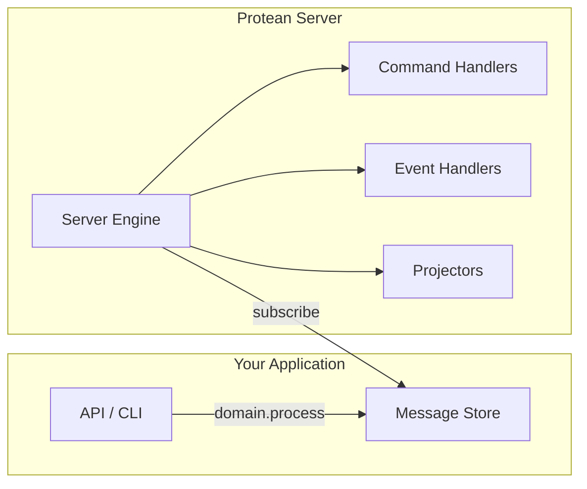
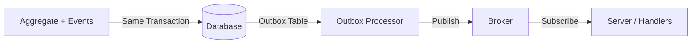

# Chapter 13: Async Processing and the Server

Throughout this tutorial, we have processed events and commands
synchronously — the handler runs immediately in the same process. In
production, you will switch to **asynchronous processing** for
scalability and resilience. This chapter introduces the Protean server
and message brokers.

## From Sync to Async

In synchronous mode:

```
Command → Handler → Done (same process, same thread)
```

In asynchronous mode:

```
Command → Message Store → Server picks up → Handler runs
```

The benefits of async processing:

- **Scalability**: handlers run in separate processes, can scale
  independently
- **Resilience**: if a handler fails, the message is retried
- **Decoupling**: producers and consumers are independent
- **Throughput**: the main process returns immediately

## Configuring a Message Broker

Update `domain.toml` to use Redis as the message broker:

```toml
event_processing = "async"
command_processing = "async"

[databases.default]
provider = "postgresql"
database_uri = "postgresql://localhost:5432/bookshelf"

[brokers.default]
provider = "redis"
URI = "redis://localhost:6379/0"

[event_store]
provider = "memory"
```

Protean supports several brokers:

| Broker | Provider | Best For |
|--------|----------|----------|
| Inline | `inline` | Development/testing (synchronous) |
| Redis Streams | `redis` | Production (durable, consumer groups) |
| Redis PubSub | `redis_pubsub` | Simple pub/sub (no persistence) |

Redis Streams is the recommended production broker — it provides
message persistence, consumer groups, and at-least-once delivery.

### Starting Redis

```shell
docker run -d --name bookshelf-redis -p 6379:6379 redis:7
```

Or with Protean's Docker Compose: `make up`

## The Protean Server

The server is a background process that subscribes to message streams
and dispatches to handlers:

```shell
protean server --domain bookshelf
```

The server:

1. Subscribes to event and command streams
2. Reads messages as they arrive
3. Dispatches to the appropriate handler
4. Acknowledges successful processing
5. Retries on failure



### Subscription Types

The server supports two subscription mechanisms:

| Type | Description | Use Case |
|------|-------------|----------|
| `event_store` | Reads from the event store | Default, development-friendly |
| `stream` | Reads from broker streams | Production, real-time |

Configure the default in `domain.toml`:

```toml
[server]
default_subscription_type = "stream"
```

### Subscription Profiles

Pre-configured settings for common scenarios:

```toml
[server]
default_subscription_profile = "production"
```

| Profile | Description |
|---------|-------------|
| `production` | High throughput, reliable delivery |
| `fast` | Low-latency processing |
| `batch` | High-volume batch processing |
| `debug` | Verbose logging for development |
| `projection` | Optimized for building read models |

## Subscribers for External Messages

Event handlers process domain events from *within* your system.
**Subscribers** process messages from *external* systems:

```python
@domain.subscriber(stream="external-orders")
class ExternalOrderSubscriber:
    """Process orders from an external system."""

    def __call__(self, payload):
        # Parse the external message
        order_data = payload
        print(f"Received external order: {order_data}")

        # Create a domain command and process it
        domain.process(
            PlaceOrder(
                customer_name=order_data["customer"],
                items=order_data["items"],
            )
        )
```

Subscribers:

- Listen to **broker streams** (not the event store)
- Have a `__call__` method that receives the raw payload
- Bridge external systems into your domain

## The Outbox Pattern

In async mode, there is a risk: what if the aggregate is persisted but
the event fails to publish to the broker? The **outbox pattern** solves
this by storing events in the same database transaction as the aggregate:

```toml
enable_outbox = true

[outbox]
broker = "default"
messages_per_tick = 10
tick_interval = 1

[outbox.retry]
max_attempts = 3
base_delay_seconds = 60
```

How it works:

1. When an aggregate is persisted, its events are written to an `outbox`
   table in the *same* database transaction
2. A background processor reads the outbox and publishes to the broker
3. If publishing fails, the message is retried with exponential backoff
4. After all retries are exhausted, the message is marked as abandoned

This guarantees **at-least-once delivery** — events are never lost, even
if the broker is temporarily unavailable.



## Running the Complete System

With async processing, the typical architecture looks like:

```
┌──────────────┐     ┌──────────────┐     ┌──────────────┐
│  Application │────▶│  PostgreSQL  │────▶│  Redis       │
│  (API/CLI)   │     │  (Database)  │     │  (Broker)    │
└──────────────┘     └──────────────┘     └──────────────┘
                                                │
                                          ┌─────▼──────┐
                                          │  Protean   │
                                          │  Server    │
                                          │            │
                                          │  Handlers  │
                                          │  Projectors│
                                          └────────────┘
```

Start everything:

```shell
# Start infrastructure
docker compose up -d  # PostgreSQL + Redis

# Start the server
protean server --domain bookshelf

# Run your application (in another terminal)
python bookshelf.py
```

## Summary

In this chapter you learned:

- **Async processing** decouples command/event producers from consumers,
  enabling scalability and resilience.
- **Message brokers** (Redis Streams) transport events between the
  application and handlers.
- **`protean server`** runs a background process that subscribes to
  streams and dispatches to handlers.
- **Subscribers** bridge external messages into your domain.
- The **outbox pattern** ensures events are never lost — they are stored
  in the same transaction as the aggregate.

Our bookstore can now run as a distributed system. In the next chapter
we will explore a fundamentally different approach to state management —
**event sourcing**.

## Next

[Chapter 14: Event Sourcing →](14-event-sourcing.md)
