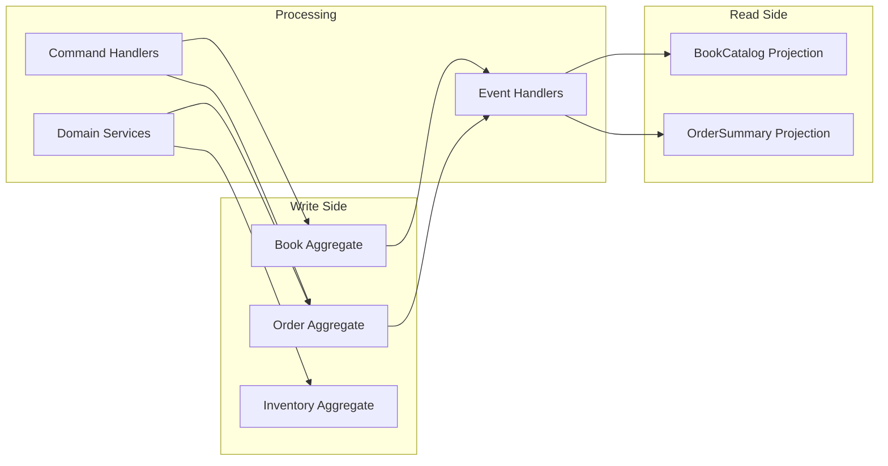

# Tutorial: Building Bookshelf

A guided, end-to-end walkthrough of building a complete online bookstore
with Protean. By the end, you will have modeled a rich domain, processed
commands and events, built read-optimized projections, connected real
databases and message brokers, and explored event sourcing.

## What You'll Build

**Bookshelf** is a small but complete online bookstore that demonstrates
every major Protean concept:

- A **Book** catalog with rich fields, value objects, and business rules
- An **Order** system with child entities, associations, and invariants
- An **Inventory** tracker coordinated across aggregate boundaries
- **Commands** that express intent and **events** that record what happened
- **Projections** for fast, read-optimized queries
- Real **database persistence**, **async message processing**, and
  **event sourcing**

## How the Tutorial Is Organized

The tutorial is divided into six parts that progressively build on each
other. Each chapter introduces new concepts while extending the Bookshelf
application.

| Part | Chapters | What You'll Learn |
|------|----------|-------------------|
| **I. Getting Started** | 1–2 | Create your first aggregate, explore fields, identity, and basic persistence |
| **II. The Domain Model** | 3–5 | Value objects, entities, associations, invariants, and business rules |
| **III. Commands & Events** | 6–8 | Commands, command handlers, domain events, and event handlers |
| **IV. Services & Read Models** | 9–11 | Application services, domain services, projections, and projectors |
| **V. Infrastructure** | 12–14 | Configuration, databases, async processing, server, and event sourcing |
| **VI. Quality** | 15 | Testing strategies for every layer |

!!! tip "Cumulative Codebase"
    Each chapter builds on the previous one. The code you write in Chapter 1
    grows throughout the tutorial into a complete application. Follow along
    in order for the best experience.

## Prerequisites

- **Python 3.11+**
- **Protean installed** — see [Installation](../installation.md)
- **Familiarity with the [Quickstart](../quickstart.md)** — the tutorial
  assumes you've seen a basic Protean domain

## Ready?

Start with **[Chapter 1: Your First Aggregate](01-your-first-aggregate.md)**
and build your bookstore from the ground up.
