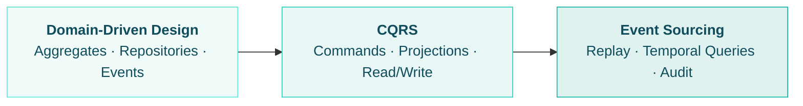

# Guides

The guides section is your comprehensive reference for building applications
with Protean. Whether you're modeling your first aggregate or architecting an
event-sourced system, you'll find detailed, practical guidance for every
concept and pattern Protean supports.

If you haven't already, start with the
[Tutorial](./getting-started/tutorial/index.md) to build a complete
application from scratch. These guides go deeper into each topic and serve
as a reference you'll return to as your application grows.

## Choose Your Path

Protean supports three architectural approaches. Each builds on the one
before it, so they also serve as a natural learning progression — start
simple and add sophistication as your needs evolve.

### :material-shield-outline: Domain-Driven Design

For teams that want clean domain modeling with application services,
repositories, and event-driven side effects. The simplest way to use Protean.

**Start here if:** You're new to Protean, building a straightforward
application, or your team is new to DDD.

[:material-arrow-right-box: DDD Pathway](./pathways/ddd.md)

### :material-call-split: CQRS

Adds Commands, Command Handlers, and read-optimized Projections on top of
DDD. Separates your write and read models for better scalability and clarity.

**Start here if:** You need independent scaling of reads and writes, want
explicit command/query separation, or are building a system with complex
read requirements.

[:material-arrow-right-box: CQRS Pathway](./pathways/cqrs.md)

### :material-history: Event Sourcing

Derives aggregate state entirely from event replay. Full audit trail,
temporal queries, and complete traceability.

**Start here if:** You need regulatory audit trails, temporal analysis,
or your domain has complex state transitions where history matters.

[:material-arrow-right-box: Event Sourcing Pathway](./pathways/event-sourcing.md)

## Browse by Topic

-   **:material-shape-outline: Define Your Domain**

    ---

    Model your business concepts with aggregates, entities, value objects,
    and rich behavior.

    [:material-arrow-right-box: Set Up the Domain](./compose-a-domain/index.md) ·
    [:material-arrow-right-box: Define Domain Elements](./domain-definition/index.md) ·
    [:material-arrow-right-box: Add Rules and Behavior](./domain-behavior/index.md)

-   **:material-cog-outline: Change State**

    ---

    Process state changes through application services, commands, and
    command handlers. Persist and retrieve aggregates.

    [:material-arrow-right-box: Change State](./change-state/index.md)

-   **:material-broadcast: React to Changes**

    ---

    Respond to state changes with event handlers, projections, process
    managers, and subscribers.

    [:material-arrow-right-box: React to Changes](./consume-state/index.md)

-   **:material-server-outline: Run in Production**

    ---

    Configure databases, run the async processing server, and use the CLI.

    [:material-arrow-right-box: Configuration](./essentials/configuration.md) ·
    [:material-arrow-right-box: Server](./server/index.md) ·
    [:material-arrow-right-box: CLI](./cli/index.md) ·
    [:material-arrow-right-box: FastAPI](./fastapi/index.md)

-   **:material-test-tube: Test Your Application**

    ---

    Strategies for testing every layer of your application.

    [:material-arrow-right-box: Testing](./testing/index.md)

## How Do I...?

A quick reference for common tasks. See the
[full task index](../how-do-i.md) for more.

| I want to...                          | Go to                                                                 |
|---------------------------------------|-----------------------------------------------------------------------|
| Define an aggregate                   | [Aggregates](./domain-definition/aggregates.md)                       |
| Add a child entity                    | [Entities](./domain-definition/entities.md)                           |
| Enforce business rules                | [Invariants](./domain-behavior/invariants.md)                         |
| Handle a request (synchronous)        | [Application Services](./change-state/application-services.md)        |
| Handle a request (via commands)       | [Commands](./change-state/commands.md) + [Handlers](./change-state/command-handlers.md) |
| Save or load an aggregate             | [Persist](./change-state/persist-aggregates.md) · [Retrieve](./change-state/retrieve-aggregates.md) |
| React to a domain event               | [Event Handlers](./consume-state/event-handlers.md)                   |
| Build a read-optimized view           | [Projections](./consume-state/projections.md)                         |
| Choose between CQRS and ES            | [Architecture Decision](../core-concepts/architecture-decision.md)    |
| Use Protean with FastAPI              | [FastAPI Integration](./fastapi/index.md)                             |
| Test my domain logic                  | [Testing](./testing/index.md)                                         |

## What Elements Do I Need?

This matrix shows which Protean domain elements are used in each
architectural approach:

| Element              | DDD | CQRS | Event Sourcing |
|----------------------|:---:|:----:|:--------------:|
| Aggregates           |  ✓  |  ✓   |  ✓             |
| Entities             |  ✓  |  ✓   |  ✓             |
| Value Objects        |  ✓  |  ✓   |  ✓             |
| Domain Services      |  ✓  |  ✓   |  ✓             |
| Repositories         |  ✓  |  ✓   |  —             |
| Application Services |  ✓  |  —   |  —             |
| Commands             |  —  |  ✓   |  ✓             |
| Command Handlers     |  —  |  ✓   |  ✓             |
| Events               |  ✓  |  ✓   |  ✓             |
| Event Handlers       |  ✓  |  ✓   |  ✓             |
| Subscribers          |  ✓  |  ✓   |  ✓             |
| Projections          |  —  |  ✓   |  ✓             |
| Projectors           |  —  |  ✓   |  ✓             |
| ES Repositories      |  —  |  —   |  ✓             |
| `@apply` decorator   |  —  |  —   |  ✓             |

✓ = core to this path, — = not used
