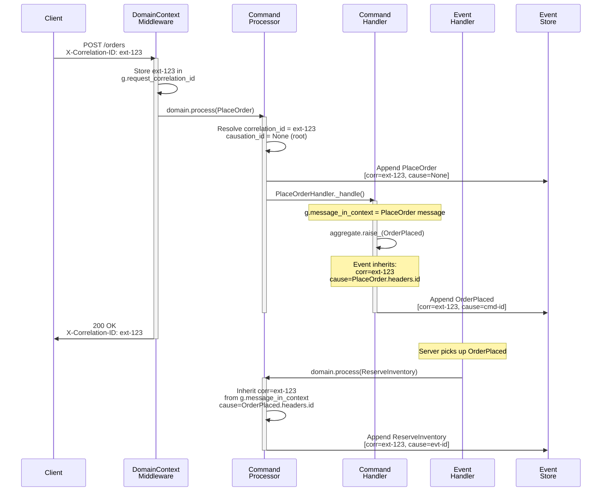

# Correlation and causation IDs

<span class="pathway-tag pathway-tag-cqrs">CQRS</span> <span class="pathway-tag pathway-tag-es">ES</span>

Every command and event in Protean carries two tracing identifiers --
`correlation_id` and `causation_id` -- that let you reconstruct the full
causal history of any business operation. This guide covers how the IDs
are generated, how they propagate, how to supply them from external callers,
and how every observability layer (logging, OTEL, Observatory) uses them.

## The out-of-the-box guarantee

Protean generates and propagates correlation and causation IDs automatically.
No opt-in configuration, no manual wiring. The moment you call
`domain.process()`, every command and event in the resulting chain carries
both IDs:

- **`correlation_id`** -- A constant identifier shared by *every* message in
  the chain. It answers: "Which business operation does this message belong to?"
- **`causation_id`** -- The `headers.id` of the *immediate parent* message.
  It answers: "What directly caused this message?"

```python
# This is all you need. Both IDs are set automatically.
domain.process(PlaceOrder(customer_id="cust-123", items=items))
```

When no external `correlation_id` is provided, Protean generates a UUID4 hex
string (32 characters, no dashes). Every downstream event and command inherits
it. You never need to check for `None`.

---

## Passing correlation IDs from external callers

In production, the `correlation_id` typically originates outside Protean --
from an API gateway, frontend client, or upstream service. There are two ways
to pass it in.

### Explicitly via `domain.process()`

Pass the `correlation_id` parameter directly:

```python
domain.process(
    PlaceOrder(customer_id="cust-123", items=items),
    correlation_id="req-abc-123-from-gateway",
)
```

### Automatically via HTTP headers

When using the `DomainContextMiddleware` with FastAPI, the middleware
extracts `X-Correlation-ID` (falling back to `X-Request-ID`) from the
incoming request and stores it in the global context. `current_domain.process()`
picks it up automatically:

```python
from protean.globals import current_domain
from protean.integrations.fastapi import DomainContextMiddleware

app.add_middleware(
    DomainContextMiddleware,
    route_domain_map={"/orders": order_domain},
)

@router.post("/orders")
async def place_order(request: PlaceOrderRequest):
    # No need to extract headers -- the middleware already did it.
    # The correlation ID flows through automatically.
    current_domain.process(PlaceOrder(**request.model_dump()))
```

The middleware also injects `X-Correlation-ID` into the response, reflecting
the ID that was actually used (from header, explicit param, or auto-generated).

### Priority of correlation ID sources

When multiple sources provide a correlation ID, Protean resolves them in
this order:

1. **Explicit `correlation_id` parameter** on `domain.process()` -- highest priority
2. **Parent message context** (`g.message_in_context`) -- used when an event
   handler dispatches a new command
3. **HTTP request header** (`g.request_correlation_id`) -- set by
   `DomainContextMiddleware`
4. **Auto-generated UUID4 hex** -- fallback when none of the above is present

---

## Full propagation flow

The following diagram shows how `correlation_id` and `causation_id` flow
through a typical command-event chain, starting from an HTTP request:



Every message in the chain shares the same `correlation_id` (`ext-123`),
while each `causation_id` points to the immediate parent message.

---

## Causation chain semantics

The two IDs together form a **causation tree**. The `correlation_id` is the
tree's label; the `causation_id` links define the edges:

```
PlaceOrder [corr=ext-123, cause=None]                <-- root command
  +-- OrderPlaced [corr=ext-123, cause=PlaceOrder.id]
        +-- ReserveInventory [corr=ext-123, cause=OrderPlaced.id]
        |     +-- InventoryReserved [corr=ext-123, cause=ReserveInventory.id]
        +-- NotifyCustomer [corr=ext-123, cause=OrderPlaced.id]
              +-- NotificationSent [corr=ext-123, cause=NotifyCustomer.id]
```

### Propagation rules

| Entry point | `correlation_id` | `causation_id` |
|-------------|-------------------|-----------------|
| `domain.process(cmd)` | Auto-generated or caller-provided | `None` (root) |
| `domain.process(cmd, correlation_id="ext-123")` | `"ext-123"` | `None` (root) |
| Command handler raises event | Inherited from command | Command's `headers.id` |
| Event handler dispatches new command | Inherited from event | Event's `headers.id` |

### Where the IDs live

Both IDs are stored in `DomainMeta`, the domain-specific section of message
metadata:

```python
# On a command or event object
event._metadata.domain.correlation_id  # "ext-123"
event._metadata.domain.causation_id    # "myapp::order:command-abc123-0"

# On a deserialized Message
message.metadata.domain.correlation_id
message.metadata.domain.causation_id
```

### Traversing the chain programmatically

The event store provides three methods for causation chain traversal:

```python
store = domain.event_store.store

# Walk UP from a message to the root command
chain = store.trace_causation(some_message)
# Returns [root_command, ..., target_message]

# Walk DOWN from a command to find all its effects
effects = store.trace_effects(command_message)
# Returns downstream events/commands in chronological order

# Build the full tree for a correlation ID
root = store.build_causation_tree("ext-123")
# Returns a CausationNode with .children recursively populated
```

### CLI inspection

Follow a causal chain from the terminal:

```bash
# Tree view (default) -- shows parent-child causation structure
protean events trace "ext-123" --domain=myapp

# Flat table view -- chronological list with trace columns
protean events trace "ext-123" --flat --domain=myapp
```

---

## Service boundary handling

When one Protean service consumes events from another via subscribers, the
correlation chain must be preserved across the boundary. Protean handles
this automatically.

### Automatic bridging in subscribers

When the server processes an incoming broker message, it extracts the
`correlation_id` from the message's `metadata.domain.correlation_id` and
sets it on the processing context. If the external message has no
correlation ID, a fresh UUID is generated so the chain within the consuming
service is still fully traced.

```python
@domain.subscriber(channel="payments")
class PaymentSubscriber:
    def __call__(self, message):
        # The correlation_id from the source service is already in context.
        # Any commands dispatched here inherit it automatically.
        domain.process(
            ConfirmPayment(order_id=message["order_id"]),
        )
```

### Nested command preservation

When a subscriber dispatches multiple commands within a single handler,
Protean preserves the outer message context across each `domain.process()`
call. This prevents the second command from losing the original correlation
chain:

```python
@domain.subscriber(channel="fulfillment")
class FulfillmentSubscriber:
    def __call__(self, message):
        # Both commands inherit the same correlation_id from the broker message.
        domain.process(ReserveInventory(order_id=message["order_id"]))
        domain.process(NotifyWarehouse(order_id=message["order_id"]))
```

---

## Relationship to OpenTelemetry

Protean maintains two distinct tracing layers that complement each other:

| Layer | Location | Purpose | Format |
|-------|----------|---------|--------|
| **Domain tracing** | `DomainMeta.correlation_id` + `causation_id` | Business operation tracking | Flexible strings |
| **Distributed tracing** | `MessageHeaders.traceparent` | Infrastructure span tracking (Jaeger, Datadog) | W3C 32-hex / 16-hex |

The `correlation_id` bridges both layers -- it identifies the same business
operation whether you're looking at domain metadata or a Jaeger trace.

When OTel is enabled, Protean sets `protean.correlation_id` on all major
spans, and `protean.causation_id` wherever a single parent message is
well-defined. This lets you filter and group spans by business operation in
your APM dashboard.

### OTEL span attribute reference

The following spans carry correlation and causation ID attributes:

| Span name | `protean.correlation_id` | `protean.causation_id` |
|-----------|:------------------------:|:----------------------:|
| `protean.command.process` | Yes | -- |
| `protean.handler.execute` | Yes | Yes |
| `protean.uow.commit` | Yes | Yes |
| `protean.outbox.process` | Yes (when uniform) | Yes (when uniform) |
| `protean.outbox.publish` | Yes | Yes |

"When uniform" means the attribute is set only when all messages in a batch
share the same ID.

For the complete span catalog, see the
[OpenTelemetry integration guide](../server/opentelemetry.md#span-catalog).

---

## Viewing correlation chains in Observatory

The Protean Observatory includes `correlation_id` and `causation_id` in
every `MessageTrace` event. This enables real-time grouping and filtering
of trace events by business operation.

### Timeline view

The Observatory Timeline page supports deep-linking by correlation ID:

```
http://localhost:9000/timeline?correlation=ext-123
```

This opens the correlation chain sub-view, showing a vertical causation tree
of all messages in the chain.

### Trace events that carry correlation context

Most trace event types include `correlation_id` and `causation_id` when
available. Handler and outbox events always carry these fields; acknowledgment
and dead-letter events may have `null` values when correlation context is
not available at the point of emission.

| Trace event | Description |
|-------------|-------------|
| `handler.started` | Handler began processing a message |
| `handler.completed` | Handler finished successfully |
| `handler.failed` | Handler raised an exception |
| `pm.transition` | Process manager state transition |
| `outbox.published` | Message published from outbox |
| `outbox.failed` | Outbox publish failure |
| `message.acked` | Message acknowledged |
| `message.dlq` | Message moved to dead letter queue |

For details on the Observatory, see the
[Observability reference](../../reference/server/observability.md).

---

## Structured logging setup

Protean provides automatic correlation context injection for both stdlib
`logging` and `structlog`. Every log record emitted during message processing
includes `correlation_id` and `causation_id` fields -- no manual threading
required.

### stdlib logging

Add the `ProteanCorrelationFilter` to any handler:

```python
import logging
from protean.integrations.logging import ProteanCorrelationFilter

handler = logging.StreamHandler()
handler.addFilter(ProteanCorrelationFilter())
handler.setFormatter(
    logging.Formatter(
        "%(levelname)s %(message)s correlation_id=%(correlation_id)s "
        "causation_id=%(causation_id)s"
    )
)
logging.getLogger().addHandler(handler)
```

### structlog

Add the `protean_correlation_processor` to your processor pipeline:

```python
import structlog
from protean.integrations.logging import protean_correlation_processor

structlog.configure(
    processors=[
        protean_correlation_processor,
        structlog.dev.ConsoleRenderer(),
    ]
)
```

### With `configure_logging()`

The domain's `configure_logging()` convenience method wires up both the
standard library filter and the `protean_correlation_processor` in one call.
Use the `extra_processors` argument only for *additional* structlog processors:

```python
import structlog

domain.configure_logging(
    extra_processors=[
        structlog.processors.TimeStamper(fmt="iso"),
    ],
)
```

### Safe when no context is active

Both integrations check for an active domain context and a
`g.message_in_context` before reading IDs. When no context is available
(e.g., during startup or in a background thread), both fields default to
`""` so formatters never raise `KeyError`.

---

## Summary

| Aspect | Detail |
|--------|--------|
| **`correlation_id` format** | Flexible string (UUID4 hex default, or any caller-provided string) |
| **`causation_id` format** | Protean message ID (e.g., `myapp::order:command-abc123-0`) |
| **Auto-generation** | Always. Every chain has a `correlation_id` even if none is supplied |
| **HTTP header** | `X-Correlation-ID` (fallback: `X-Request-ID`), extracted by `DomainContextMiddleware` |
| **Cross-service** | Automatic bridging through subscribers; generates fresh UUID when source has none |
| **OTEL spans** | `protean.correlation_id` and `protean.causation_id` on all major spans |
| **Observatory** | Every `MessageTrace` event carries both IDs; Timeline supports correlation deep-links |
| **Logging** | `ProteanCorrelationFilter` (stdlib) and `protean_correlation_processor` (structlog) |
| **CLI** | `protean events trace <correlation_id>` with tree and flat views |
| **Programmatic API** | `trace_causation()`, `trace_effects()`, `build_causation_tree()` |

---

!!! tip "See also"
    **Pattern:** [Message Tracing in Event-Driven Systems](../../patterns/message-tracing.md) -- Design considerations, format decisions, and multi-service strategies.

    **Guide:** [Message Tracing](../domain-behavior/message-tracing.md) -- How-to guide for setting up tracing, accessing trace IDs, and using the test DSL.

    **Guide:** [OpenTelemetry Integration](../server/opentelemetry.md) -- Full span catalog, metrics, APM setup, and TraceParent propagation.

    **Guide:** [Structured Logging](../server/logging.md) -- Environment-aware logging configuration, context variables, and method call tracing.

    **Reference:** [Observability](../../reference/server/observability.md) -- TraceEmitter, Observatory server, SSE streaming, and Prometheus metrics.

    **Reference:** [`protean events trace`](../../reference/cli/data/events.md) -- CLI command for following causal chains.
