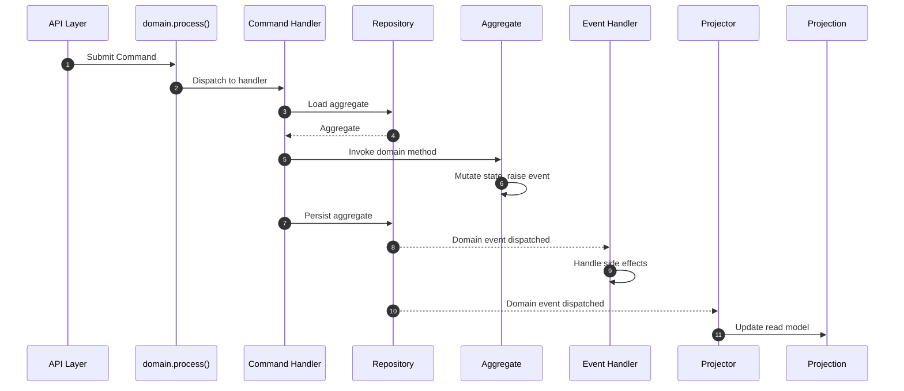

# CQRS with Protean

!!! info "Builds on DDD"
    This approach adds Commands, Command Handlers, and Projections on top of
    the [DDD foundation](./ddd.md). If you haven't read the DDD pathway yet,
    start there — CQRS extends those concepts.

## Overview

CQRS (Command Query Responsibility Segregation) separates your application
into a **write side** and a **read side**. On the write side, explicit
Commands capture user intent and Command Handlers orchestrate aggregate
changes. On the read side, Projections provide query-optimized views built
from domain events.

This replaces Application Services with a more structured pattern: instead
of calling methods directly, the API layer submits Commands via
`domain.process()`, and Command Handlers execute the business logic. Events
flow to Projectors that maintain read models optimized for each query need.

## Request Flow

1. The **API layer** creates a Command and submits it via `domain.process()`
2. The framework **dispatches** the command to the appropriate Command Handler
3. The handler loads the aggregate from the **Repository**
4. It invokes the **domain method** on the aggregate
5. The aggregate mutates state and **raises events**
6. The handler **persists** the aggregate
7. Events flow to **Event Handlers** for side effects and to **Projectors**
   that update read-optimized **Projections**

## What CQRS Adds to DDD

| DDD Element | CQRS Replacement/Addition |
|-------------|--------------------------|
| Application Services | **Commands** + **Command Handlers** replace direct method calls |
| — | **Projections** provide dedicated read models |
| — | **Projectors** build projections from events |
| Events + Event Handlers | Same as DDD, but now also feed projectors |
| Repositories | Same as DDD |

## Elements You'll Use

Everything from the [DDD pathway](./ddd.md), **plus**:

| Element | Purpose |
|---------|---------|
| [Commands](../change-state/commands.md) | Immutable DTOs representing intent to change state |
| [Command Handlers](../change-state/command-handlers.md) | Process commands and orchestrate aggregate changes |
| [Projections](../consume-state/projections.md) | Read-optimized views stored in database or cache |
| [Subscribers](../consume-state/subscribers.md) | Consume messages from external message brokers |
| [Server](../server/index.md) | Async processing engine for events and commands |

## Guided Reading Order

If you've already worked through the DDD pathway, pick up from step 4.
Otherwise, start from the beginning:

### Start with DDD foundations

| Step | Guide | What You'll Learn |
|------|-------|-------------------|
| 1 | [Set Up the Domain](../compose-a-domain/index.md) | Register elements, initialize and activate your domain |
| 2 | [Define Domain Elements](../domain-definition/index.md) | Aggregates, entities, value objects, fields |
| 3 | [Add Rules and Behavior](../domain-behavior/index.md) | Validations, invariants, mutations, raising events |

### Add the command side

With the domain model in place, replace direct method calls with explicit
commands that capture user intent:

| Step | Guide | What You'll Learn |
|------|-------|-------------------|
| 4 | [Commands](../change-state/commands.md) | Define commands that capture user intent |
| 5 | [Command Handlers](../change-state/command-handlers.md) | Process commands and coordinate aggregates |
| 6 | [Persist Aggregates](../change-state/persist-aggregates.md) | Save and load aggregates via repositories |

### Build the read side

With commands flowing through the write path, you can define events and
build query-optimized read models:

| Step | Guide | What You'll Learn |
|------|-------|-------------------|
| 7 | [Events](../domain-definition/events.md) | Define domain events |
| 8 | [Event Handlers](../consume-state/event-handlers.md) | React to events for side effects and cross-aggregate sync |
| 9 | [Projections](../consume-state/projections.md) | Build read-optimized views from events |

### React and coordinate

To manage multi-step workflows, run asynchronous processing, and configure
infrastructure:

| Step | Guide | What You'll Learn |
|------|-------|-------------------|
| 10 | [Process Managers](../consume-state/process-managers.md) | Coordinate multi-step processes across aggregates |
| 11 | [Server](../server/index.md) | Run the async processing engine |
| 12 | [Configuration](../essentials/configuration.md) | Configure databases, brokers, and event stores |
| 13 | [Testing](../testing/index.md) | Test commands, handlers, and projections |

## Relevant Patterns

These patterns complement the CQRS approach. The first group applies to any
DDD project; the second group addresses concerns specific to CQRS:

| Pattern | What It Covers |
|---------|---------------|
| [Design Small Aggregates](../../patterns/design-small-aggregates.md) | Keep aggregates focused and performant |
| [Encapsulate State Changes](../../patterns/encapsulate-state-changes.md) | Protect aggregate internals with controlled mutation |
| [Replace Primitives with Value Objects](../../patterns/replace-primitives-with-value-objects.md) | Use rich types instead of raw strings and numbers |
| [Validation Layering](../../patterns/validation-layering.md) | Apply validation at the right layer |
| [Thin Handlers, Rich Domain](../../patterns/thin-handlers-rich-domain.md) | Keep handlers lean, push logic into the domain model |
| [Testing Domain Logic in Isolation](../../patterns/testing-domain-logic-in-isolation.md) | Test domain rules without infrastructure |
| [Organize by Domain Concept](../../patterns/organize-by-domain-concept.md) | Structure your project around business concepts |
| [Creating Identities Early](../../patterns/creating-identities-early.md) | Generate aggregate IDs before persistence |
| [Command Idempotency](../../patterns/command-idempotency.md) | Ensure commands can be safely retried |
| [Design Events for Consumers](../../patterns/design-events-for-consumers.md) | Shape events around downstream needs |
| [Idempotent Event Handlers](../../patterns/idempotent-event-handlers.md) | Handle duplicate events gracefully |
| [Coordinating Long-Running Processes](../../patterns/coordinating-long-running-processes.md) | Manage multi-step workflows with process managers |

## When to Evolve to Event Sourcing

Consider moving to [Event Sourcing](./event-sourcing.md) when an aggregate
meets **two or more** of these criteria:

- **Strong auditability required** — regulatory compliance or financial
  transactions requiring complete traceability
- **Temporal analysis needed** — historical reporting or state
  reconstruction at any point in time
- **Complex state transitions** — multi-step workflows with intricate
  business rules
- **Event-driven integration** — other bounded contexts consume your events
  as their primary data source

!!! note
    You don't have to move your entire domain to Event Sourcing. Protean
    supports mixing CQRS and Event Sourcing **at the aggregate level**
    within the same domain. See the
    [Architecture Decision](../../core-concepts/architecture-decision.md)
    guide for the full decision framework.
