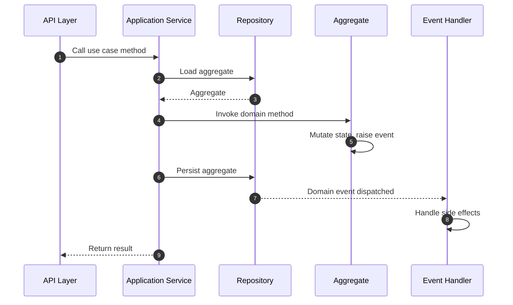

# Domain-Driven Design with Protean

!!! info "The Foundation"
    This is the simplest way to use Protean and the foundation for the other
    two approaches. Start here if you're new to Protean or building a
    straightforward application.

## Overview

In the pure DDD approach, you model your domain with aggregates, entities,
and value objects, then use **application services** to orchestrate use cases.
Repositories handle persistence, and domain events propagate side effects
to event handlers.

This approach follows the patterns from Eric Evans' *Domain-Driven Design*
(the "Blue Book"). There are no commands or command handlers — application
services receive requests directly and coordinate the domain logic.

## Request Flow

1. The **API layer** calls a method on an Application Service
2. The Application Service loads the aggregate from a **Repository**
3. It invokes the appropriate **domain method** on the aggregate
4. The aggregate mutates its state and **raises domain events**
5. The Application Service **persists** the aggregate back through the
   repository
6. Domain events are dispatched to **Event Handlers** for side effects
7. The result is returned **synchronously** to the caller

## Elements You'll Use

| Element | Purpose |
|---------|---------|
| [Aggregates](../domain-definition/aggregates.md) | Root entities that encapsulate business logic and enforce invariants |
| [Entities](../domain-definition/entities.md) | Objects with identity that live within an aggregate |
| [Value Objects](../domain-definition/value-objects.md) | Immutable descriptive objects (Money, Address, Email) |
| [Fields](../domain-definition/fields/index.md) | Typed attributes on domain elements |
| [Application Services](../change-state/application-services.md) | Orchestrate use cases with `@use_case` methods |
| [Repositories](../change-state/persist-aggregates.md) | Persist and retrieve aggregates |
| [Events](../domain-definition/events.md) | Record state changes as domain events |
| [Event Handlers](../consume-state/event-handlers.md) | React to events with side effects |
| [Subscribers](../consume-state/subscribers.md) | Consume messages from external message brokers |
| [Domain Services](../domain-behavior/domain-services.md) | Coordinate logic spanning multiple aggregates |

## Guided Reading Order

Work through these guides in order to build a complete understanding of the
DDD approach:

### Define your domain model

| Step | Guide | What You'll Learn |
|------|-------|-------------------|
| 1 | [Set Up the Domain](../compose-a-domain/index.md) | Register elements, initialize and activate your domain |
| 2 | [Aggregates](../domain-definition/aggregates.md) | Define your root entities and aggregate boundaries |
| 3 | [Entities](../domain-definition/entities.md) | Add child objects with identity |
| 4 | [Value Objects](../domain-definition/value-objects.md) | Model immutable descriptive concepts |
| 5 | [Fields](../domain-definition/fields/index.md) | Understand the field system and data types |
| 6 | [Relationships](../domain-definition/relationships.md) | Connect entities with HasOne, HasMany, Reference |

### Add business rules and behavior

With your domain model defined, you need to protect it with business rules
and give it the ability to communicate what happened:

| Step | Guide | What You'll Learn |
|------|-------|-------------------|
| 7 | [Validations & Invariants](../domain-behavior/invariants.md) | Enforce business rules |
| 8 | [Aggregate Mutation](../domain-behavior/aggregate-mutation.md) | Change aggregate state safely |
| 9 | [Raising Events](../domain-behavior/raising-events.md) | Emit domain events from aggregates |

### Wire the application layer

With a rich domain model in place, you can orchestrate use cases and persist
state:

| Step | Guide | What You'll Learn |
|------|-------|-------------------|
| 10 | [Application Services](../change-state/application-services.md) | Orchestrate use cases with `@use_case` |
| 11 | [Persist Aggregates](../change-state/persist-aggregates.md) | Save aggregates through repositories |
| 12 | [Retrieve Aggregates](../change-state/retrieve-aggregates.md) | Load aggregates by ID or query |

### React to state changes

To handle side effects and coordinate across aggregates:

| Step | Guide | What You'll Learn |
|------|-------|-------------------|
| 13 | [Event Handlers](../consume-state/event-handlers.md) | React to domain events |
| 14 | [Subscribers](../consume-state/subscribers.md) | Consume messages from external brokers |
| 15 | [Domain Services](../domain-behavior/domain-services.md) | Coordinate cross-aggregate logic |
| 16 | [Testing](../testing/index.md) | Test your domain model and application layer |

## Relevant Patterns

These patterns complement the DDD approach:

| Pattern | What It Covers |
|---------|---------------|
| [Design Small Aggregates](../../patterns/design-small-aggregates.md) | Keep aggregates focused and performant |
| [Encapsulate State Changes](../../patterns/encapsulate-state-changes.md) | Protect aggregate internals with controlled mutation |
| [Replace Primitives with Value Objects](../../patterns/replace-primitives-with-value-objects.md) | Use rich types instead of raw strings and numbers |
| [Validation Layering](../../patterns/validation-layering.md) | Apply validation at the right layer |
| [Thin Handlers, Rich Domain](../../patterns/thin-handlers-rich-domain.md) | Keep handlers lean, push logic into the domain model |
| [Testing Domain Logic in Isolation](../../patterns/testing-domain-logic-in-isolation.md) | Test domain rules without infrastructure |
| [Organize by Domain Concept](../../patterns/organize-by-domain-concept.md) | Structure your project around business concepts |
| [Creating Identities Early](../../patterns/creating-identities-early.md) | Generate aggregate IDs before persistence |

## When to Evolve to CQRS

Consider moving to [CQRS](./cqrs.md) when:

- Your read and write models have diverging requirements
- You need read-optimized views (projections) independent of your aggregates
- You want explicit, auditable commands representing user intent
- You need asynchronous command processing
- Your application would benefit from separating the write path from the
  read path

See the [Architecture Decision](../../core-concepts/architecture-decision.md)
guide for a systematic decision framework.
