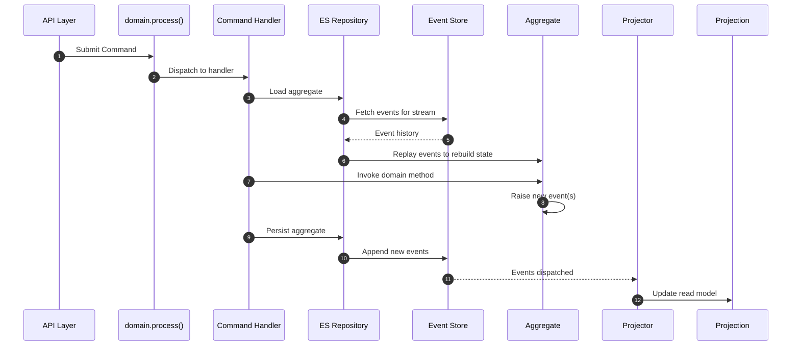

# Event Sourcing with Protean

!!! info "Builds on CQRS"
    Event Sourcing extends the [CQRS pathway](./cqrs.md) with event replay,
    temporal queries, and full audit trails. If you haven't read the CQRS
    pathway yet, start there — Event Sourcing builds on those concepts.

## Overview

In Event Sourcing, aggregate state is not stored as a snapshot in a
database. Instead, every state change is captured as an **event**, and the
aggregate's current state is **reconstructed by replaying** its event
history. This gives you a complete, immutable audit trail and the ability
to answer "what was the state at time T?" for any aggregate.

In Protean, you enable Event Sourcing on a per-aggregate basis by marking
it with `is_event_sourced=True`. The aggregate uses `@apply` methods to
define how each event type mutates state, and an Event Sourced Repository
handles persistence to the event store.

## Request Flow



1. The **API layer** submits a Command via `domain.process()`
2. The Command Handler asks the **Event Sourced Repository** to load the
   aggregate
3. The repository **fetches all events** for that aggregate from the Event
   Store
4. It **replays** them through the aggregate's `@apply` methods to rebuild
   current state
5. The handler invokes the **domain method**, which calls `raise_()` —
   `raise_()` automatically invokes the corresponding `@apply` handler,
   mutating state in-place
6. The repository **appends** the new events to the Event Store
7. Events flow to **Projectors** that update read-optimized **Projections**

## What Event Sourcing Adds to CQRS

| CQRS Element | Event Sourcing Change |
|--------------|-----------------------|
| `@domain.aggregate` | Add `is_event_sourced=True` option |
| Aggregate methods | Use `@apply` decorator for event application |
| `@domain.repository` | Replace with `@domain.event_sourced_repository` |
| Persistence Store | Replace with **Event Store** (e.g., Message DB) |
| Everything else | Commands, Command Handlers, Projections, Projectors — unchanged |

## Elements You'll Use

Everything from the [CQRS pathway](./cqrs.md), **with these changes**:

| Element | Purpose |
|---------|---------|
| Event Sourced Aggregates | Aggregates with `is_event_sourced=True` that derive state from events |
| `@apply` decorator | Methods that define how each event type mutates aggregate state — called automatically by `raise_()` and during replay |
| Event Sourced Repository | Persists events and reconstructs aggregates from event streams |
| Fact Events | Auto-generated snapshot events capturing full aggregate state |
| [Event Store adapter](../../adapters/eventstore/index.md) | Infrastructure for storing and retrieving events (e.g., Message DB) |

## Guided Reading Order

If you've already worked through the CQRS pathway, pick up from step 1
below. These guides cover the Event Sourcing-specific concepts:

| Step | Guide | What You'll Learn |
|------|-------|-------------------|
| 1 | [Event Sourcing Concepts](../../core-concepts/event-sourcing.md) | Theory and workflow of event sourcing |
| 2 | [Events](../domain-definition/events.md) | Delta events vs. fact events |
| 3 | [Raising Events](../domain-behavior/raising-events.md) | How aggregates raise events and the `@apply` decorator |
| 4 | [Persist Aggregates](../change-state/persist-aggregates.md) | Event sourced repositories |
| 5 | [Stream Categories](../essentials/stream-categories.md) | How events are organized into streams |
| 6 | [Projections](../consume-state/projections.md) | Build read models from event streams |
| 7 | [Server](../server/index.md) | Process events asynchronously |
| 8 | [Event Store adapters](../../adapters/eventstore/index.md) | Configure Message DB or other event stores |
| 9 | [Process Managers](../consume-state/process-managers.md) | Coordinate multi-step processes across aggregates |
| 10 | [Architecture Decision](../../core-concepts/architecture-decision.md) | When to use ES vs. CQRS per aggregate |
| 11 | [Event Upcasting](../event-upcasting.md) | Transform old event schemas during replay |
| 12 | [Testing](../testing/index.md) | Test event-sourced aggregates and projections |

## Key Concepts

### The `@apply` Decorator

In event-sourced aggregates, state changes are expressed through events.
The `@apply` decorator marks methods that define how each event type
mutates the aggregate's state. These handlers are invoked automatically
by `raise_()` during live operations and during event replay —
making them the **single source of truth** for all state mutations:

```python
@domain.aggregate(is_event_sourced=True)
class Order:
    status: String(default="draft")
    total: Float(default=0.0)

    def place(self):
        self.raise_(OrderPlaced(order_id=self.id, total=self.total))

    @apply
    def placed(self, event: OrderPlaced):
        self.status = "placed"
        self.total = event.total

    @apply
    def cancelled(self, event: OrderCancelled):
        self.status = "cancelled"
```

When `place()` calls `raise_()`, the framework automatically invokes
`placed()` to apply the state change. The same `placed()` method runs
during replay when the aggregate is loaded from the event store. Every
event raised by an ES aggregate **must** have a corresponding `@apply`
handler — raising an event without one will throw `NotImplementedError`.

### Fact Events

When `fact_events=True` is set on an aggregate, Protean auto-generates a
snapshot event after every state change. This captures the complete current
state of the aggregate, making it easy for downstream consumers to build
projections without replaying the full event history.

### Mixing Patterns Per Aggregate

Protean allows mixing CQRS and Event Sourcing **at the aggregate level**
within the same domain. Some aggregates can use standard repositories while
others use event sourcing — the decision is explicit and per-aggregate:

```python
@domain.aggregate  # Standard CQRS — state stored as snapshots
class Product:
    ...

@domain.aggregate(is_event_sourced=True)  # Event Sourced — state from events
class Order:
    ...
```

See the [Architecture Decision](../../core-concepts/architecture-decision.md)
guide for criteria on choosing the right pattern per aggregate.
