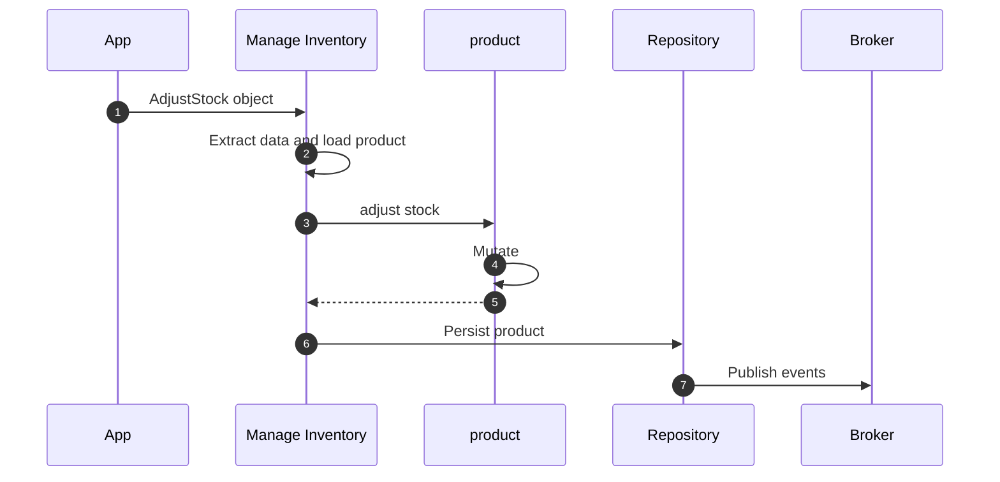
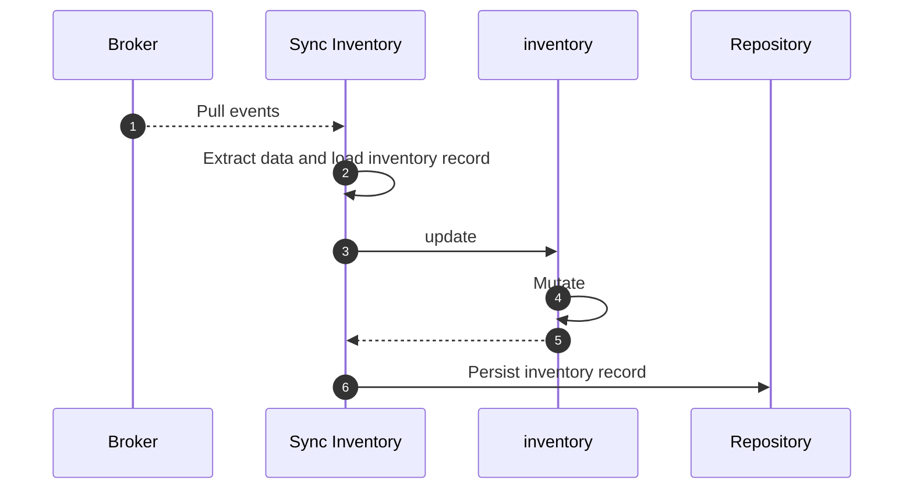

# Views

Views, a.k.a Read models, are representations of data optimized for querying
and reading purposes. It is designed to provide data in a format that makes it
easy and efficient to read, often tailored to the specific needs of a
particular view or user interface.

Views are typically populated in response to Domain Events raised in the
domain model.

## Defining a View

Views are defined with the `Domain.view` decorator.

```python hl_lines="15-19"
--8<-- "guides/projections/001.py:60:66"
```

## Workflow

`ManageInventory` Command Handler handles `AdjustStock` command, loads the
product and updates it, and then persists the product, generating domain
events.



The events are then consumend by the event handler that loads the view record
and updates it.



## Example

Below is a full-blown example of a view `ProductInventory` synced with the
`Product` aggregate with the help of `ProductAdded` and `StockAdjusted` domain
events.

```python hl_lines="68-74 115-127 129-136"
{! docs_src/guides/projections/001.py !}
```
