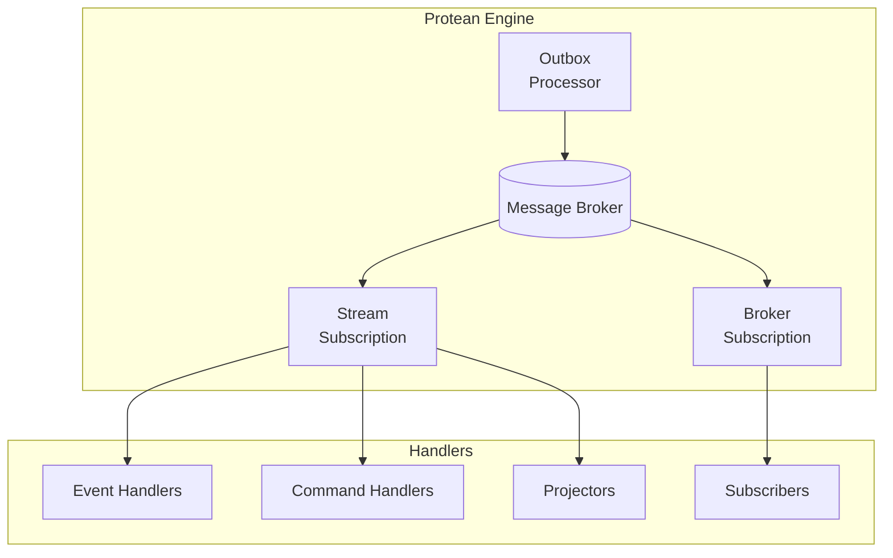

# Async Message Processing

The Protean Server is an asynchronous message processing engine that handles
events, commands, and external messages in your domain. It provides reliable,
scalable message consumption with support for multiple subscription types,
configuration profiles, and the transactional outbox pattern.

## Overview

When you run `protean server`, Protean starts the **Engine**, an async runtime
that:

- **Processes domain events** through event handlers
- **Processes commands** through command handlers
- **Builds projections** through projectors
- **Consumes external messages** through broker subscribers
- **Publishes outbox messages** to message brokers



## Configuration to Use the Server

Protean supports three processing flags that control how work is dispatched and handled:

- `event_processing`: Controls how domain events are processed.
- `command_processing`: Controls how commands are processed.
- `message_processing`: Controls how standalone messages from brokers (such as Redis Streams or Pub/Sub) are handled.

Set any of these to `"async"` in your domain configuration to process the respective tasks asynchronously using the server. When set to `"async"`, the Protean server will run the corresponding background workers to handle these tasks outside of the main request flow.

### Example Configuration

```toml
# domain.toml
event_processing = "async"
command_processing = "async"

[event_store]
provider = "message_db"
database_uri = "postgresql://message_store@localhost:5433/message_store"

[brokers.default]
provider = "redis"
URI = "redis://localhost:6379/0"
```

With this configuration, events, commands, and broker messages are all processed asynchronously by the server, enabling scalable, out-of-band handling of all message types.

## Quick Start

```bash
# Start the server with your domain
protean server --domain=your_domain

# Start with debug logging
protean server --domain=your_domain --debug

# Run in test mode (processes pending events/commands/messages and exits)
protean server --domain=your_domain --test-mode
```

## Key Concepts

### Subscriptions

Subscriptions use the Observer pattern to connect your handlers (observers) to message sources (subjects or publishers). This allows your handlers to automatically receive and react to new messages as they arrive. Protean supports two
subscription types:

- **StreamSubscription**: Uses Redis Streams for production workloads with
  consumer groups, retries, and dead letter queues
- **EventStoreSubscription**: Reads directly from the event store, suitable for
  projections and event replay

Learn more in [Subscription Types](subscription-types.md).

### Configuration Profiles

Profiles provide pre-configured settings optimized for common use cases:

| Profile | Subscription Type | Use Case |
| ------- | ----------------- | -------- |
| `production` | Stream | High throughput with reliability guarantees |
| `fast` | Stream | Low-latency processing |
| `batch` | Stream | High-volume batch processing |
| `debug` | Stream | Development and debugging |
| `projection` | Event Store | Building read models |

Learn more in [Configuration](configuration.md).

### Outbox Pattern

The outbox pattern ensures reliable message delivery by:

1. Storing messages and business data in the database as part of a single transaction
2. Publishing messages to the broker in a separate process
3. Guaranteeing at-least-once delivery

Learn more in [Outbox Pattern](outbox.md).

## In This Section

- [Engine Architecture](engine.md) - How the engine manages subscriptions and
  lifecycle
- [Subscriptions](subscriptions.md) - How handlers connect to message sources
- [Subscription Types](subscription-types.md) - StreamSubscription vs
  EventStoreSubscription
- [Configuration](configuration.md) - Configuring subscriptions with profiles
  and options
- [Outbox Pattern](outbox.md) - Reliable message publishing
- [Running the Server](running.md) - CLI options and deployment
