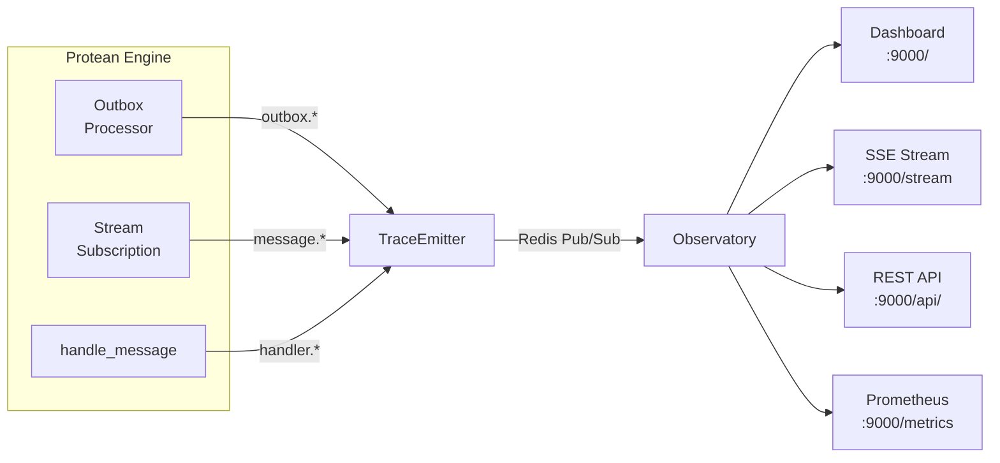

# Observability

Protean provides built-in observability for the async message processing
pipeline. Two components work together to give you real-time visibility into
how messages flow through the engine:

- **TraceEmitter** -- Lightweight instrumentation embedded in the engine that
  emits structured trace events as messages are processed.
- **Protean Observatory** -- A standalone monitoring server that subscribes to
  those trace events and exposes them through a dashboard, SSE stream, REST
  API, and Prometheus metrics endpoint.



## Trace events

The TraceEmitter publishes structured `MessageTrace` events at key points in
the message processing pipeline. Each trace event captures:

| Field | Description |
|-------|-------------|
| `event` | Stage identifier (see table below) |
| `domain` | Domain name |
| `stream` | Stream category (e.g. `identity::customer`) |
| `message_id` | Domain event or command UUID |
| `message_type` | Class name (e.g. `CustomerRegistered`) |
| `status` | `ok`, `error`, or `retry` |
| `handler` | Handler class name (when applicable) |
| `duration_ms` | Processing time in milliseconds (handler stages) |
| `error` | Error message (failure stages) |
| `metadata` | Extra context dict |
| `timestamp` | ISO 8601 UTC timestamp |

### Event types

| Event | Emitted by | When |
|-------|-----------|------|
| `handler.started` | Engine | Before a handler processes a message |
| `handler.completed` | Engine | After successful handler execution |
| `handler.failed` | Engine | When a handler raises an exception |
| `message.acked` | StreamSubscription | After a message is acknowledged |
| `message.nacked` | StreamSubscription | When a message is returned to pending |
| `message.dlq` | StreamSubscription | When a message is moved to the dead letter queue |
| `outbox.published` | OutboxProcessor | After a message is published to the broker |
| `outbox.failed` | OutboxProcessor | When outbox publishing fails |

## Zero-overhead design

The TraceEmitter is designed to add no measurable overhead when nobody is
listening:

1. **Lazy initialization** -- The Redis connection is not established until the
   first emit call.
2. **Subscriber check** -- Before serializing any trace, the emitter runs
   `PUBSUB NUMSUB` to check if anyone is subscribed to the trace channel. This
   result is cached for 2 seconds.
3. **Short-circuit** -- If no subscribers are found, `emit()` returns
   immediately without constructing or serializing the `MessageTrace`.
4. **Silent failure** -- If Redis is unavailable or publishing fails, the error
   is logged at DEBUG level and swallowed. Tracing never affects message
   processing.

## Protean Observatory

The Observatory is a standalone FastAPI server that subscribes to trace events
and provides multiple monitoring interfaces. It runs on its own port (default
9000), separate from your application.

### Starting the Observatory

```python
from protean.server.observatory import Observatory

# Single domain
observatory = Observatory(domains=[domain])
observatory.run(port=9000)

# Multi-domain monitoring
observatory = Observatory(domains=[identity, catalogue, orders])
observatory.run(port=9000)
```

For deployment with uvicorn directly:

```python
from protean.server.observatory import create_observatory_app

app = create_observatory_app(domains=[identity, catalogue])

# Then run with: uvicorn my_module:app --host 0.0.0.0 --port 9000
```

### Endpoints

#### Dashboard -- `GET /`

An embedded HTML dashboard that connects to the SSE stream and displays
real-time message flow. Open `http://localhost:9000` in your browser.

#### SSE stream -- `GET /stream`

Server-Sent Events endpoint for real-time trace streaming. Supports
server-side filtering via query parameters:

| Parameter | Description | Example |
|-----------|-------------|---------|
| `domain` | Filter by domain name | `?domain=identity` |
| `stream` | Filter by stream category | `?stream=identity::customer` |
| `event` | Filter by event type (glob) | `?event=handler.*` |
| `type` | Filter by message type (glob) | `?type=Customer*` |

```bash
# Stream all events
curl -N http://localhost:9000/stream

# Stream only handler failures
curl -N "http://localhost:9000/stream?event=handler.failed"

# Stream events for a specific domain and stream
curl -N "http://localhost:9000/stream?domain=identity&stream=identity::customer"
```

Each SSE message has `event: trace` and a JSON `data` payload matching the
`MessageTrace` structure.

#### Health -- `GET /api/health`

Infrastructure health check returning broker connectivity, version, memory
usage, and throughput:

```json
{
  "status": "ok",
  "domains": ["identity", "catalogue"],
  "infrastructure": {
    "broker": {
      "healthy": true,
      "version": "7.2.4",
      "connected_clients": 5,
      "memory": "2.50M",
      "uptime_seconds": 86400,
      "ops_per_sec": 142
    }
  }
}
```

#### Outbox -- `GET /api/outbox`

Outbox message counts per domain, broken down by status:

```json
{
  "identity": {
    "status": "ok",
    "counts": {"PENDING": 3, "PUBLISHED": 1250, "FAILED": 0}
  }
}
```

#### Streams -- `GET /api/streams`

Redis stream lengths, message counts, and consumer group information:

```json
{
  "message_counts": {"total_messages": 2139, "in_flight": 5},
  "streams": {"count": 8},
  "consumer_groups": {"identity::user": [...]}
}
```

#### Stats -- `GET /api/stats`

Combined outbox and stream statistics for dashboard consumption.

#### Prometheus metrics -- `GET /metrics`

Metrics in Prometheus text exposition format, suitable for scraping by
Prometheus, Grafana Agent, or any compatible collector:

```
# HELP protean_outbox_pending Current pending outbox messages
# TYPE protean_outbox_pending gauge
protean_outbox_messages{domain="identity",status="PENDING"} 3

# HELP protean_broker_up Broker health (1=up, 0=down)
# TYPE protean_broker_up gauge
protean_broker_up 1

# HELP protean_broker_memory_bytes Broker memory usage in bytes
# TYPE protean_broker_memory_bytes gauge
protean_broker_memory_bytes 2621440

# HELP protean_stream_messages_total Total messages in streams
# TYPE protean_stream_messages_total gauge
protean_stream_messages_total 2139

# HELP protean_stream_pending Pending (in-flight) messages
# TYPE protean_stream_pending gauge
protean_stream_pending 5
```

Available metrics:

| Metric | Type | Description |
|--------|------|-------------|
| `protean_outbox_messages` | gauge | Outbox messages by domain and status |
| `protean_broker_up` | gauge | Broker health (1=up, 0=down) |
| `protean_broker_memory_bytes` | gauge | Broker memory usage in bytes |
| `protean_broker_connected_clients` | gauge | Number of connected broker clients |
| `protean_broker_ops_per_sec` | gauge | Broker operations per second |
| `protean_stream_messages_total` | gauge | Total messages across all streams |
| `protean_stream_pending` | gauge | Pending (in-flight) messages |
| `protean_streams_count` | gauge | Number of active streams |
| `protean_consumer_groups_count` | gauge | Number of consumer groups |

### Prometheus scrape configuration

```yaml
# prometheus.yml
scrape_configs:
  - job_name: 'protean'
    scrape_interval: 15s
    static_configs:
      - targets: ['localhost:9000']
```

### CORS configuration

The Observatory enables CORS by default to allow browser-based dashboards. You
can customize the allowed origins:

```python
observatory = Observatory(
    domains=[domain],
    enable_cors=True,
    cors_origins=["https://monitoring.example.com"],
)
```

## Prerequisites

The observability system requires **Redis** as the message broker. The
TraceEmitter uses Redis Pub/Sub (channel `protean:trace`) as the transport
between the engine and the Observatory. When using the `InlineBroker` (the
default for development), the TraceEmitter gracefully no-ops -- no errors, no
overhead.

The Observatory server requires the `fastapi` and `uvicorn` packages:

```bash
pip install fastapi uvicorn
```

## Next steps

- [Engine Architecture](engine.md) -- How the engine manages subscriptions
  and lifecycle
- [Running the Server](running.md) -- CLI options, deployment, and monitoring
- [Subscription Types](subscription-types.md) -- StreamSubscription vs
  EventStoreSubscription
